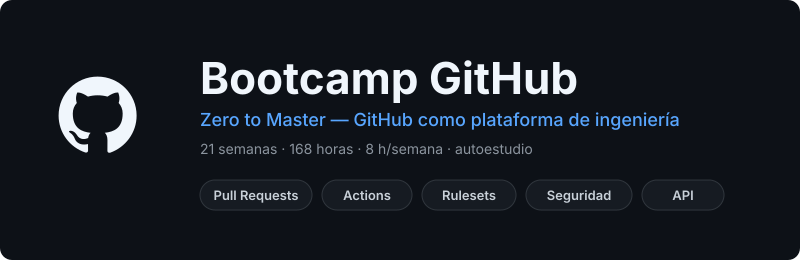

<p align="center">
  
</p>

<p align="center">
  <a href="LICENSE"></a>
  <a href="#"></a>
  <a href="#"></a>
  <a href="#"></a>
  <a href="#"></a>
  <a href="#"></a>
</p>

<p align="center">
  <a href="README_EN.md"></a>
</p>

---

## 📋 Descripción

Bootcamp de **21 semanas (~5 meses)** sobre **GitHub como plataforma de
ingeniería**, no como "el sitio donde subo el código". Diseñado para
desarrolladores fullstack que quieren moverse hacia **DevOps / Platform
Engineering**: al terminar eres la persona que diseña los rulesets del repo,
escribe las actions propias del equipo, firma los releases y cierra la cadena de
suministro.

Es **autoestudio asincrónico**: cada semana trae verificación automática de tus
entregables contra la API real de GitHub.

### 🎯 Objetivos

Al finalizar el bootcamp serás capaz de:

- ✅ Operar Git con soltura quirúrgica (`rebase -i`, `reflog`, `bisect`, `worktree`)
- ✅ Convertir un repositorio en un producto: docs, plantillas, CODEOWNERS, Pages
- ✅ Diseñar taxonomías de issues y flujos de triage que escalan
- ✅ Modelar el trabajo en **GitHub Projects v2** y automatizarlo por GraphQL
- ✅ Dominar el ciclo de Pull Request: review, sugerencias, merge queue, stacked PRs
- ✅ Gobernar repos con **rulesets**, required checks y commits firmados
- ✅ Escribir **GitHub Actions** de nivel producción: matrices, caché, reusables, actions propias
- ✅ Desplegar sin secretos de larga vida usando **OIDC** y environments protegidos
- ✅ Publicar releases versionados en **GHCR** y npm con procedencia verificable
- ✅ Cerrar la cadena de suministro: Dependabot, CodeQL, secret scanning, attestations
- ✅ Automatizar GitHub por **REST, GraphQL, `gh` CLI y GitHub Apps**
- ✅ Administrar organizaciones: teams, roles, políticas y audit log
- ✅ Operar monorepos y repos gigantes (path filters, partial clone, LFS, `filter-repo`)
- ✅ Contribuir a open source de verdad y mantener una comunidad
- ✅ Trabajar en **Codespaces** y con **Copilot** (code review, agentes, Models)

### 🚀 ¿Por qué un bootcamp entero sobre GitHub?

> **La mayoría sabe `push`. Muy pocos saben plataforma.**

GitHub dejó de ser un hosting de repos hace años: hoy es CI/CD, gestión de
producto, control de acceso, análisis de seguridad, registro de paquetes y capa
de IA. La diferencia entre un dev y un platform engineer está casi toda ahí, y
casi nadie la enseña con profundidad — se enseña en tutoriales de 10 minutos que
te dejan copiando YAML que no entiendes.

Este bootcamp va al fondo de cada feature: qué problema resuelve, cómo se
configura bien, qué antipatrones tiene y qué trucos usan quienes viven en la
plataforma.

---

## 🗓️ Estructura del Bootcamp

|            Fase            | Semanas | Horas | Temas Principales                                        |
| :------------------------: | :-----: | :---: | -------------------------------------------------------- |
| **Fundamentos plataforma** |   1-3   |  24h  | Setup pro, repo como producto, issues y triage           |
| **Colaboración**           |   4-8   |  40h  | Projects v2, Pull Requests, code review, rulesets        |
| **Automatización**         |  9-12   |  32h  | Actions a fondo, CD con OIDC, releases y packages        |
| **Seguridad**              |  13-14  |  16h  | Dependabot, CodeQL, secret scanning, cadena de suministro |
| **Programabilidad**        |  15-16  |  16h  | REST/GraphQL, `gh` CLI, webhooks, GitHub Apps            |
| **Escala y comunidad**     |  17-20  |  32h  | Organizaciones, monorepos, OSS, Codespaces + Copilot     |
| **Cierre**                 |   21    |   8h  | Proyecto final: repo production-grade                    |

**Total: 21 semanas** | **168 horas** de formación

---

## 📚 Contenido por Semana

Cada semana incluye:

```
bootcamp/week-XX-tema_principal/
├── README.md                 # Objetivos, contenidos, tiempos, trucos, entregables
├── rubrica-evaluacion.md     # Criterios de evaluación
├── checks.json               # Verificación automática (gh api)
├── 0-assets/                 # Diagramas SVG
├── 1-teoria/                 # Material teórico
├── 2-practicas/              # Ejercicios guiados
├── 3-proyecto/               # Capa semanal de tu repo hilo conductor
├── 4-recursos/               # ebooks-free / videografia / webgrafia
└── 5-glosario/               # Términos clave
```

| Semana | Tema                                   | Descripción                                                              |
| :----: | -------------------------------------- | ------------------------------------------------------------------------ |
|   01   | `git_repaso_y_setup_pro`               | Git quirúrgico, SSH/commits firmados, `gh` CLI, tokens, perfil          |
|   02   | `repositorio_como_producto`            | README, LICENSE, CODEOWNERS, Markdown GFM, búsqueda, Pages               |
|   03   | `issues_y_triage`                      | Issue forms YAML, labels, milestones, sub-issues, triage                 |
|   04   | `projects_v2_fundamentos`              | Modelo de datos, campos, vistas, roadmap, workflows integrados           |
|   05   | `projects_v2_automatizacion_y_metricas`| GraphQL de Projects, insights, métricas DORA-lite                        |
|   06   | `pull_requests_a_fondo`                | Draft, review, sugerencias, estrategias de merge, stacked PRs            |
|   07   | `code_review_y_convenciones`           | Cultura de review, Conventional Commits, CODEOWNERS, GitHub flow         |
|   08   | `gobernanza_rulesets_y_merge_queue`    | Rulesets, required checks, push rules, environments, merge queue         |
|   09   | `actions_fundamentos`                  | Eventos, contexts, expresiones, matrices, artifacts, caché, debugging    |
|   10   | `actions_reutilizacion_y_actions_propias`| Reusable workflows, composite, actions JS/Docker, Marketplace          |
|   11   | `actions_seguridad_entornos_y_cd`      | `permissions`, pinning SHA, OIDC, environments, self-hosted runners      |
|   12   | `releases_y_packages`                  | SemVer, release-please, GHCR, npm publish, provenance                    |
|   13   | `seguridad_dependabot_y_code_scanning` | Dependabot version updates, CodeQL, SARIF de terceros                    |
|   14   | `seguridad_supply_chain_y_hardening`   | Secret scanning, push protection, advisories, SBOM, attestations         |
|   15   | `api_rest_graphql_y_gh_cli`            | Octokit, REST vs GraphQL, `gh api --jq`, extensiones de `gh`             |
|   16   | `webhooks_apps_y_bots`                 | Webhooks + HMAC, GitHub Apps vs PAT, bots de triage, ChatOps             |
|   17   | `organizaciones_teams_y_politicas`     | Roles, teams, rulesets de org, audit log, políticas de Actions           |
|   18   | `monorepos_y_repos_a_escala`           | Path filters, sparse-checkout, LFS, submódulos, `git filter-repo`        |
|   19   | `oss_y_comunidad`                      | Forks y upstream, contribución real, Discussions, mantenimiento          |
|   20   | `codespaces_devcontainers_y_copilot`   | `devcontainer.json`, prebuilds, Copilot code review, agentes, Models     |
|   21   | `proyecto_final_repo_production_grade` | Integración y auditoría de las 20 semanas                                |

### 🔑 Componentes Clave

- 📖 **Teoría**: el porqué de cada feature, no solo el clic
- 💻 **Práctica**: operaciones reales sobre GitHub, verificables por API
- 🎩 **Trucos**: atajos, URLs ocultas y flags que casi nadie usa
- 📦 **Proyecto**: una capa nueva sobre tu repo, cada semana
- ✅ **Autograding**: `scripts/verificar-semana.sh` valida tu repo de verdad

---

## 🛠️ Herramientas

| Herramienta            | Versión  | Uso                                       |
| ---------------------- | -------- | ----------------------------------------- |
| Git                    | **2.40+**| Control de versiones                      |
| GitHub CLI (`gh`)      | **2.x**  | Operar GitHub desde la terminal           |
| `jq`                   | **1.6+** | Procesar respuestas de la API             |
| Node.js                | **22+**  | Stack demo de los workflows y actions     |
| pnpm                   | **10.x** | Gestor de paquetes del stack demo         |
| Docker                 | **26+**  | Actions en contenedor, GHCR, devcontainers|
| `act` *(opcional)*     | **0.2.x**| Ejecutar workflows en local               |
| `git-filter-repo`      | **2.x**  | Reescritura de historia (Semana 18)       |
| VS Code                | —        | Editor + Codespaces / devcontainers       |

**Cuenta requerida**: GitHub **Free** es suficiente. Todas las prácticas se hacen
sobre **repositorios públicos**, donde Actions, rulesets, CodeQL, secret
scanning, Projects v2, Pages y GHCR están disponibles sin costo. Las features
exclusivas de Team/Enterprise (SAML, EMU, runner groups avanzados) se estudian a
nivel conceptual en la Semana 17.

---

## 🚀 Inicio Rápido

### Prerrequisitos

- **Git 2.40+** y conocimientos básicos (clonar, commit, push, ramas)
- **Node.js 22+** y **pnpm 10.x** (`corepack enable`)
- **`gh` CLI 2.x** autenticado — ver [`docs/setup-entorno.md`](docs/setup-entorno.md)
- **`jq`** instalado (`sudo apt install jq` / `brew install jq`)
- Una **cuenta de GitHub** con verificación en dos pasos activa

### 1. Clonar el material

```bash
git clone https://github.com/ergrato-dev/bc-github.git
cd bc-github
```

### 2. Preparar el entorno

```bash
gh auth login          # elige HTTPS o SSH
gh auth refresh -s workflow,read:org,gist,read:project
gh auth status         # debe listar tu cuenta y los scopes
./scripts/verificar-semana.sh --doctor
```

### 3. Crear tu repositorio del bootcamp

Todo el bootcamp construye **un solo repositorio tuyo**, semana a semana. Léelo
antes de empezar: [`docs/proyecto-hilo-conductor.md`](docs/proyecto-hilo-conductor.md).

### 4. Empezar la Semana 01

```bash
cd bootcamp/week-01-git_repaso_y_setup_pro
```

---

## ✅ Verificación Automática

En autoestudio nadie te revisa: te revisa la API.

```bash
./scripts/verificar-semana.sh 01 --repo tu-usuario/tu-repo
```

```
== Semana 01 — Git repaso y setup pro ==
✅ El repositorio existe y es público
✅ Tiene descripción
✅ Al menos 3 commits firmados (verified)
❌ No existe el archivo README.md en la raíz
   → Práctica 02, paso 4

2 de 3 verificaciones superadas.
```

Cada semana declara sus comprobaciones en `checks.json`; el script las traduce a
llamadas de `gh api`. Ver [`docs/autograding.md`](docs/autograding.md).

---

## 📊 Metodología de Aprendizaje

### Estrategias

- 🎯 **Un repo que crece**: cada semana añade una capa real a tu proyecto
- 🧩 **Práctica deliberada**: operaciones sobre GitHub, no lectura pasiva
- 🔬 **Ingeniería inversa**: leer repos públicos grandes y entender sus decisiones
- 🎩 **Trucos acumulados**: [`docs/trucos-github.md`](docs/trucos-github.md) crece contigo
- 🤖 **Verificación por API**: el estado real del repo es la única prueba válida

### Distribución del Tiempo (8h/semana)

- **Teoría**: 2 horas
- **Prácticas**: 3-4 horas
- **Proyecto**: 2-3 horas

### Evaluación

Cada semana incluye tres tipos de evidencias:

1. **Conocimiento 🧠** (30%): cuestionario de autoevaluación con respuestas
2. **Desempeño 💪** (40%): prácticas verificadas por `verificar-semana.sh`
3. **Producto 📦** (30%): la capa semanal de tu repositorio

**Criterio de aprobación**: mínimo 70% en cada tipo de evidencia.

### 🏛️ Tu dominio

En la Semana 01 eliges el **dominio** de tu proyecto (biblioteca, gimnasio,
cine, taller, lo que quieras) y lo mantienes las 21 semanas. No es decorativo:
un repo con un dominio real produce issues reales, releases reales y un
portafolio que se puede enseñar.

---

## 📞 Soporte

- 💬 **Discussions**: [GitHub Discussions](https://github.com/ergrato-dev/bc-github/discussions)
- 🐛 **Issues**: [GitHub Issues](https://github.com/ergrato-dev/bc-github/issues)

---

## ⚠️ Exención de Responsabilidad

Este repositorio es un recurso **educativo** creado con fines de aprendizaje. Al
utilizarlo, aceptas los siguientes términos:

- **Solo fines educativos**: el contenido, los ejemplos y los proyectos están
  diseñados para la enseñanza. No constituyen asesoramiento profesional, legal
  ni de seguridad.
- **Sin garantías**: el material se proporciona **"tal cual"**, sin garantías de
  ningún tipo.
- **La plataforma cambia**: GitHub itera su UI y sus features constantemente.
  Los flujos descritos pueden variar; la documentación oficial siempre manda.
- **Configuraciones de seguridad**: los ejemplos de rulesets, permisos y
  workflows son ilustrativos. Antes de aplicarlos a un repo de tu organización,
  revísalos contra tus propias políticas.
- **Costos**: Actions, Codespaces, Copilot y Packages tienen cuotas y precios que
  cambian. Verifica tu consumo; las prácticas se diseñan para el plan Free sobre
  repos públicos.
- **Responsabilidad del estudiante**: cada estudiante responde por sus propios
  repositorios, tokens, credenciales y decisiones técnicas.

---

## 📄 Licencia

Este proyecto está bajo la licencia **[CC BY-NC-SA 4.0](https://creativecommons.org/licenses/by-nc-sa/4.0/)**
(Creative Commons Attribution-NonCommercial-ShareAlike 4.0 International).

**Puedes:** compartir y adaptar el material, incluso crear forks educativos.
**No puedes:** usar este material con fines comerciales.
**Debes:** dar crédito apropiado y distribuir las adaptaciones bajo la misma licencia.

Ver el archivo [LICENSE](LICENSE) para el texto completo.

---

## 🏆 Agradecimientos

- [GitHub Docs](https://docs.github.com/) — la fuente de verdad de todo el material
- [GitHub CLI](https://cli.github.com/) — por hacer la plataforma scriptable
- [OpenSSF](https://openssf.org/) — por Scorecard y el trabajo en cadena de suministro
- [Conventional Commits](https://www.conventionalcommits.org/) — por una convención que sí escala
- Comunidad open source — por los repos públicos que sirven de caso de estudio
- Todos los contribuidores

---

## 📚 Documentación Adicional

- [🤖 Instrucciones de Copilot](.github/copilot-instructions.md)
- [📜 Código de Conducta](CODE_OF_CONDUCT.md)
- [🔒 Política de Seguridad](SECURITY.md)
- [🤝 Guía de Contribución](CONTRIBUTING.md)
- [🛠️ Setup del entorno](docs/setup-entorno.md)
- [🧵 Proyecto hilo conductor](docs/proyecto-hilo-conductor.md)
- [🎩 Trucos de GitHub](docs/trucos-github.md)
- [✅ Autograding](docs/autograding.md)
- [📖 Glosario global](docs/glosario-global.md)

---

<p align="center">
  <strong>🎓 Bootcamp GitHub - Zero to Master</strong><br>
  <em>De usar GitHub a ser dueño de la plataforma</em>
</p>

<p align="center">
  <a href="bootcamp/week-01-git_repaso_y_setup_pro">Comenzar Semana 1</a> •
  <a href="docs">Ver Documentación</a> •
  <a href="https://github.com/ergrato-dev/bc-github/issues">Reportar Issue</a>
</p>

<p align="center">
  Hecho con ❤️ para la comunidad de desarrolladores
</p>
