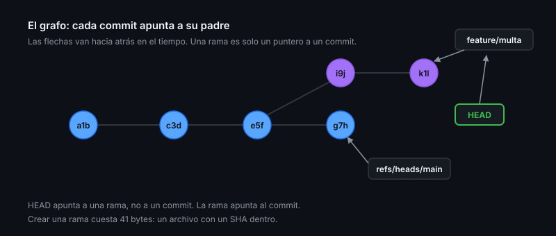

# Modelo mental de Git

> Casi todo el miedo a Git viene de creer que la historia es una lista. Es un
> grafo, y los comandos que dan pánico solo mueven punteros.

## 🎯 Objetivos

- Describir los cuatro tipos de objeto de Git y para qué sirve cada uno
- Distinguir entre commit, rama, `HEAD` y rama de seguimiento remoto
- Explicar qué hace exactamente `reset` en sus tres modos
- Leer el grafo de commits desde la terminal
- Nombrar cualquier commit sin copiar un SHA a mano

## 1. Qué problema resuelve

Git no guarda diferencias: guarda **fotos completas** del árbol de archivos,
direccionadas por el hash de su contenido. Esa decisión explica casi todo su
comportamiento: por qué es rápido, por qué no puede perder nada que hayas
commiteado, y por qué reescribir historia crea commits nuevos en vez de editar
los viejos.

Este archivo es la base de las tres teorías siguientes. Si algo de
[reescribir](02-reescribir-historia.md), [rescatar](03-rescate-y-arqueologia.md) o
[bisecar](04-bisect-y-worktree.md) parece magia, es que falta algo de aquí.

## 2. Los cuatro objetos

Todo lo que Git almacena en `.git/objects` es uno de estos cuatro:

| Objeto | Qué contiene | Analogía |
|--------|--------------|----------|
| **blob** | El contenido de un archivo. Sin nombre, sin permisos | El archivo desnudo |
| **tree** | Una lista de nombres → blobs y otros trees | Una carpeta |
| **commit** | Un tree + padre(s) + autor + fecha + mensaje | Una foto fechada y firmada |
| **tag** (anotado) | Un puntero a un objeto + mensaje + firma | Una etiqueta con acta |

Míralos de verdad:

```bash
git cat-file -t HEAD          # commit
git cat-file -p HEAD          # tree, parent, author, committer, mensaje
git cat-file -p HEAD^{tree}   # el contenido de la carpeta raíz en ese commit
git cat-file -s HEAD          # su tamaño en bytes
```

El nombre del objeto **es** el hash de su contenido. Consecuencias directas:

- Dos archivos idénticos en cien commits distintos son **un solo blob**. Git
  deduplica sin proponérselo
- Cambiar cualquier byte de un commit —incluida su fecha o su padre— produce un
  hash distinto: **un commit es inmutable**
- Los renombrados no se guardan. Git los **deduce** al comparar (`git log
  --follow`, `git diff -M`), porque el blob es el mismo con otro nombre en el tree

> [!NOTE]
> El hash es SHA-1, pero no el SHA-1 pelado: Git usa una variante endurecida que
> detecta los ataques de colisión conocidos. Existe soporte experimental de
> SHA-256 en repositorios nuevos; GitHub no lo admite todavía, así que en la
> práctica seguirás viendo hashes de 40 caracteres hexadecimales.

## 3. Refs: los punteros

Un **ref** es un archivo de texto con un hash dentro:

```bash
cat .git/refs/heads/main       # el hash al que apunta la rama main
cat .git/HEAD                  # ref: refs/heads/main
git show-ref --heads           # todas las ramas y a qué apuntan
```

(Si el archivo no existe, la ref está *empaquetada* en `.git/packed-refs`. Mismo
contenido, otro formato.)

De ahí salen las ideas que la gente confunde:

- Una **rama** es un puntero móvil a un commit. Nada más. Crear una rama cuesta
  41 bytes, por eso Git anima a crearlas sin pensar
- **`HEAD`** es un puntero a la rama en la que estás. En *detached HEAD* apunta
  directamente a un commit, sin rama de por medio
- Un **tag ligero** es un puntero que no se mueve; uno **anotado** es además un
  objeto con autor, fecha y firma. Para releases, siempre anotado
- **`origin/main`** no es una rama tuya: es una **rama de seguimiento remoto**,
  una foto de dónde estaba `main` en el remoto la última vez que hiciste `fetch`.
  Por eso `git fetch` nunca toca tu trabajo: solo actualiza esas fotos



### *Detached HEAD* no es un error

Estás en *detached HEAD* cuando haces `git checkout <sha>`, `git checkout v1.0` o
durante un rebase. Puedes mirar, compilar y hasta commitear. Lo único que pasa es
que ningún nombre apunta a esos commits nuevos, así que si te vas, los pierdes de
vista (que no es lo mismo que perderlos: siguen en el reflog).

```bash
git switch -c rama-nueva      # convierte donde estás en una rama
git switch -                  # vuelve a la anterior
```

## 4. El grafo (DAG)

Cada commit apunta a su padre (o padres, si es un merge). El resultado es un
**grafo acíclico dirigido**: se avanza hacia atrás en el tiempo, nunca en
círculo.

```bash
git log --oneline --graph --all --decorate
```

Con eso en la cabeza, los comandos se vuelven traducibles:

| Comando | En términos del grafo |
|---------|-----------------------|
| `git commit` | Crea un nodo hijo del actual y mueve la rama ahí |
| `git merge` | Crea un nodo con **dos** padres |
| `git rebase` | **Copia** commits sobre otra base — hashes nuevos, contenido igual |
| `git cherry-pick` | Copia **un** commit a otro sitio |
| `git reset` | Mueve el puntero de la rama a otro nodo |
| `git revert` | Crea un nodo nuevo que deshace otro. No borra nada |
| `git tag` | Clava un puntero que no se mueve |

## 5. Nombrar commits sin copiar hashes

Casi nunca hace falta un SHA completo. Git tiene una gramática para esto:

| Expresión | Qué es |
|-----------|--------|
| `HEAD~3` | Tres commits hacia atrás por la **primera** línea de padres |
| `HEAD^` | El primer padre; `HEAD^2` el **segundo** (solo en merges) |
| `main@{2}` | Donde estaba `main` hace dos movimientos (reflog) |
| `main@{yesterday}` | Donde estaba `main` ayer |
| `v1.0..main` | Los commits que están en `main` y no en `v1.0` |
| `v1.0...main` | Los de ambos lados desde su ancestro común |
| `main^{tree}` | El tree de ese commit |
| `:/multa` | El commit más reciente cuyo mensaje contiene "multa" |

```bash
git log --oneline v1.0..main        # qué va a entrar en la próxima release
git diff HEAD~3 -- src/multa.ts     # cómo ha cambiado ese archivo en 3 commits
git show :/multa                    # el último commit que mencione "multa"
```

`git rev-parse` traduce cualquiera de esas expresiones a un hash, que es lo que
usarás dentro de los scripts:

```bash
git rev-parse --short HEAD
git rev-parse main@{1}
```

## 6. Las tres zonas y `reset`

```
working tree  →  index (staging)  →  repositorio
   git add ──────────┘                    │
   git commit ────────────────────────────┘
```

El **índice** no es una lista de archivos marcados: es un árbol completo, la foto
que se convertirá en el próximo commit. Se puede mirar:

```bash
git ls-files -s              # el contenido exacto del índice, con sus blobs
git diff                     # working tree  ↔ índice
git diff --staged            # índice        ↔ último commit
git status --short           # dos columnas: izquierda índice, derecha working tree
```

`reset` mueve la rama y, según el modo, arrastra las otras dos zonas:

| Modo | Mueve la rama | Toca el índice | Toca tus archivos |
|------|:-------------:|:--------------:|:-----------------:|
| `--soft` | sí | no | no |
| `--mixed` *(por defecto)* | sí | sí | no |
| `--hard` | sí | sí | **sí — destruye cambios sin commitear** |

`--soft` es el que se usa para "quiero rehacer los últimos tres commits como uno
solo": `git reset --soft HEAD~3 && git commit`.

`--hard` es el único que puede perder trabajo de verdad, y solo el que **nunca
estuvo commiteado**. Todo lo que llegó a ser un commit sigue en `.git/objects` y
lo encuentras con `reflog` ([Teoría 03](03-rescate-y-arqueologia.md)).

> [!WARNING]
> `git reset --hard` descarta los cambios del directorio de trabajo sin pasar por
> ninguna papelera. Antes de ejecutarlo, `git stash` o `git commit` lo que te
> importe.

### `switch` y `restore`: los verbos que faltaban

`checkout` hacía dos cosas sin relación entre sí, y esa es la mitad de la
confusión histórica con Git. Desde 2.23 están separadas:

| Quiero… | Comando |
|---------|---------|
| Cambiar de rama | `git switch <rama>` |
| Crear una rama y cambiar a ella | `git switch -c <rama>` |
| Volver a la rama anterior | `git switch -` |
| Descartar cambios de un archivo | `git restore <archivo>` |
| Sacar un archivo del índice, sin perder los cambios | `git restore --staged <archivo>` |
| Recuperar un archivo como estaba en otro commit | `git restore --source=HEAD~3 <archivo>` |

## 7. Dónde vive todo esto

```bash
git count-objects -vH        # cuántos objetos sueltos y cuánto ocupa el repo
```

Git guarda cada objeto nuevo como un archivo suelto y, de vez en cuando, los
comprime en **packfiles** (`.git/objects/pack/`) con deltas entre versiones
parecidas. Eso lo hace `git gc`, que además caduca reflogs y borra objetos
inalcanzables.

Lo importante para el día a día: **`git gc` es lo único que borra de verdad**. Un
commit "perdido" existe hasta que pasa el recolector, y por eso el rescate de la
[Teoría 03](03-rescate-y-arqueologia.md) funciona.

## 8. Antipatrones

| Antipatrón | Por qué duele | Qué hacer |
|------------|---------------|-----------|
| Ver la historia solo con `git log` plano | Escondes los merges y las ramas paralelas | `--graph --all --decorate` |
| Usar `checkout` para todo | Hace dos cosas distintas y confunde | `switch` para ramas, `restore` para archivos |
| Miedo a *detached HEAD* | Es un estado normal, no un error | `git switch -c rama-nueva` |
| Creer que `origin/main` se actualiza sola | Es una foto del último `fetch` | `git fetch` antes de comparar |
| `commit -am` siempre | Te lleva ficheros que no querías | Revisa con `git add -p` |
| Copiar hashes a mano del `log` | Lento y propenso a errores | `HEAD~3`, `v1.0..main`, `@{yesterday}` |
| Ramas de vida larga | El merge final es una noche de conflictos | Ramas cortas, integración frecuente |
| Commitear binarios grandes "una sola vez" | Quedan en la historia y en todos los clones para siempre | Git LFS o fuera del repo |

## 9. Trucos

- **Ver el diff que vas a commitear**: `git diff --staged`
- **Commitear por trozos, no por archivo**: `git add -p` — te enseña cada hunk y
  eliges. Produce commits que se explican solos
- **Grafo compacto y legible**:
  ```bash
  git config --global alias.lg "log --oneline --graph --all --decorate -20"
  ```
- **Diff que detecta código movido**: `git config --global diff.colorMoved zebra`
  distingue "esto se movió" de "esto se reescribió"
- **Algoritmo de diff mejor**: `git config --global diff.algorithm histogram`
- **De dónde sale una opción rara de tu configuración**:
  `git config --list --show-origin | grep <clave>`
- **Qué archivo cambia más** (candidato a refactor):
  `git log --format= --name-only | sort | uniq -c | sort -rn | head`
- **El tamaño real de tu repositorio**: `git count-objects -vH`

## 📚 Recursos Adicionales

- [Pro Git — Cap. 10: Git Internals](https://git-scm.com/book/es/v2/Los-entresijos-internos-de-Git-Fontanería-y-porcelana)
- [`git cat-file` — documentación](https://git-scm.com/docs/git-cat-file)
- [`gitrevisions` — cómo nombrar commits](https://git-scm.com/docs/gitrevisions)
- [Visualizing Git (interactivo)](https://git-school.github.io/visualizing-git/)

## ✅ Checklist de Verificación

- [ ] Puedes mostrar el tree de `HEAD` con `git cat-file -p HEAD^{tree}`
- [ ] Sabes decir a qué hash apunta tu rama actual sin usar `git log`
- [ ] Explicas la diferencia entre `reset --soft` y `reset --hard` sin dudar
- [ ] Sabes qué es `origin/main` y por qué puede estar desactualizada
- [ ] Nombras un commit con `HEAD~`, `..` o `@{}` en vez de copiar el hash
- [ ] Tu `git lg` (o equivalente) muestra el grafo con ramas y tags
