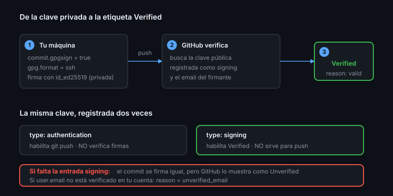

# Identidad y firmas

> `user.name` no demuestra nada: cualquiera puede poner tu nombre en un commit.
> Una firma sí.

## 🎯 Objetivos

- Explicar por qué la autoría de un commit no es una prueba de identidad
- Configurar commits firmados con tu clave SSH
- Conseguir la etiqueta `Verified` en GitHub
- Proteger tu email sin romper la atribución de commits

## 1. Qué problema resuelve

El autor de un commit es texto libre:

```bash
git -c user.name="Linus Torvalds" -c user.email="torvalds@linux-foundation.org" \
    commit --allow-empty -m "definitivamente escribí yo esto"
```

Ese commit se ve idéntico a uno real. Si lo empujas a un repo público, el avatar
y el nombre que GitHub muestra dependen únicamente del email. **La autoría es
una declaración, no una prueba.**

Una firma criptográfica sí es una prueba: solo quien tiene la clave privada pudo
generarla. Por eso los repos serios exigen commits firmados en `main` (lo
configuraremos con rulesets en la Semana 08) y por eso la cadena de suministro
de software empieza aquí.

## 2. Autoría vs. commit vs. firma

Un commit tiene **tres** identidades distintas:

| Campo | Quién es | Cambia con |
|-------|----------|------------|
| `author` | Quien escribió el cambio | `--author`, se conserva en rebase |
| `committer` | Quien creó este objeto commit | Se reescribe en cada rebase/cherry-pick |
| firma | Quien tiene la clave privada | Se pierde al reescribir, hay que refirmar |

```bash
git log -1 --format='autor: %an <%ae>%ncommitter: %cn <%ce>%nfirma: %G?'
```

`%G?` devuelve `G` (buena), `B` (mala), `U` (buena, confianza desconocida) o `N`
(sin firma).

## 3. Firmar con SSH (no hace falta GPG)

Desde Git 2.34 puedes firmar con la misma clave SSH que ya usas para empujar. Es
la vía corta: una clave, dos usos.

```bash
git config --global gpg.format ssh
git config --global user.signingkey ~/.ssh/id_ed25519.pub
git config --global commit.gpgsign true
git config --global tag.gpgsign true
```

Y en GitHub hay que registrar la clave **dos veces**:

```bash
gh ssh-key add ~/.ssh/id_ed25519.pub --title "laptop"
gh ssh-key add ~/.ssh/id_ed25519.pub --type signing --title "laptop (signing)"
```

> [!IMPORTANT]
> Una clave registrada como `authentication` **no** verifica firmas, y una
> registrada como `signing` **no** sirve para `git push`. Son dos entradas
> distintas con el mismo contenido. Es el error número uno al configurar esto:
> el commit se firma, pero GitHub lo muestra como `Unverified`.

Verificación:

```bash
git commit --allow-empty -m "chore: prueba de firma"
git push
gh api repos/{owner}/{repo}/commits --jq '.[0].commit.verification'
```

```json
{ "verified": true, "reason": "valid", "signature": "...", "payload": "..." }
```

### Verificar también en local

Para que `git log --show-signature` diga `Good signature` y no
`No principal matched`:

```bash
echo "tu-email@ejemplo.com $(cat ~/.ssh/id_ed25519.pub)" >> ~/.ssh/allowed_signers
git config --global gpg.ssh.allowedSignersFile ~/.ssh/allowed_signers
```

GitHub no usa ese archivo — verifica contra las claves de tu cuenta. Es solo
para tu terminal.

## 4. `Verified` vs `Verified (unverified)` vs `Partially verified`

| Etiqueta en GitHub | Qué significa |
|--------------------|---------------|
| **Verified** | Firma válida, clave registrada, email del firmante verificado en la cuenta |
| **Unverified** | Hay firma, pero la clave no está registrada o el email no coincide |
| *(sin etiqueta)* | Sin firma |
| **Partially verified** | Un merge donde algunos commits están firmados y otros no |

El caso de `Unverified` más frecuente: firmas con la clave correcta pero
`user.email` no es un email verificado de tu cuenta.

## 5. Email privado

Tu email queda en cada commit, público y para siempre. GitHub ofrece un alias:

`Settings → Emails → Keep my email addresses private` →
`158541050+tu-usuario@users.noreply.github.com`

```bash
git config --global user.email "158541050+tu-usuario@users.noreply.github.com"
```

Activa también **Block command line pushes that expose my email**: rechaza el
push antes de filtrarlo en vez de avisarte después.

> [!NOTE]
> El alias `noreply` cuenta como email verificado, así que los commits se
> atribuyen a tu perfil y pueden estar `Verified`. No pierdes nada.

Si ya filtraste tu email personal en un repo público: no hay marcha atrás
razonable — el commit está en clones y forks. Cambia a `noreply` de aquí en
adelante y sigue.

## 6. Antipatrones

| Antipatrón | Por qué duele | Qué hacer |
|------------|---------------|-----------|
| Clave SSH sin passphrase | Quien te robe el portátil firma como tú | Passphrase + `ssh-agent` |
| Subir la clave solo como `authentication` | Commits `Unverified` para siempre | Súbela también como `signing` |
| `user.email` con el correo de la universidad | Caduca y pierdes la atribución | Usa el `noreply` o uno permanente |
| Compartir una clave entre máquinas | No puedes revocar una sola | Una clave por dispositivo |
| Claves RSA de 2048 | Débiles y lentas | `ed25519` |
| Firmar todo pero no exigirlo en el repo | La firma es opcional = decorativa | Ruleset de commits firmados (Semana 08) |

## 7. Trucos

- **Ver si un commit está firmado sin salir de la terminal**:
  `git log --show-signature -1`
- **Firmar commits antiguos de tu rama**: `git rebase --exec 'git commit --amend --no-edit -S' -i main`
- **Una clave por máquina, nombrada**: el título de la clave en GitHub es lo
  único que verás cuando tengas que revocar una. `laptop-trabajo`, no `key1`
- **Comprobar qué claves tienes registradas**: `gh ssh-key list`
- **Rotar una clave**: crea la nueva, súbela (dos veces), prueba `ssh -T
  git@github.com`, y solo entonces borra la vieja con `gh ssh-key delete <id>`
- **Auditar si tus commits llegan firmados**:
  ```bash
  gh api repos/{owner}/{repo}/commits --jq '.[] | "\(.commit.verification.verified) \(.sha[0:7]) \(.commit.message | split("\n")[0])"'
  ```



## 📚 Recursos Adicionales

- [GitHub Docs — Firmar commits](https://docs.github.com/authentication/managing-commit-signature-verification/signing-commits)
- [GitHub Docs — Sobre la verificación de firmas](https://docs.github.com/authentication/managing-commit-signature-verification/about-commit-signature-verification)
- [`ssh-keygen` — documentación](https://man.openbsd.org/ssh-keygen)

## ✅ Checklist de Verificación

- [ ] `git log --show-signature -1` muestra una firma
- [ ] GitHub marca tu último commit como `Verified`
- [ ] `gh ssh-key list` muestra tu clave **dos veces** (auth y signing)
- [ ] Tu `user.email` es un email verificado de tu cuenta
- [ ] `commit.gpgsign` está en `true` de forma global
