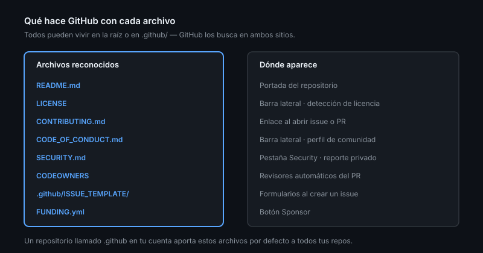

# Anatomía de un repositorio

> Diez segundos. Es lo que tarda alguien en decidir si tu repositorio merece la
> pena. Todo lo que decide en esos diez segundos es configurable.

## 🎯 Objetivos

- Enumerar los archivos que GitHub trata de forma especial y qué hace con cada uno
- Centralizar los archivos de comunidad con el repositorio `.github`
- Enrutar revisores con `CODEOWNERS`
- Configurar descripción, topics y los interruptores del repositorio
- Leer el *community profile* y saber qué le falta al tuyo

## 1. Qué problema resuelve

Un repositorio sin README es una carpeta. GitHub, encima, penaliza: no aparece en
las búsquedas por tema, no muestra nada en la portada y quien llega no sabe si el
proyecto está vivo.

La plataforma reconoce un conjunto de archivos **por su nombre** y les da
tratamiento especial. Conocerlos es la diferencia entre un repositorio que se
explica solo y uno que obliga a leer el código para entender qué hace.

## 2. Los archivos que GitHub trata especial

| Archivo | Dónde puede vivir | Qué hace GitHub con él |
|---------|-------------------|------------------------|
| `README.md` | raíz, `.github/`, `docs/` | Lo renderiza en la portada |
| `LICENSE` | raíz | Detecta la licencia y la muestra en la barra lateral |
| `CONTRIBUTING.md` | raíz, `.github/`, `docs/` | Enlace al abrir un issue o PR |
| `CODE_OF_CONDUCT.md` | ídem | Enlace en la barra lateral y en el perfil de comunidad |
| `SECURITY.md` | ídem | Pestaña *Security* → "Reporting a vulnerability" |
| `SUPPORT.md` | ídem | Enlace al abrir un issue |
| `GOVERNANCE.md` | ídem | Enlace en el perfil de comunidad |
| `FUNDING.yml` | `.github/` | Botón *Sponsor* |
| `CODEOWNERS` | raíz, `.github/`, `docs/` | Asigna revisores automáticamente |
| `.github/ISSUE_TEMPLATE/` | — | Plantillas y formularios de issue (Semana 03) |
| `PULL_REQUEST_TEMPLATE.md` | raíz, `.github/` | Precarga la descripción de cada PR |
| `CITATION.cff` | raíz | Botón "Cite this repository" |
| `.gitattributes` | raíz | EOL, `linguist`, diffs ([Teoría 05](05-gitignore-y-gitattributes.md)) |
| `.git-blame-ignore-revs` | raíz | Commits que `blame` ignora ([Teoría 07](07-blame-e-historia.md)) |



El orden de búsqueda es siempre el mismo: **raíz → `.github/` → `docs/`**. Gana el
primero que aparece. La convención más limpia es dejar en la raíz solo `README`,
`LICENSE` y los archivos que la gente espera ahí, y meter el resto en `.github/`.

## 3. El repositorio `.github` de tu cuenta

Un repositorio **público** llamado exactamente `.github` en tu usuario u
organización actúa como plantilla por defecto: cualquier repo tuyo que no tenga
`CONTRIBUTING.md`, `CODE_OF_CONDUCT.md`, `SECURITY.md`, `SUPPORT.md`,
`FUNDING.yml` o plantillas de issue y PR **hereda los de ahí**.

```
.github/                     ← el repositorio, no la carpeta
├── profile/README.md        ← lo que se ve en tu perfil de organización
├── CONTRIBUTING.md
├── CODE_OF_CONDUCT.md
├── SECURITY.md
└── ISSUE_TEMPLATE/
    ├── bug.yml
    └── config.yml
```

Se escribe una vez y sirve para veinte repositorios. Dos detalles:

- La herencia es **para mostrar**, no para clonar: los archivos heredados no
  aparecen en un `git clone` del repo hijo
- Un archivo propio en el repositorio **siempre** gana al heredado

> [!TIP]
> Un repositorio con el nombre exacto de tu usuario (`tu-usuario/tu-usuario`) y
> un `README.md` dentro se convierte en la portada de tu perfil. Es el mismo
> mecanismo, otra ranura.

## 4. `CODEOWNERS`: enrutar revisores

Enruta revisores por ruta. Vive en la raíz, en `.github/` o en `docs/`.

```
# Dueños por defecto de todo el repo
*                   @tu-usuario

# Por área
/src/reglas/        @tu-usuario @otra-persona
/.github/workflows/ @equipo-plataforma
/docs/              @equipo-docs

# Por extensión
*.sql               @equipo-datos
```

Las tres reglas que se olvidan:

- Gana la **última** regla que coincide, no la más específica. El orden importa,
  y por eso el patrón general va arriba
- Los equipos se escriben `@org/equipo` y **necesitan acceso de escritura** al
  repositorio, o la regla se ignora en silencio
- Sin un ruleset que exija revisión de code owners, `CODEOWNERS` es solo una
  sugerencia: reparte revisores, no bloquea nada. Se vuelve obligatorio en la
  Semana 08, y se lleva a escala en la Semana 07

```bash
gh api repos/{owner}/{repo}/codeowners/errors --jq '.errors'
```

Ese endpoint es la única forma fiable de saber que tu `CODEOWNERS` funciona: un
usuario mal escrito no produce ningún error visible en la interfaz.

## 5. Metadatos: descripción, topics y la barra lateral

```bash
gh repo edit --description "Gestión de préstamos de biblioteca — API y reglas de negocio"
gh repo edit --add-topic biblioteca --add-topic typescript --add-topic api-rest
gh repo edit --homepage "https://tu-usuario.github.io/tu-repo"
```

Los **topics** son cómo te encuentra la gente: son el índice de GitHub. Tres a
seis, específicos. `javascript` no distingue tu repo de otros dos millones.

La descripción se lee en los resultados de búsqueda y en cada tarjeta: es tu única
frase de venta, y cabe en unos 350 caracteres.

En la barra lateral también se configuran, desde el engranaje de *About*: la web
del proyecto, los releases, los paquetes y si se muestran los topics.

## 6. Los interruptores del repositorio

`Settings` tiene una lista larga y casi nadie la revisa entera. Los que importan:

| Ajuste | Por qué te afecta |
|--------|-------------------|
| **Default branch** | `main`. Renombrarla después redirige, pero rompe scripts y CI |
| **Template repository** | Convierte el repo en plantilla: `gh repo create --template` |
| **Issues / Wiki / Projects / Discussions** | Apaga lo que no uses: cada pestaña vacía es una promesa incumplida |
| **Allow forking** | En privados, decide si alguien puede sacarse una copia |
| **Merge button** | Qué estrategias permites (Semana 06) |
| **Automatically delete head branches** | Ramas muertas que se limpian solas |
| **Social preview** | La imagen que se ve al compartir el enlace |
| **Archive this repository** | Solo lectura, con banner. La forma honesta de jubilar un proyecto |
| **Visibility** | Público ↔ privado. Al pasar a público, la historia entera se hace pública |

```bash
gh repo edit --enable-wiki=false --enable-projects=false --delete-branch-on-merge
gh api repos/{owner}/{repo} --jq '{plantilla: .is_template, archivado: .archived, rama: .default_branch}'
```

> [!WARNING]
> Pasar un repositorio de privado a público publica **toda su historia**, no solo
> el estado actual. Cualquier secreto commiteado alguna vez queda expuesto, aunque
> se borrara después. Antes de hacer público un repo con pasado: revisa la
> historia y **revoca** lo que aparezca ([Semana 01, Teoría 07](../../week-01-git_repaso_y_setup_pro/1-teoria/07-credenciales-y-tokens.md)).

## 7. El community profile

`Insights → Community Standards` puntúa la presencia de README, LICENSE,
CONTRIBUTING, CODE_OF_CONDUCT, plantillas de issue y de PR.

```bash
gh api repos/{owner}/{repo}/community/profile \
  --jq '{salud: .health_percentage, faltan: [.files | to_entries[] | select(.value == null) | .key]}'
```

No es una métrica de calidad del código; es una lista de comprobación de si tu
proyecto está listo para que alguien de fuera participe. Llegar al 100% cuesta
media hora y evita la mitad de las preguntas repetidas.

## 8. Antipatrones

| Antipatrón | Por qué duele | Qué hacer |
|------------|---------------|-----------|
| Sin LICENSE | Legalmente nadie puede usar tu código | Elige una ([Teoría 04](04-licencias.md)) |
| Topics genéricos (`web`, `app`) | No te encuentra nadie | Específicos y de dominio |
| Wiki y Discussions activados y vacíos | Pestañas muertas que dan sensación de abandono | Apágalos hasta que los uses |
| Quince archivos de comunidad en la raíz | La raíz se vuelve ilegible | `.github/` para casi todos |
| Copiar `CONTRIBUTING.md` en cada repo | Veinte copias que divergen | Repositorio `.github` de la cuenta |
| `CODEOWNERS` con usuarios sin acceso | Se ignora en silencio | Endpoint de `codeowners/errors` |
| Borrar un repositorio para "jubilarlo" | Rompes enlaces, forks y citas | `Archive` |
| Hacer público sin revisar la historia | Publicas todos los secretos que hubo | Revisa y revoca antes |

## 9. Trucos

- **Auditar tu comunidad en una línea**:
  `gh api repos/{owner}/{repo}/community/profile --jq .health_percentage`
- **README por carpeta**: GitHub renderiza el `README.md` de cada directorio.
  Úsalo para explicar carpetas grandes en su sitio
- **Plantilla de repositorio**: `gh repo create nuevo --template OWNER/PLANTILLA`
  crea un repo con los archivos pero **sin la historia** — es lo que quieres para
  un andamiaje
- **Ver la configuración completa sin abrir Settings**:
  `gh api repos/{owner}/{repo} | jq 'del(.owner, .permissions)'`
- **Comprobar de dónde sale un archivo heredado**: si no está en tu repo y aparece
  en la interfaz, viene de tu repositorio `.github`
- **`CITATION.cff`** convierte tu repo en algo citable en un paper con un clic;
  cuesta ocho líneas de YAML

## 📚 Recursos Adicionales

- [GitHub Docs — Community health files](https://docs.github.com/communities/setting-up-your-project-for-healthy-contributions/creating-a-default-community-health-file)
- [GitHub Docs — About CODEOWNERS](https://docs.github.com/repositories/managing-your-repositorys-settings-and-features/customizing-your-repository/about-code-owners)
- [GitHub Docs — Repository settings](https://docs.github.com/repositories/managing-your-repositorys-settings-and-features)
- [GitHub Docs — About CITATION files](https://docs.github.com/repositories/managing-your-repositorys-settings-and-features/customizing-your-repository/about-citation-files)

## ✅ Checklist de Verificación

- [ ] Tu repositorio tiene descripción y 3+ topics específicos
- [ ] `community/profile` devuelve 100
- [ ] Sabes en qué tres sitios puede vivir `CONTRIBUTING.md` y cuál gana
- [ ] `codeowners/errors` devuelve una lista vacía
- [ ] Has apagado las pestañas que tu proyecto no usa
