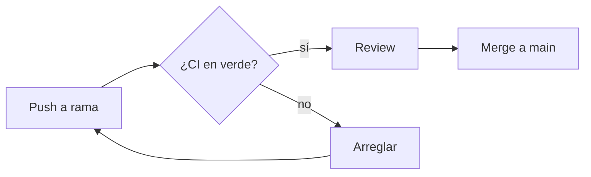
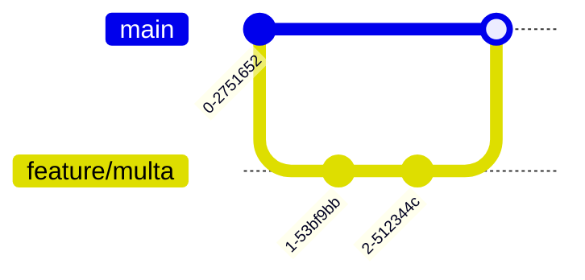

# Markdown GFM a fondo

> GitHub Flavored Markdown hace bastante más que negritas y listas. La mitad de
> lo que la gente resuelve con capturas se puede escribir en texto.

## 🎯 Objetivos

- Usar alerts, colapsables, footnotes y tablas alineadas
- Dibujar diagramas con Mermaid sin generar imágenes
- Enlazar código de forma permanente
- Saber qué se renderiza en GitHub y qué no

## 1. Qué problema resuelve

La documentación que se escribe en Markdown se versiona, se revisa en un PR y se
busca. La que vive en una imagen, no. Cada diagrama que puedas escribir en texto
es un diagrama que seguirá actualizado dentro de un año.

## 2. Alerts

```markdown
> [!NOTE]
> Información que el lector debería saber.

> [!TIP]
> Un atajo o una forma mejor de hacerlo.

> [!IMPORTANT]
> Necesario para que lo que sigue funcione.

> [!WARNING]
> Riesgo de romper algo si se ignora.

> [!CAUTION]
> Consecuencias graves: pérdida de datos, seguridad.
```

Se renderizan con color e icono. Reglas: uno por idea, nunca dos seguidos, y la
severidad de verdad — si todo es `WARNING`, nada lo es.

## 3. Diagramas con Mermaid

Un bloque de código con lenguaje `mermaid` se renderiza como diagrama:

````markdown

````

Tipos disponibles: `flowchart`, `sequenceDiagram`, `stateDiagram-v2`,
`erDiagram`, `gantt`, `classDiagram`, `gitGraph`.

`gitGraph` es especialmente útil para documentar tu estrategia de ramas:

````markdown

````

> [!TIP]
> Mermaid se renderiza en READMEs, issues, PRs, discussions y wikis. También en
> los artifacts publicados, así que sirve igual para documentación interna.

## 4. Colapsables

```markdown
<details>
<summary><strong>Ver la salida completa</strong></summary>

```json
{ "mucho": "json" }
```

</details>
```

Para logs largos, respuestas de API y soluciones de ejercicios. Deja la línea en
blanco después de `<summary>` o el Markdown de dentro no se renderiza.

## 5. Enlaces permanentes a código

Tres formas, de peor a mejor:

1. Pegar el código en el mensaje → envejece mal
2. Enlazar `blob/main/src/index.ts#L10` → se rompe al cambiar el archivo
3. Enlazar por SHA → nunca se rompe

Pulsa `y` mirando el archivo: GitHub cambia la rama por el SHA del commit. Si
pegas esa URL en un issue o PR, GitHub **incrusta el fragmento de código**
directamente en el comentario.

## 6. Otros elementos útiles

| Elemento | Sintaxis |
|----------|----------|
| Tarea | `- [ ] pendiente` / `- [x] hecha` |
| Footnote | `texto[^1]` y `[^1]: la nota` |
| Tachado | `~~texto~~` |
| Subíndice / superíndice | `<sub>x</sub>` / `<sup>2</sup>` |
| Fórmula | `$E = mc^2$` en línea, `$$...$$` en bloque |
| Mención de issue | `#12` |
| Mención de commit | pegar el SHA |
| Mención de usuario | `@usuario` |
| Alineación en tablas | `\|:---\|:---:\|---:\|` |
| Emoji | `:rocket:` |

Las **tasklists** dentro de un issue se convierten en barra de progreso
automáticamente.

## 7. Antipatrones

| Antipatrón | Por qué duele | Qué hacer |
|------------|---------------|-----------|
| Capturas de código | No se busca, no se copia, no se actualiza | Bloque de código o permalink |
| Diagramas en PNG hechos a mano | Cambia el sistema y el diagrama miente | Mermaid, versionado con el código |
| Bloques sin lenguaje | Sin resaltado y sin pistas al lector | ` ```bash `, ` ```yaml `, ` ```ts ` |
| Todo en `WARNING` | Se pierde la señal | Usa la severidad real |
| Tablas de 12 columnas | Ilegibles en móvil | Divide o usa lista de definiciones |
| HTML donde hay Markdown | Más ruido, peor diff | HTML solo para `<details>`, `<sub>`, `` con tamaño |

## 8. Trucos

- **Ver el crudo de cualquier `.md`**: `?plain=1`
- **Índice automático**: el icono de lista junto al título del archivo genera la
  tabla de contenidos
- **Arrastrar imágenes**: suéltalas en la caja de comentario; GitHub las sube y
  pone la URL. No van a tu repo, así que no lo engordan
- **Ancho de imagen sin CSS**: ``
- **Pegar un enlace sobre texto seleccionado** en la caja de comentarios crea el
  enlace Markdown directamente
- **Vista previa con diff**: en la pestaña *Preview* de un editor de archivo,
  el desplegable ofrece "Preview changes"
- **Sangría en listas anidadas**: 2 espacios en GFM, no 4

## 📚 Recursos Adicionales

- [GitHub Docs — Basic writing and formatting syntax](https://docs.github.com/get-started/writing-on-github)
- [GitHub Docs — Diagramas Mermaid](https://docs.github.com/get-started/writing-on-github/working-with-advanced-formatting/creating-diagrams)
- [Mermaid — documentación](https://mermaid.js.org/intro/)

## ✅ Checklist de Verificación

- [ ] Tu README tiene al menos un diagrama Mermaid que se renderiza
- [ ] Has usado un alert con la severidad correcta
- [ ] Sabes generar un permalink con `y` y pegarlo para que se incruste
- [ ] Todos tus bloques de código declaran lenguaje
