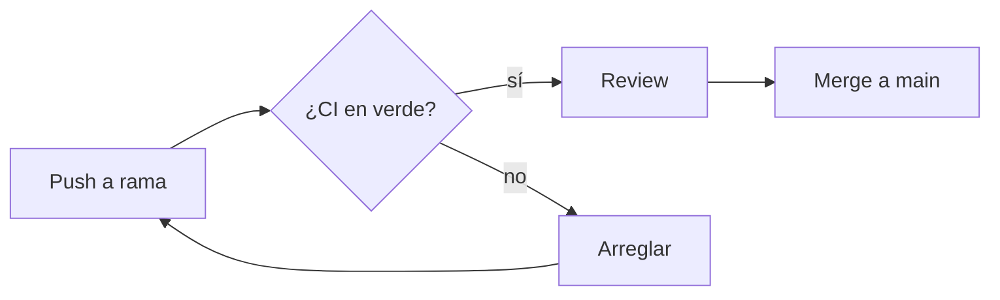
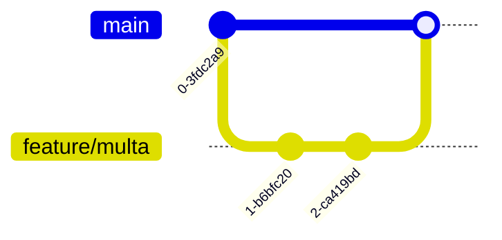

# Markdown GFM a fondo

> GitHub Flavored Markdown hace bastante más que negritas y listas. La mitad de
> lo que la gente resuelve con capturas se puede escribir en texto — y el texto
> se busca, se revisa en un PR y se actualiza.

## 🎯 Objetivos

- Usar alerts, colapsables, footnotes, tasklists y tablas con criterio
- Dibujar diagramas con Mermaid sin generar imágenes
- Enlazar código de forma permanente y que GitHub lo incruste
- Saber qué HTML sobrevive al sanitizador y cuál no
- Distinguir qué se renderiza en GitHub y qué solo en Pages

## 1. Qué problema resuelve

La documentación escrita en Markdown se versiona, se revisa en un PR y se busca.
La que vive en una imagen, no. Cada diagrama que puedas escribir en texto es un
diagrama que seguirá siendo cierto dentro de un año, porque quien cambie el
sistema verá el diagrama en su propio diff.

## 2. Alerts

```markdown
> [!NOTE]
> Información que el lector debería saber.

> [!TIP]
> Un atajo o una forma mejor de hacerlo.

> [!IMPORTANT]
> Necesario para que lo que sigue funcione.

> [!WARNING]
> Riesgo de romper algo si se ignora.

> [!CAUTION]
> Consecuencias graves: pérdida de datos, seguridad.
```

Se renderizan con color e icono. Reglas de uso: uno por idea, nunca dos seguidos,
y la severidad de verdad — si todo es `WARNING`, nada lo es.

Detalles que fallan la primera vez: el marcador va **solo en la primera línea**
de la cita, el resto del bloque lleva `>` normal, y los alerts **no se anidan**
dentro de listas ni de otros alerts.

## 3. Diagramas con Mermaid

Un bloque de código con lenguaje `mermaid` se renderiza como diagrama:

````markdown

````

Tipos disponibles: `flowchart`, `sequenceDiagram`, `stateDiagram-v2`,
`erDiagram`, `gantt`, `classDiagram`, `gitGraph`, `journey`, `pie`, `mindmap`.

`gitGraph` es especialmente útil para documentar tu estrategia de ramas
(Semana 07):

````markdown

````

Tres cosas que conviene saber antes de meter Mermaid en todas partes:

- Se renderiza en READMEs, issues, PRs, discussions y wikis
- Si la sintaxis está mal, GitHub muestra un error en el sitio del diagrama: **no
  se ve el bloque de código**, se ve el fallo. Previsualiza antes de mergear
- Un diagrama con treinta nodos no lo lee nadie. Cuando pase de doce, divídelo o
  pásate a un SVG hecho a propósito

## 4. Colapsables

```markdown
<details>
<summary><strong>Ver la salida completa</strong></summary>

```json
{ "mucho": "json" }
```

</details>
```

Para logs largos, respuestas de API y soluciones de ejercicios. Dos reglas: deja
una **línea en blanco** después de `<summary>` o el Markdown de dentro no se
renderiza, y añade `open` (`<details open>`) si quieres que empiece desplegado.

## 5. Enlaces permanentes a código

Tres formas, de peor a mejor:

1. Pegar el código en el mensaje → envejece mal y no se puede seguir
2. Enlazar `blob/main/src/index.ts#L10` → se rompe en cuanto cambia el archivo
3. Enlazar **por SHA** → nunca se rompe

Pulsa `y` mirando el archivo: GitHub cambia la rama por el SHA del commit. Si
pegas esa URL en un issue o PR, GitHub **incrusta el fragmento de código**
directamente en el comentario, con su resaltado y su enlace.

```
https://github.com/OWNER/REPO/blob/<sha>/src/multa.ts#L10-L20
```

Y para enlaces dentro del propio repositorio, **relativos**: `../docs/setup.md`
funciona en la web, en los forks y en cualquier rama.

## 6. Elementos que se usan menos de lo que deberían

| Elemento | Sintaxis | Nota |
|----------|----------|------|
| Tarea | `- [ ] pendiente` / `- [x] hecha` | En un issue se convierte en barra de progreso |
| Footnote | `texto[^1]` y `[^1]: la nota` | Se renumeran solas y enlazan en los dos sentidos |
| Tachado | `~~texto~~` | |
| Subíndice / superíndice | `<sub>x</sub>` / `<sup>2</sup>` | |
| Fórmula | `$E = mc^2$` en línea, `$$…$$` en bloque | LaTeX vía MathJax |
| Tecla | `<kbd>Ctrl</kbd> + <kbd>C</kbd>` | Para documentar atajos |
| Mención de issue o PR | `#12`, `OWNER/REPO#12` | Cruza repositorios |
| Mención de commit | pegar el SHA | Se acorta y enlaza solo |
| Alineación en tablas | `\|:---\|:---:\|---:\|` | Izquierda, centro, derecha |
| Emoji | `:rocket:` | |
| Enlace a un encabezado | `[ver](#3-diagramas-con-mermaid)` | Minúsculas, guiones, sin acentos ni signos |

### Bloques de código

El lenguaje del bloque no es decoración: activa el resaltado y, en los lenguajes
soportados, la navegación por símbolos. Dos que se olvidan:

````markdown
```diff
- const tarifa = 0.5;
+ const tarifa = 0.75;
```
````

`diff` pinta en rojo y verde cualquier explicación de un cambio — perfecto para
un CONTRIBUTING o una guía de migración. Y para mostrar un bloque de Markdown
dentro de otro (como en este archivo), se usan **cuatro** acentos graves.

## 7. Qué HTML sobrevive

GitHub sanitiza el HTML de los archivos Markdown: se queda con el marcado
estructural y tira todo lo activo.

| Sobrevive | No sobrevive |
|-----------|--------------|
| `<details>`, `<summary>`, `<sub>`, `<sup>`, `<kbd>` | `<script>`, `<style>`, `<iframe>`, `<form>` |
| `` con `width`, `height`, `align` | Atributos `on*` (`onclick`…) |
| `<picture>` con `prefers-color-scheme` | CSS propio, clases con estilo |
| Tablas HTML | Cualquier cosa que ejecute código |

Regla práctica: **HTML solo donde el Markdown no llega** (colapsables, tamaño de
imagen, imagen por tema). Todo lo demás en Markdown, porque el diff se lee mejor.

> [!NOTE]
> Un frontmatter YAML al principio del archivo (`---` … `---`) se muestra como
> una tabla en la vista de GitHub, y solo lo interpreta un generador de sitios
> como Jekyll. No lo pongas "por si acaso".

## 8. Antipatrones

| Antipatrón | Por qué duele | Qué hacer |
|------------|---------------|-----------|
| Capturas de código | No se busca, no se copia, no se actualiza | Bloque de código o permalink |
| Diagramas en PNG hechos a mano | Cambia el sistema y el diagrama miente | Mermaid, versionado con el código |
| Bloques sin lenguaje | Sin resaltado y sin pistas al lector | ` ```bash `, ` ```yaml `, ` ```ts ` |
| Todo en `WARNING` | Se pierde la señal | Usa la severidad real |
| Tablas de 12 columnas | Ilegibles en móvil | Divide, o usa una lista |
| HTML donde hay Markdown | Más ruido y peor diff | Solo lo que el Markdown no cubre |
| Enlazar código por rama | El enlace apunta a otra línea en un mes | Permalink por SHA (`y`) |
| Mermaid de treinta nodos | Nadie lo lee y no cabe | Divídelo o usa un SVG |

## 9. Trucos

- **Ver el crudo de cualquier `.md`**: `?plain=1` al final de la URL
- **Índice automático**: el icono de lista junto al título del archivo genera la
  tabla de contenidos, sin mantenerla a mano
- **Arrastrar imágenes**: suéltalas en la caja de comentario; GitHub las sube a su
  CDN y pone la URL. No van a tu repositorio, así que no lo engordan
- **Ancho de imagen sin CSS**: ``
- **Pegar un enlace sobre texto seleccionado** en la caja de comentarios crea el
  enlace Markdown ya montado
- **Editar en el navegador con editor completo**: pulsa `.` en cualquier
  repositorio y se abre `github.dev`
- **Sangría de listas anidadas**: 2 espacios en GFM, no 4
- **Salto de línea sin párrafo nuevo**: dos espacios al final, o `<br>` si te
  molesta el espacio invisible en el diff

## 📚 Recursos Adicionales

- [GitHub Docs — Basic writing and formatting syntax](https://docs.github.com/get-started/writing-on-github)
- [GitHub Docs — Diagramas Mermaid](https://docs.github.com/get-started/writing-on-github/working-with-advanced-formatting/creating-diagrams)
- [GitHub Docs — Fórmulas matemáticas](https://docs.github.com/get-started/writing-on-github/working-with-advanced-formatting/writing-mathematical-expressions)
- [Mermaid — documentación](https://mermaid.js.org/intro/)

## ✅ Checklist de Verificación

- [ ] Tu README tiene al menos un diagrama Mermaid que se renderiza
- [ ] Has usado un alert con la severidad correcta
- [ ] Sabes generar un permalink con `y` y pegarlo para que se incruste
- [ ] Todos tus bloques de código declaran lenguaje
- [ ] Sabes qué HTML se queda por el camino y por qué
