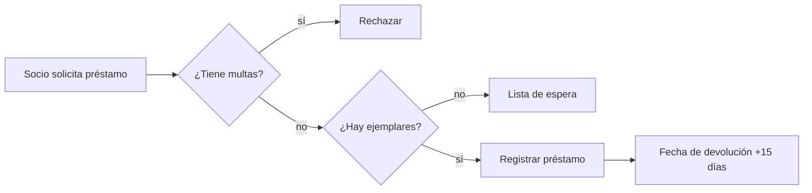
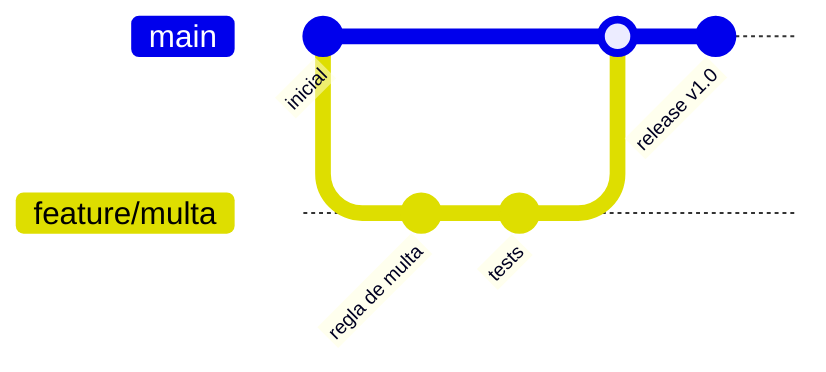

# Práctica 03 — Markdown avanzado

> Un diagrama que se versiona, avisos con la severidad correcta y enlaces a
> código que no se rompen nunca.

**Duración estimada**: 40 min
**Prerrequisitos**: [Teoría 02](../1-teoria/02-markdown-gfm.md)

## Contexto

La documentación que envejece peor es la que vive fuera del repositorio: una
captura de un diagrama que ya no es cierto, un enlace a una línea que se movió.
Todo eso se arregla escribiendo en texto.

## Paso 1: Un diagrama Mermaid de tu dominio

**Por qué**: un diagrama en Markdown se revisa en el PR igual que el código.

Añade a tu `README.md`, en la sección "Cómo se ve":

````markdown

````

Adáptalo a **tu** dominio: el flujo de una reserva, de una venta, de una cita.

**Verifica**:

```bash
git add README.md && git commit -qm "docs: añade diagrama de flujo del dominio" && git push -q
gh browse README.md
```

El diagrama debe renderizarse en la página, no aparecer como bloque de código.

## Paso 2: El grafo de ramas con `gitGraph`

**Por qué**: documenta tu estrategia de ramas sin dibujarla en una herramienta
externa.

Añade a `CONTRIBUTING.md`:

````markdown

````

**Verifica**: se renderiza en GitHub.

## Paso 3: Alerts con la severidad correcta

**Por qué**: si todo es una advertencia, nada lo es.

Añade cada uno **una sola vez**, donde de verdad corresponda:

```markdown
> [!NOTE]
> Las reglas de negocio están en `src/`, sin capa de base de datos todavía.

> [!TIP]
> `node --test` ejecuta los tests sin instalar nada.

> [!WARNING]
> Los importes están en centavos. Pasar euros produce multas 100 veces mayores.
```

**Verifica**: los tres se ven con color e icono distintos.

## Paso 4: Un colapsable para lo largo

**Por qué**: los bloques largos entierran lo importante.

```markdown
<details>
<summary><strong>Salida completa de <code>node src/index.js</code></strong></summary>

\`\`\`text
...
\`\`\`

</details>
```

> [!IMPORTANT]
> Deja una línea en blanco después de `</summary>` o el Markdown de dentro no se
> renderiza. Es el fallo más común con `<details>`.

**Verifica**: el bloque aparece plegado y se abre al hacer clic.

## Paso 5: Permalinks a código

**Por qué**: un enlace a una rama apunta a otra línea en cuanto alguien edita el
archivo.

1. Abre `src/index.js` en GitHub
2. Haz clic en el número de la primera línea de tu función y `Shift`+clic en la última
3. Pulsa `y` — la URL cambia de `blob/main/...` a `blob/<sha>/...`
4. Copia esa URL

Crea un issue y pega el enlace:

```bash
gh issue create --title "Revisar la regla de cálculo" \
  --body "La regla actual está aquí: <pega-la-URL-con-SHA>"
```

**Verifica**: en el issue, GitHub incrusta el fragmento de código con su
resaltado, no solo el enlace.

## Paso 6: Tabla de contenidos e índice

**Por qué**: un README largo sin índice no se navega.

GitHub genera el índice automáticamente a partir de los encabezados: el icono de
lista junto al nombre del archivo. Para que funcione bien:

- Un solo `#` de nivel 1 por documento
- Sin saltos de nivel (`##` seguido de `####`)
- Encabezados descriptivos, no `Notas` ni `Otros`

**Verifica**: abre el README en GitHub y despliega el índice — la jerarquía debe
tener sentido.

## ✅ Resultado

- [ ] Un diagrama `flowchart` de tu dominio renderizando en el README
- [ ] Un `gitGraph` en `CONTRIBUTING.md`
- [ ] Tres alerts con severidades distintas y justificadas
- [ ] Un bloque `<details>` que se abre correctamente
- [ ] Un issue con un permalink incrustado por SHA
- [ ] El índice automático refleja una jerarquía coherente

## 🧯 Si algo sale mal

| Síntoma | Causa | Solución |
|---------|-------|----------|
| Mermaid se ve como bloque de código | El lenguaje no es exactamente `mermaid` | Revisa la palabra tras las tres comillas |
| Mermaid da error de sintaxis | Acentos o caracteres especiales sin comillas | Entrecomilla el texto de los nodos |
| El alert sale como cita normal | Falta el `>` en la segunda línea, o el tipo está mal escrito | Los cinco válidos son NOTE, TIP, IMPORTANT, WARNING, CAUTION |
| El contenido de `<details>` no se formatea | Falta la línea en blanco tras `</summary>` | Añádela |
| El permalink no incrusta el código | Es un enlace a rama, no a SHA | Pulsa `y` antes de copiar |
