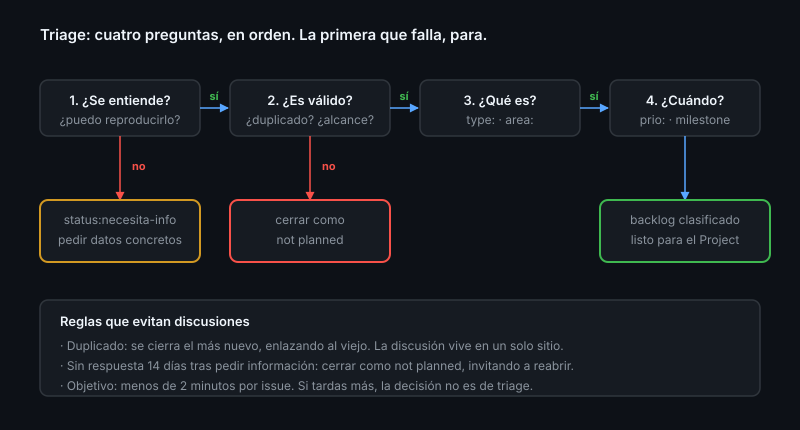

# El proceso de triage

> El triage no es "leer los issues nuevos": es un proceso con reglas escritas,
> que se hace en veinte minutos a la semana y cuya salida es un backlog en el que
> se puede confiar.

## 🎯 Objetivos

- Ejecutar una sesión de triage con criterios explícitos y tiempo acotado
- Separar las dos decisiones que importan: ¿es válido? y ¿lo vamos a hacer?
- Usar respuestas guardadas para lo repetitivo sin sonar a robot
- Decidir qué se automatiza y qué no se automatiza nunca
- Medir si tu triage funciona

## 1. Qué problema resuelve

Sin proceso pasa una de dos cosas: o los issues se ignoran —y la gente deja de
reportar—, o se responden en caliente sin criterio —y el backlog se llena de
cosas que nadie va a hacer—.

Un backlog en el que no se confía es peor que no tenerlo: nadie lo consulta para
decidir, y las decisiones se toman por quien grita más fuerte.

## 2. Las cuatro preguntas

En orden. En cuanto una falla, se para: no se sigue clasificando algo que no va a
existir.

```
1. ¿Se entiende?     → no: pedir información, label status:necesita-info
2. ¿Es válido?       → no: cerrar (duplicado, fuera de alcance, no reproducible)
3. ¿Qué es?          → labels de tipo y área, issue type
4. ¿Cuándo?          → prioridad + milestone, o backlog sin milestone
```



**Tiempo objetivo: menos de dos minutos por issue.** Si tardas más, o el issue
está mal escrito (se arregla con el formulario, [Teoría 02](02-issue-forms-yaml.md))
o la decisión no es de triage y hay que sacarla del proceso.

### Reglas que evitan discusiones

Escríbelas en `CONTRIBUTING.md` y deja de negociarlas caso a caso:

| Situación | Regla |
|-----------|-------|
| Duplicado | Se cierra el **más nuevo** enlazando al viejo; la discusión vive en uno solo |
| Sin respuesta 14 días tras pedir información | Se cierra como *not planned*, invitando a reabrir con los datos |
| No reproducible con los datos dados | Se pide una reproducción mínima; sin ella, se cierra |
| Petición fuera del alcance | Se cierra explicando qué **sí** cubre el proyecto |
| Nadie lo va a hacer en el horizonte previsible | Se cierra. Un backlog honesto vale más que uno largo |

Cerrar no es un castigo, y conviene decirlo en la propia respuesta: un issue
cerrado sigue siendo buscable, se puede reabrir y sirve de referencia al
siguiente que reporte lo mismo.

## 3. La sesión

Una franja fija a la semana, con la lista de consultas de la
[Teoría 06](06-consultas-y-bandeja.md) abierta en pestañas:

1. **Sin triar** (`no:label sort:created-asc`) — de arriba abajo, sin saltarse
   ninguno
2. **Esperando información** — cerrar los que pasaron de plazo
3. **Abandonados** (`updated:<60 días`) — ¿sigue teniendo sentido?
4. **Más votados** (`sort:reactions-+1-desc`) — ¿coincide con tu prioridad?

Lo que sale de la sesión: cada issue tocado tiene tipo, área, prioridad y
milestone (o está cerrado). Nada queda "para mirarlo luego".

> [!TIP]
> Trocea: veinte minutos cada semana funcionan; tres horas cada dos meses, no.
> El triage acumulado se convierte en una tarea que nadie quiere empezar.

## 4. Respuestas guardadas

Las mismas cuatro respuestas se escriben mil veces. `Settings → Saved replies`, y
se insertan con `Ctrl` + `.` en cualquier caja de comentario.

Las que valen la pena tener:

- **Falta información**: qué datos concretos hacen falta y por qué
- **Duplicado**: enlace al original y por qué se cierra este
- **Fuera de alcance**: qué sí cubre el proyecto y dónde seguir la conversación
- **Bienvenida a primera contribución**: enlace a `CONTRIBUTING.md`

Son globales de tu cuenta, no del repositorio: se escriben una vez y sirven en
todos. Dos advertencias: personaliza siempre la primera línea —una respuesta
íntegramente enlatada se nota y desanima—, y nunca uses una para cerrar algo que
alguien se ha tomado la molestia de argumentar.

## 5. Qué automatizar y qué no

| Automatizable | Manual, siempre |
|---------------|-----------------|
| Etiquetar por la ruta modificada | Decidir la prioridad |
| Añadir al Project al abrirse | Decidir si es duplicado |
| Poner `status:triage` al crear | Valorar si la información recibida basta |
| Avisar de inactividad a los 60 días | Cerrar algo que alguien pidió con argumentos |
| Agradecer una primera contribución | Responder a un caso ambiguo |
| Recordar al asignado que lleva 30 días parado | Reasignar a otra persona |

La línea es simple: **se automatiza mover y clasificar; no se automatiza
decidir**.

> [!WARNING]
> Cerrar issues automáticamente por inactividad es la automatización que más
> comunidad ha destruido en el open source. Si la usas: que avise antes, que dé
> plazo largo (60-90 días), que excluya lo priorizado y lo que tenga label de
> `bug` confirmado, y que el mensaje no suene a máquina. El bot de triage se
> construye en la Semana 16; el criterio de qué delegarle se decide ahora.

## 6. Medir si funciona

Tres números, y ninguno es "issues abiertos":

| Métrica | Cómo se lee |
|---------|-------------|
| **Tiempo hasta el primer triage** | Cuánto tarda un issue nuevo en recibir label. Si pasa de una semana, la gente deja de reportar |
| **Porcentaje sin triar** | `no:label` sobre el total de abiertos. Debería tender a cero cada semana |
| **Tasa de cierre como *not planned*** | Si es 0 %, no estás decidiendo; si es 80 %, tus plantillas atraen lo que no quieres |

```bash
gh issue list --search "is:open no:label" --json number --jq 'length'
gh issue list --state closed --limit 100 --json number,stateReason \
  --jq '[.[] | .stateReason] | group_by(.) | map({razon: .[0], n: length})'
```

Las métricas de flujo completas (lead time, throughput) llegan en la Semana 05;
estas tres son las que dependen solo de ti.

## 7. Antipatrones

| Antipatrón | Por qué duele | Qué hacer |
|------------|---------------|-----------|
| Dejar issues sin responder semanas | La gente deja de reportar | Sesión fija semanal |
| Responder sin etiquetar | El issue vuelve a la pila de "sin triar" | Responder y clasificar en el mismo gesto |
| Backlog infinito "por si acaso" | Esconde lo que sí importa | Cierra lo que no vas a hacer |
| Prioridad decidida por quien grita más | El backlog deja de reflejar valor | Criterio escrito en `CONTRIBUTING.md` |
| Bot de *stale* agresivo | Cierra cosas importantes y quema a la comunidad | Plazos largos y excepciones por label |
| Discutir el diseño durante el triage | La sesión de 20 minutos se va a dos horas | Etiqueta `status:necesita-diseño` y sigue |
| Triar solo lo que llega, nunca lo viejo | El fondo del backlog se pudre | Una consulta de abandonados por sesión |
| Cerrar sin explicar | Se percibe como desprecio y vuelve como otro issue | Una frase con el motivo y la puerta abierta |

## 8. Trucos

- **Cerrar como *not planned* desde la terminal**:
  ```bash
  gh issue close 42 --reason "not planned" --comment "Duplicado de #12"
  ```
- **Etiquetar y asignar en un gesto**:
  `gh issue edit 42 --add-label "type:bug,prio:media" --milestone "v1.0"`
- **Edición múltiple en la interfaz**: marca varios issues en la lista y usa la
  barra superior (labels, milestone, assignee, cerrar)
- **Reacciones como señal de demanda**: `sort:reactions-+1-desc` es más honesto
  que el volumen de comentarios, donde tres personas parecen veinte
- **Plantilla de respuesta con hueco**: deja `<!-- por qué -->` en la respuesta
  guardada para acordarte de personalizarla
- **Triage de dos personas**: media hora en pareja una vez al mes calibra
  criterios mucho mejor que cualquier documento
- **La consulta que cierra la sesión**: `is:open no:label` debe devolver cero

## 📚 Recursos Adicionales

- [GitHub Docs — Saved replies](https://docs.github.com/get-started/writing-on-github/working-with-saved-replies/about-saved-replies)
- [GitHub Docs — Managing disruptive comments](https://docs.github.com/communities/moderating-comments-and-conversations/managing-disruptive-comments)
- [Open Source Guides — Best practices for maintainers](https://opensource.guide/best-practices/)

## ✅ Checklist de Verificación

- [ ] Tienes las reglas de cierre escritas en `CONTRIBUTING.md`
- [ ] Sabes cerrar como *not planned* y por qué importa
- [ ] Tienes al menos dos respuestas guardadas
- [ ] Puedes triar un issue en menos de dos minutos
- [ ] Al acabar tu sesión, `is:open no:label` devuelve cero
