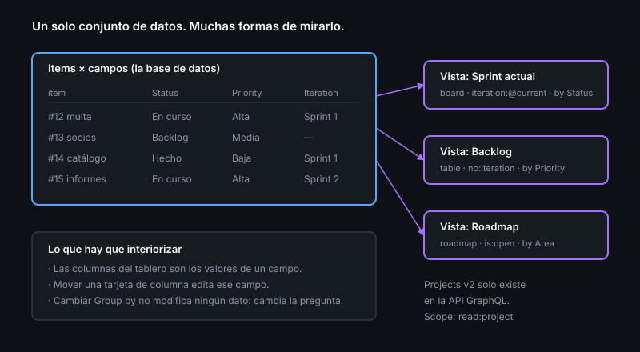

# El modelo de datos de Projects v2

> Si crees que un project es un tablero con columnas, vas a duplicar projects
> cada vez que necesites ver los datos de otra forma. Es una base de datos.

## 🎯 Objetivos

- Describir las tres piezas del modelo: items, campos y vistas
- Explicar por qué las columnas de un tablero no existen
- Distinguir los tres tipos de item
- Entender qué se guarda en el project y qué en el issue

## 1. Qué problema resuelve

Projects classic era literalmente un tablero: columnas fijas, tarjetas dentro.
Para ver lo mismo agrupado por persona en vez de por estado, había que crear
otro tablero y mantener los dos.

Projects v2 separa **los datos** de **cómo los miras**. Un solo conjunto de
items, tantas vistas como preguntas tengas.

## 2. Las tres piezas

```
PROJECT
├── items      → las filas: issues, PRs y notas
├── campos     → las columnas de datos: estado, prioridad, iteración, estimación
└── vistas     → formas de mirar esos datos: tabla, tablero, roadmap
```

| Pieza | Qué es | Cuántas |
|-------|--------|---------|
| **Item** | Una fila. Un issue, un PR o una nota suelta | Hasta 50 000, **incluido el archivo** |
| **Campo** | Un dato asociado a cada item | Hasta 50, incluidos los que trae de fábrica |
| **Vista** | Una configuración de filtro + agrupación + orden | Las que necesites (pocas, en la práctica) |



## 3. Las columnas del tablero no existen

Este es el punto que hay que interiorizar: en la vista de tablero, **las
columnas son los valores de un campo**. Por defecto, del campo `Status`.

Cambia `Group by` a `Priority` y las columnas pasan a ser Alta/Media/Baja, con
los mismos items. No has movido nada: has cambiado la pregunta.

Consecuencias prácticas:

- Mover una tarjeta de columna **edita un campo**. No la "cambia de sitio".
- Puedes tener dos vistas de tablero del mismo project agrupadas por campos
  distintos, siempre coherentes entre sí.
- Si necesitas una columna nueva, lo que necesitas es un **valor** nuevo en un
  campo, no una columna.

## 4. Los tres tipos de item

| Tipo | De dónde sale | Se puede |
|------|---------------|----------|
| **Issue** | Un issue de un repositorio | Todo: asignar, cerrar, enlazar PRs |
| **Pull request** | Un PR | Igual, y refleja su estado de revisión |
| **Draft** (nota) | Se escribe en el project | Solo vive en el project; se convierte en issue cuando toca |

Los **drafts** son para capturar ideas sin ensuciar el repositorio: no tienen
URL propia, no se pueden asignar a un repo, no salen en búsquedas. En cuanto la
idea es real, se convierte en issue **conservando los valores de los campos**.

> [!TIP]
> Un project puede contener issues de **varios repositorios**. Es la forma
> correcta de coordinar un producto repartido en frontend, backend e infra.

## 5. Qué vive dónde

Es la duda constante: ¿la prioridad es una label o un campo del project?

| Dato | Dónde vive | Por qué |
|------|-----------|---------|
| Título, cuerpo, comentarios | Issue | Es el contenido |
| Labels | Issue | Clasificación permanente, se busca desde el repo |
| Assignee | Issue | Responsabilidad, visible sin abrir el project |
| Milestone | Issue | Entrega, con barra de progreso propia |
| **Estado del flujo** (Todo/En curso/Hecho) | **Project** | Cambia constantemente y depende del tablero |
| **Iteración / sprint** | **Project** | Planificación, no clasificación |
| **Estimación** | **Project** | Solo tiene sentido dentro de una planificación |

Regla: si el dato tiene sentido cuando alguien encuentra el issue por búsqueda,
va en el issue. Si solo tiene sentido dentro de tu planificación, va en el
project.

### Cuando el project se llena

Los 50 000 items cuentan los archivados, así que archivar no libera espacio: para
eso está **borrar** el item del project (que no borra el issue). En la práctica,
un project personal no se acerca ni de lejos a ese techo; lo que sí llega pronto
es el techo de **50 campos**, porque los de fábrica cuentan.

## 6. Alcance, permisos y copias

Un project pertenece a una **cuenta** (tu usuario) o a una **organización**, no a
un repositorio, aunque se pueda enlazar a uno o a varios para que aparezca en su
pestaña *Projects*.

| Aspecto | Cómo funciona |
|---------|---------------|
| Visibilidad | Público o privado, independiente de la de los repositorios |
| Acceso | Se concede por persona o por equipo: lectura, escritura o administración |
| Enlace a repositorios | `gh project link <n> --owner @me --repo <repo>` |
| Copiar | *Make a copy* duplica campos y vistas (y opcionalmente los drafts) |
| Plantilla | Un project se puede marcar como plantilla para reutilizar su estructura |

Un item de un repositorio privado no se muestra a quien no tenga acceso a ese
repositorio, aunque el project sea público: los permisos del contenido mandan.

## 7. Solo GraphQL

La API REST **no** expone Projects v2. Todo pasa por GraphQL:

```bash
gh api graphql -F owner='<tu-usuario>' -f query='
  query($owner: String!) {
    user(login: $owner) {
      projectsV2(first: 10) {
        nodes { number title items { totalCount } }
      }
    }
  }' --jq '.data.user.projectsV2.nodes[] | "\(.number) \(.title) — \(.items.totalCount) items"'
```

Requiere el scope **`read:project`** (o `project` para escribir):

```bash
gh auth refresh -s read:project
```

Sin él, la respuesta es `INSUFFICIENT_SCOPES`. Es el primer tropiezo de todo el
mundo con Projects.

## 8. Antipatrones

| Antipatrón | Por qué duele | Qué hacer |
|------------|---------------|-----------|
| Un project por sprint | Pierdes el histórico y duplicas configuración | Un project, campo de iteración |
| Un project por vista | La misma información se desincroniza | Una vista más |
| Duplicar en labels lo que ya es un campo | Dos fuentes de verdad que se contradicen | Estado en el project, clasificación en labels |
| Usar drafts para todo | No se buscan, no se asignan, no se enlazan | Convierte a issue en cuanto sea trabajo real |
| 20 campos personalizados | Nadie los rellena y quedan vacíos | 4-6 campos que se usen de verdad |
| Esperar que la API REST funcione | No existe para Projects v2 | GraphQL, siempre |

## 9. Trucos

- **Listar tus projects con su número**: `gh project list --owner @me`
- **Ver toda la estructura en JSON**: `gh project view <n> --owner @me --format json`
  — de ahí salen los IDs que necesita GraphQL
- **Convertir un draft en issue** conserva los valores de campo: captura primero,
  formaliza después
- **Un project puede vivir en la organización**, no solo en tu usuario: así lo
  ven todos los equipos
- **Enlazarlo al repositorio** para que salga en su pestaña *Projects*:
  `gh project link <n> --owner @me --repo <repo>`
- **Copiar la estructura** a un proyecto nuevo: `gh project copy <n> --source-owner @me --target-owner @me --title "Nuevo"`
- **Atajo `c`** dentro de un project: crea un item nuevo sin tocar el ratón
- **La vista de tabla se comporta como una hoja de cálculo**: se puede pegar una
  columna entera desde el portapapeles

## 📚 Recursos Adicionales

- [GitHub Docs — About Projects](https://docs.github.com/issues/planning-and-tracking-with-projects/learning-about-projects/about-projects)
- [GitHub Docs — Using the API to manage Projects](https://docs.github.com/issues/planning-and-tracking-with-projects/automating-your-project/using-the-api-to-manage-projects)
- [GitHub Docs — Límites de Projects](https://docs.github.com/issues/planning-and-tracking-with-projects/learning-about-projects/about-projects#limits)

## ✅ Checklist de Verificación

- [ ] Explicas por qué las columnas de un tablero no son columnas
- [ ] Sabes decidir si un dato va en el issue o en el project
- [ ] Tienes el scope `read:project` y tu consulta GraphQL responde
- [ ] Distingues cuándo usar un draft y cuándo un issue
- [ ] Sabes a quién pertenece un project y cómo se enlaza a un repositorio
