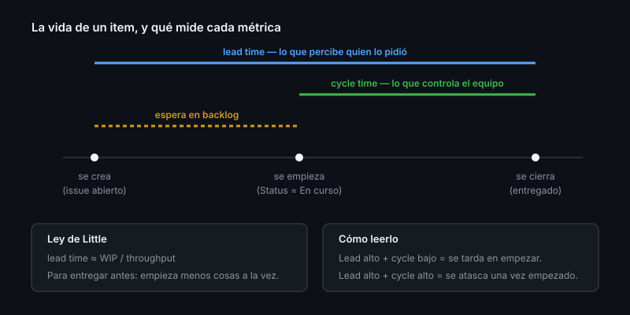

# Métricas de flujo

> Medir es fácil; medir lo que importa, no. La mitad de los paneles de métricas
> que verás miden productividad aparente y empeoran el equipo que miden.

## 🎯 Objetivos

- Definir lead time, cycle time, throughput y WIP
- Calcular las cuatro desde la API de GitHub
- Relacionarlas con las métricas DORA
- Reconocer las métricas que hacen daño

## 1. Qué problema resuelve

"¿Vamos bien?" no se responde con una sensación. Cuatro números bastan para
saber si el trabajo fluye o se atasca, y para detectar el atasco **antes** de la
fecha de entrega.

## 2. Las cuatro métricas

| Métrica | Qué mide | Cómo se calcula |
|---------|----------|-----------------|
| **Lead time** | Desde que se pide hasta que se entrega | `closedAt - createdAt` |
| **Cycle time** | Desde que se empieza hasta que se entrega | `closedAt - (primer commit / paso a "En curso")` |
| **Throughput** | Cuánto se termina por unidad de tiempo | Items cerrados por semana |
| **WIP** | Cuánto hay empezado a la vez | Items en estados intermedios |

La diferencia entre lead time y cycle time es **el tiempo en backlog**. Un lead
time enorme con cycle time pequeño no significa que el equipo sea lento:
significa que las cosas esperan mucho antes de empezarse. Son problemas
distintos y se arreglan distinto.



### La ley de Little

```
Lead time medio ≈ WIP / Throughput
```

De ahí sale la consecuencia más contraintuitiva de la gestión de trabajo: **para
entregar antes, empieza menos cosas a la vez**. Bajar el WIP reduce el lead time
sin trabajar más rápido.

## 3. Calcularlas con la API

**Lead time** de los issues cerrados este mes:

```bash
gh issue list --state closed --limit 100 --json number,createdAt,closedAt \
  --jq '[.[] | select(.closedAt != null)
        | {n: .number,
           dias: (((.closedAt | fromdate) - (.createdAt | fromdate)) / 86400 | floor)}]'
```

**Media y mediana** (la mediana informa mejor: un issue olvidado durante un año
destroza la media):

```bash
gh issue list --state closed --limit 100 --json createdAt,closedAt \
  --jq '[.[] | ((.closedAt | fromdate) - (.createdAt | fromdate)) / 86400]
        | sort
        | {n: length,
           media: (add / length | floor),
           mediana: (.[length/2 | floor] | floor)}'
```

**Throughput** semanal:

```bash
gh issue list --state closed --search "closed:>=$(date -d '7 days ago' +%Y-%m-%d)" \
  --json number --jq 'length'
```

**WIP** actual, desde el project:

```bash
gh project item-list <n> --owner @me --format json \
  --jq '[.items[] | select(.status == "En curso")] | length'
```

**Lead time de PRs** (el más útil para la salud del equipo):

```bash
gh pr list --state merged --limit 50 --json number,createdAt,mergedAt,additions,deletions \
  --jq '[.[] | {n: .number,
                horas: (((.mergedAt | fromdate) - (.createdAt | fromdate)) / 3600 | floor),
                tam: (.additions + .deletions)}]'
```

## 4. Relación con DORA

Las cuatro métricas DORA miden entrega de software, no gestión de tareas:

| Métrica DORA | Qué es | Se puede sacar de |
|--------------|--------|-------------------|
| **Frecuencia de despliegue** | Cada cuánto llega algo a producción | Releases o deployments (Semanas 11-12) |
| **Lead time for changes** | De commit a producción | Commit → deployment |
| **Change failure rate** | Qué porcentaje de despliegues rompe algo | Releases con hotfix posterior |
| **Time to restore** | Cuánto se tarda en recuperarse | Incidente → despliegue de arreglo |

Sin CI/CD aún no puedes medir las cuatro; con lo de esta semana tienes las dos
primeras en versión aproximada. Se completan en la Semana 12.

## 5. Métricas que hacen daño

| Métrica | Por qué hace daño |
|---------|-------------------|
| Commits por persona | Se optimiza troceando commits. Mide ruido |
| Líneas de código | Premia el código largo. Lo contrario de lo que quieres |
| Issues cerrados por persona | Incentiva coger lo fácil y evitar lo difícil |
| Velocity comparada entre equipos | Los puntos no son comparables. Se infla y ya |
| Horas dedicadas | Mide presencia, no resultado |

Regla: **mide el flujo del trabajo, no el rendimiento de las personas.** En
cuanto una métrica se usa para evaluar a alguien, deja de medir la realidad
(ley de Goodhart).

## 6. Antipatrones

| Antipatrón | Por qué duele | Qué hacer |
|------------|---------------|-----------|
| Usar la media en vez de la mediana | Un dato extremo la destroza | Mediana, y percentil 85 si quieres el peor caso |
| Medir sobre 5 items | No hay señal, solo ruido | Mínimo 20-30 items cerrados |
| Panel con 15 gráficos | Nadie mira ninguno | 4 métricas, 4 números |
| Medir sin decidir nada | Trabajo tirado | Cada métrica con un umbral y una acción |
| Comparar equipos | Contextos distintos, incentivos perversos | Compara un equipo consigo mismo en el tiempo |
| Medir lead time y culpar al equipo | Incluye el tiempo en backlog, que no controlan | Para el equipo, cycle time |

## 7. Trucos

- **`fromdate` en `jq`** convierte ISO 8601 a epoch: es la clave de todos estos
  cálculos
- **Percentil 85 en vez de máximo**: `sort | .[(length * 0.85) | floor]` da el
  "casi peor caso" sin el outlier absurdo
- **Tamaño de PR contra tiempo de merge**: correlacionarlos es la forma más
  rápida de convencer a un equipo de que abra PRs pequeños
- **Cuenta issues, no PRs, para throughput de producto**; cuenta PRs para
  throughput de ingeniería
- **Excluye los `not planned`** de las métricas de cierre: no son entregas
  ```bash
  gh issue list --state closed --json stateReason,createdAt,closedAt \
    --jq '[.[] | select(.stateReason != "not_planned")]'
  ```
- **Guarda el histórico**: la API te da el estado de hoy. Un informe semanal
  commiteado te da la serie temporal, que es lo que de verdad se lee

## 📚 Recursos Adicionales

- [DORA — Métricas](https://dora.dev/guides/dora-metrics-four-keys/)
- [`github/issue-metrics`](https://github.com/github/issue-metrics) — action oficial de métricas
- [Kanban — WIP limits](https://www.atlassian.com/agile/kanban/wip-limits)

## ✅ Checklist de Verificación

- [ ] Sabes la diferencia entre lead time y cycle time, y qué implica
- [ ] Has calculado la mediana de lead time de tu repositorio
- [ ] Sabes por qué la ley de Little recomienda bajar el WIP
- [ ] Puedes nombrar tres métricas que no deberías usar
