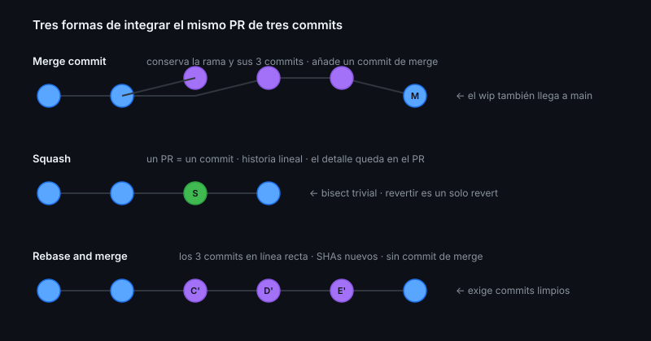

# Estrategias de merge

> Las tres opciones del botón verde no son equivalentes: cada una deja una
> historia distinta, y esa historia es la que leerás cuando algo falle.

## 🎯 Objetivos

- Explicar qué le hace cada estrategia al grafo de commits
- Elegir una para tu repositorio y saber justificarla
- Configurar el repositorio para que solo se pueda usar esa
- Usar auto-merge con criterio

## 1. Qué problema resuelve

Cuando `main` se rompe, lo primero que haces es leer la historia: qué entró, en
qué orden, y qué revertir. Una historia coherente convierte eso en dos minutos.
Una historia mezclada lo convierte en una tarde.

## 2. Las tres estrategias



### Merge commit

```
main:    A───B───────────M
              \         /
feature:       C───D───E
```

Crea un commit `M` con dos padres. Conserva **todos** los commits de la rama y
el hecho de que existió una rama.

| A favor | En contra |
|---------|-----------|
| No pierde información | Historia con muchas bifurcaciones |
| El contexto de la rama queda visible | Commits `wip` intermedios en `main` |
| Revertir el merge revierte todo el PR | `git log --oneline` cuesta más de leer |

### Squash

```
main:    A───B───S
```

Funde todos los commits del PR en **uno solo** sobre `main`.

| A favor | En contra |
|---------|-----------|
| Historia lineal: un PR, un commit | Se pierden los pasos intermedios |
| `git bisect` es trivial | El detalle solo queda en el PR |
| Los `wip` no llegan a `main` | La rama queda "no mergeada" para Git |

Es el más usado hoy, y con razón: la unidad de cambio pasa a ser el PR, que es
como la gente piensa de verdad.

### Rebase and merge

```
main:    A───B───C'───D'───E'
```

Reaplica cada commit del PR sobre `main`, sin commit de merge.

| A favor | En contra |
|---------|-----------|
| Historia lineal conservando cada commit | Los SHAs cambian |
| Sin commits de merge | Solo funciona si los commits son limpios |
| Cada commit sigue siendo revertible | Un commit intermedio puede no compilar |

## 3. Cuál elegir

| Contexto | Estrategia |
|----------|------------|
| Proyecto pequeño, PRs de un tema | **Squash** |
| Equipo disciplinado con commits atómicos | **Rebase** |
| Necesitas trazabilidad completa de las ramas | **Merge commit** |
| Open source con contribuciones muy variadas | **Squash** (normaliza la calidad) |

Y lo más importante: **elige una y desactiva las demás**. Un repositorio donde
cada persona usa la que le apetece tiene lo peor de las tres.

```bash
gh repo edit \
  --enable-squash-merge \
  --enable-merge-commit=false \
  --enable-rebase-merge=false

gh api repos/{owner}/{repo} --jq '{squash: .allow_squash_merge, merge: .allow_merge_commit, rebase: .allow_rebase_merge}'
```

### El título del commit de squash

Configúralo para que use el título del PR y su número:

```bash
gh api repos/{owner}/{repo} --method PATCH \
  -f squash_merge_commit_title=PR_TITLE \
  -f squash_merge_commit_message=PR_BODY
```

Así cada commit de `main` dice qué hizo y enlaza a su PR. Con el valor por
defecto (`COMMIT_OR_PR_TITLE`) acabas con commits titulados `wip` en `main`.

## 4. Auto-merge

Mergea el PR **en cuanto** se cumplan las condiciones: checks en verde y
aprobaciones necesarias.

```bash
gh pr merge 42 --auto --squash
```

| Bueno para | Malo para |
|------------|-----------|
| PRs pequeños ya aprobados | Cambios delicados |
| CI que tarda | Cuando aún estás decidiendo |
| Dependabot | PRs sin revisión obligatoria |

Requiere estar habilitado en el repositorio:

```bash
gh repo edit --enable-auto-merge
```

> [!WARNING]
> Auto-merge con checks que **no** son obligatorios en un ruleset mergea en
> cuanto haya aprobación, aunque el CI esté rojo. La combinación segura es
> auto-merge **más** checks obligatorios (Semana 08).

## 5. Borrar la rama al mergear

```bash
gh repo edit --delete-branch-on-merge
```

Sin esto, en seis meses tendrás doscientas ramas muertas. El commit sigue en la
historia; la rama no aporta nada.

## 6. Revertir

| Estrategia | Cómo se revierte |
|------------|------------------|
| Squash | `git revert <sha>` — un solo commit |
| Rebase | Un `revert` por commit, o un rango |
| Merge commit | `git revert -m 1 <sha-del-merge>` |

El botón **Revert** del PR crea automáticamente un PR inverso. Es la vía rápida
en producción: revierte primero, investiga después.

## 7. Antipatrones

| Antipatrón | Por qué duele | Qué hacer |
|------------|---------------|-----------|
| Las tres estrategias habilitadas | Historia incoherente | Elige una, desactiva el resto |
| Squash con título por defecto | `main` lleno de commits `wip` | `squash_merge_commit_title=PR_TITLE` |
| Rebase con commits sucios | Cada `wip` acaba en `main` | Limpia con `rebase -i` antes |
| Auto-merge sin checks obligatorios | Puede mergear con CI en rojo | Ruleset con checks requeridos |
| No borrar ramas | Cementerio de ramas | `--delete-branch-on-merge` |
| Mergear tu propio PR sin revisión | El PR pierde su función | Al menos una revisión, aunque sea diferida |

## 8. Trucos

- **Ver la configuración actual**:
  ```bash
  gh api repos/{owner}/{repo} --jq '{squash: .allow_squash_merge, merge: .allow_merge_commit, rebase: .allow_rebase_merge, auto: .allow_auto_merge, borrar: .delete_branch_on_merge}'
  ```
- **Actualizar la rama antes de mergear**: `gh pr merge --auto` respeta el
  requisito de "rama al día" si el ruleset lo exige
- **Revert en un clic**: el botón *Revert* del PR mergeado crea el PR inverso
- **Squash conservando el detalle**: el cuerpo del commit incluye la lista de
  commits originales si usas `squash_merge_commit_message=COMMIT_MESSAGES`
- **Ver cómo quedará la historia** antes de decidir: prueba las tres en un repo
  de laboratorio (es la práctica 03)

## 📚 Recursos Adicionales

- [GitHub Docs — About merge methods](https://docs.github.com/pull-requests/collaborating-with-pull-requests/incorporating-changes-from-a-pull-request/about-merge-methods-on-github)
- [GitHub Docs — Automatically merging a pull request](https://docs.github.com/pull-requests/collaborating-with-pull-requests/incorporating-changes-from-a-pull-request/automatically-merging-a-pull-request)
- [GitHub Docs — Reverting a pull request](https://docs.github.com/pull-requests/collaborating-with-pull-requests/incorporating-changes-from-a-pull-request/reverting-a-pull-request)

## ✅ Checklist de Verificación

- [ ] Tu repositorio tiene **una sola** estrategia habilitada
- [ ] Puedes justificar por qué esa
- [ ] El título del commit de squash usa el del PR
- [ ] Las ramas se borran solas al mergear
