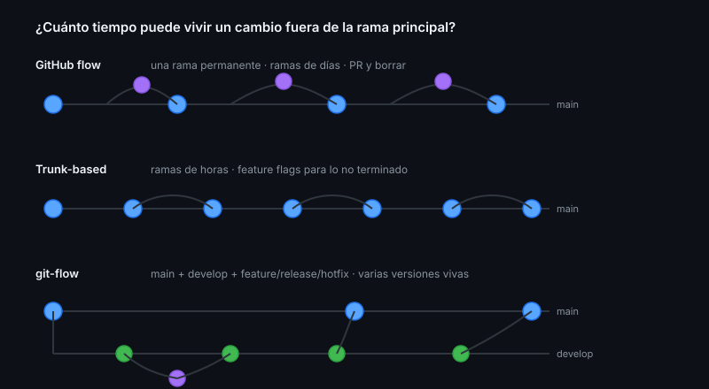

# Estrategias de ramificación

> La discusión sobre qué flujo de ramas usar suele ser una discusión sobre otra
> cosa: cuánto tarda tu CI y cuánto confías en él.

## 🎯 Objetivos

- Describir GitHub flow, trunk-based development y git-flow
- Elegir uno con criterio, según el contexto real del proyecto
- Nombrar ramas de forma consistente
- Entender por qué las ramas de vida larga generan conflictos

## 1. Qué problema resuelve

Todo flujo responde a la misma pregunta: **¿cuánto tiempo puede vivir un cambio
fuera de la rama principal?** Cuanto más tiempo, más diverge y más caro es
integrarlo. Cuanto menos, más falta hace confiar en la automatización.



## 2. GitHub flow

```
main ────●────────●────────●──────►
          \      /  \     /
           feat-a     feat-b
```

Una sola rama permanente (`main`, siempre desplegable). Cada cambio en una rama
corta que entra por PR y se borra.

| A favor | En contra |
|---------|-----------|
| Simple: una regla que todos recuerdan | Necesita CI fiable |
| Ramas cortas = pocos conflictos | Sin soporte nativo para varias versiones en producción |
| Encaja de forma natural con PRs y rulesets | |

**Cuándo**: aplicaciones web, servicios, la mayoría de proyectos. Es lo que usa
este bootcamp.

## 3. Trunk-based development

```
main ────●──●──●──●──●──●──►
          \/    \/    \/     ramas de horas, no de días
```

Como GitHub flow, pero llevado al extremo: ramas de **horas**, integración
varias veces al día, y lo que no está listo se esconde detrás de **feature
flags** en vez de quedarse en una rama.

| A favor | En contra |
|---------|-----------|
| Conflictos prácticamente inexistentes | Exige CI muy rápido y muy fiable |
| Integración continua de verdad | Los feature flags son código que hay que limpiar |
| Despliegue continuo natural | Cultura de tests muy sólida |

**Cuándo**: equipos con CI de minutos, cobertura buena y despliegue automatizado.

## 4. git-flow

```
main    ────●──────────────●────►   solo releases
              \            /
develop ──●────●────●─────●─────►   integración
           \  /      \   /
          feature   release/hotfix
```

Cinco tipos de rama: `main`, `develop`, `feature/*`, `release/*`, `hotfix/*`.

| A favor | En contra |
|---------|-----------|
| Soporta varias versiones a la vez | Ceremonioso: muchas ramas que sincronizar |
| Ventana de estabilización antes de release | Ramas de vida larga = conflictos garantizados |
| Encaja con releases planificadas | `develop` y `main` divergen y hay que reconciliarlos |

**Cuándo**: software con versiones que se mantienen en paralelo (una librería con
soporte a 2.x y 3.x, un producto instalable). **No** para una aplicación web con
un solo entorno de producción.

> [!NOTE]
> Su autor, Vincent Driessen, añadió una nota al artículo original recomendando
> **no** usarlo si entregas de forma continua. Se sigue aplicando por inercia en
> proyectos donde estorba.

## 5. Cómo elegir

| Pregunta | Si la respuesta es… | Entonces |
|----------|---------------------|----------|
| ¿Mantienes varias versiones en producción? | Sí | git-flow |
| ¿Tu CI tarda menos de 10 minutos y es fiable? | Sí | Trunk-based |
| ¿Ninguna de las dos? | — | **GitHub flow** |

En caso de duda, GitHub flow. Es el más simple que funciona, y siempre se puede
endurecer.

## 6. Nombres de rama

```
<tipo>/<issue>-<descripcion-corta>

feat/issue-42-calculo-multa
fix/issue-57-devolucion-mismo-dia
chore/actualizar-dependencias
```

- **En inglés**, en kebab-case, sin acentos ni mayúsculas
- **Con el número del issue**: conecta rama, issue y PR de un vistazo
- **Cortos**: el nombre aparece en la terminal, en el PR y en los logs de CI

Prefijos habituales: `feat/`, `fix/`, `chore/`, `docs/`, `refactor/`,
`hotfix/`.

## 7. La ley de las ramas largas

Una rama de dos semanas no tiene "un poco más" de conflictos que una de dos
días: tiene **muchos** más. Cada día que pasa, `main` recibe cambios que tu rama
no tiene, y la probabilidad de tocar los mismos archivos crece.

Consecuencia práctica: si un trabajo va a durar más de unos días, no lo dejes en
una rama. Divídelo (stacked PRs, Semana 06), o intégralo desactivado.

## 8. Antipatrones

| Antipatrón | Por qué duele | Qué hacer |
|------------|---------------|-----------|
| git-flow en una app web | Cinco tipos de rama para un solo entorno | GitHub flow |
| Ramas de semanas | Conflictos garantizados | Divide o usa feature flags |
| `develop` que nadie despliega | Rama fantasma que solo genera merges | Elimínala |
| Nombres tipo `arreglos` o `pruebas` | Nadie sabe qué contiene | `tipo/issue-N-descripcion` |
| No borrar ramas mergeadas | Cementerio de ramas | `--delete-branch-on-merge` |
| Cambiar de flujo cada trimestre | El coste está en el cambio, no en el flujo | Elige uno y mantenlo |

## 9. Trucos

- **Nombre de rama automático desde el issue**: en la barra lateral del issue,
  *Create a branch* genera `42-titulo-del-issue` y lo enlaza solo
- **Cambiar de rama sin perder el trabajo**: `git worktree` (Semana 01) es mejor
  que `stash` para esto
- **Limpiar ramas locales ya mergeadas**:
  ```bash
  git fetch -p && git branch --merged main | grep -v main | xargs -r git branch -d
  ```
- **Ver ramas por antigüedad** (las viejas son deuda):
  ```bash
  git for-each-ref --sort=committerdate refs/heads/ --format='%(committerdate:short) %(refname:short)'
  ```
- **Proteger el nombre por convención**: un ruleset puede exigir que las ramas
  cumplan un patrón (Semana 08)

## 📚 Recursos Adicionales

- [GitHub flow](https://docs.github.com/get-started/using-github/github-flow)
- [Trunk Based Development](https://trunkbaseddevelopment.com/)
- [git-flow (con la nota del autor)](https://nvie.com/posts/a-successful-git-branching-model/)
- [Martin Fowler — Patterns for Managing Source Code Branches](https://martinfowler.com/articles/branching-patterns.html)

## ✅ Checklist de Verificación

- [ ] Tu `CONTRIBUTING.md` dice qué flujo usa el proyecto y por qué
- [ ] Tus ramas siguen `tipo/issue-N-descripcion`
- [ ] Ninguna rama tuya lleva más de una semana abierta
- [ ] Puedes explicar cuándo git-flow sí tiene sentido
