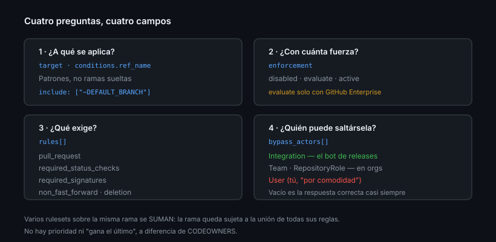
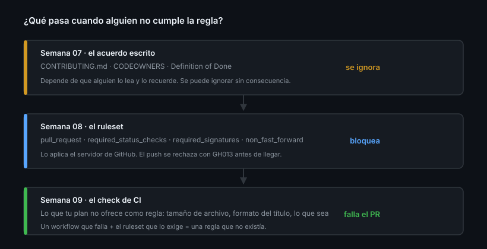

# Rulesets frente a branch protection

> La Semana 07 dejó escrito el contrato del proyecto. Escrito no es lo mismo que
> obligatorio: hasta hoy, cualquiera podía saltárselo con un `git push`.

## 🎯 Objetivos

- Explicar qué es un ruleset y en qué se diferencia de branch protection
- Entender los tres ejes de un ruleset: **target**, **enforcement** y **reglas**
- Saber qué reglas puedes usar de verdad con tu plan y tu tipo de repositorio
- Leer las reglas efectivas de una rama sin abrir la UI

## 1. Qué problema resuelve

Branch protection clásica tiene tres límites que aparecen en cuanto el
repositorio crece:

| Límite | Qué significa en la práctica |
|--------|------------------------------|
| Una regla, una rama | `main`, `release/1.x`, `release/2.x`… una configuración por cada una |
| Se aplica o no se aplica | No hay estado intermedio ni borrador |
| Solo ramas | Nada para tags ni para pushes |
| Sin historial | No hay registro de quién la cambió ni por qué |

Un **ruleset** es una lista con nombre de reglas que se aplica a un conjunto de
refs descrito por patrones. Resuelve los cuatro puntos: patrones en vez de ramas
sueltas, estados de borrador y prueba, targets de rama/tag/push, e historial de
versiones consultable por API.



## 2. Los tres ejes

### Target — a qué se aplica

```json
"target": "branch",
"conditions": {
  "ref_name": {
    "include": ["~DEFAULT_BRANCH", "refs/heads/release/*"],
    "exclude": ["refs/heads/release/legacy-*"]
  }
}
```

- `~DEFAULT_BRANCH` sigue a tu rama por defecto aunque la renombres
- `~ALL` es todo; úsalo sabiendo lo que haces
- Los patrones usan sintaxis `fnmatch`, y `exclude` gana sobre `include`

Valores de `target`: `branch`, `tag`, `push`.

### Enforcement — con cuánta fuerza

| Valor | Qué hace | Disponible |
|-------|----------|------------|
| `disabled` | Guardado, sin efecto. Un borrador que sí puedes revisar | Todos |
| `evaluate` | **No bloquea** y registra qué habría bloqueado | Solo **GitHub Enterprise** |
| `active` | Bloquea | Todos |

> [!IMPORTANT]
> La propia API lo dice: *"`evaluate` is only available with GitHub
> Enterprise"*. En este bootcamp el equivalente barato es `disabled`: creas el
> ruleset, lo lees en JSON, compruebas que el `context` del check existe y que
> firmas de verdad, y **solo entonces** lo pasas a `active`. No registra intentos
> como `evaluate`, pero evita el 90 % de los bloqueos accidentales.

### Reglas — qué se exige

Cada regla es un objeto `{ "type": "...", "parameters": {...} }`. Las que usarás
esta semana:

| `type` | Qué exige |
|--------|-----------|
| `pull_request` | Nada entra sin PR; aprobaciones, code owners, resolución de hilos |
| `required_status_checks` | Checks concretos en verde |
| `required_signatures` | Todos los commits firmados |
| `non_fast_forward` | Prohíbe `push --force` |
| `deletion` | Prohíbe borrar la rama |
| `required_linear_history` | Prohíbe commits de merge |
| `creation` / `update` | Prohíbe crear / actualizar refs que coincidan |
| `required_deployments` | Exige despliegue correcto a environments concretos |

## 3. Qué puedes usar de verdad (y qué no)

Esta es la tabla que evita perder una tarde. El bootcamp asume **GitHub Free**
sobre **repositorios públicos** de una **cuenta personal**.

| Feature | Free · público · personal | Requiere |
|---------|:-------------------------:|----------|
| Rulesets de rama y tag | ✅ | En repos privados: Pro/Team/Enterprise |
| `pull_request`, `required_status_checks` | ✅ | — |
| `required_signatures`, `non_fast_forward`, `deletion` | ✅ | — |
| `required_linear_history`, `required_deployments` | ✅ | — |
| **Push rulesets** (tamaño, rutas, extensiones) | ❌ | Team+ **y** repo privado o interno |
| **Merge queue** | ❌ | Repo de una **organización** |
| **Metadata rules** (`commit_message_pattern`…) | ❌ | Organización en **GitHub Enterprise** |
| **Modo `evaluate`** | ❌ | **GitHub Enterprise** — usa `disabled` como borrador |
| Rulesets a nivel de organización | ❌ | Organización en **GitHub Enterprise** |
| Environments con revisor y wait timer | ✅ | En repos privados: Pro/Team/Enterprise |

> [!IMPORTANT]
> Verificado en agosto de 2026. La disponibilidad por plan cambia; confirma en
> [About rulesets](https://docs.github.com/repositories/configuring-branches-and-merges-in-your-repository/managing-rulesets/about-rulesets)
> antes de dar una regla por perdida.

Lo que no puedes exigir con un ruleset lo exiges con **CI**: un workflow que
falla es un status check requerido, y eso sí lo tienes. Es el patrón de la
Práctica 03 y el puente hacia la Semana 09.



## 4. La forma del JSON

Un ruleset completo tiene siempre la misma estructura, y conviene reconocerla
porque es lo que vas a versionar en el repositorio:

```json
{
  "name": "main-proteccion",
  "target": "branch",
  "enforcement": "disabled",
  "conditions": {
    "ref_name": { "include": ["~DEFAULT_BRANCH"], "exclude": [] }
  },
  "bypass_actors": [],
  "rules": [
    { "type": "pull_request", "parameters": { "required_approving_review_count": 0 } },
    { "type": "non_fast_forward" }
  ]
}
```

| Campo | Qué es |
|-------|--------|
| `name` | Identificador legible. Sale en los mensajes de bloqueo, así que dilo bien |
| `target` | `branch`, `tag` o `push` |
| `enforcement` | `disabled`, `evaluate` (Enterprise) o `active` |
| `conditions.ref_name` | A qué refs aplica, con `include` y `exclude` |
| `bypass_actors` | Quién puede saltárselo ([Teoría 05](05-bypass-y-auditoria.md)) |
| `rules` | La lista de reglas, cada una con sus `parameters` |

Ese JSON se crea y se actualiza con la API, y **es lo que debe vivir en el
repositorio**:

```bash
gh api repos/{owner}/{repo}/rulesets --method POST --input .github/rulesets/main.json
gh api repos/{owner}/{repo}/rulesets/<id> --method PUT --input .github/rulesets/main.json
```

Versionarlo tiene tres consecuencias que la interfaz no da: se revisa en un PR,
se puede copiar a otro repositorio y queda escrito **por qué** está así.

## 5. Dónde puede vivir un ruleset

| Nivel | Alcance | Disponible |
|-------|---------|------------|
| Repositorio | Ese repositorio | Todos los planes (privado: Pro/Team/Enterprise) |
| Organización | Todos los repositorios de la organización, por patrón | **GitHub Enterprise** |

Los de organización son la forma de aplicar la misma política a doscientos
repositorios sin tocarlos uno a uno. No los tienes en este bootcamp, pero es la
razón por la que la gobernanza a escala se hace con rulesets y no con branch
protection.

## 6. Se apilan, no se sustituyen

Varios rulesets pueden aplicar a la misma rama. **Se suman**: la rama queda
sujeta a la unión de todas las reglas, y la más restrictiva gana. No hay
"prioridad" ni "el último gana" como en `CODEOWNERS`.

Consecuencia práctica: separa por intención, no por rama.

```
main-proteccion      → ~DEFAULT_BRANCH → PR, checks, firmas
historia-inmutable   → ~ALL            → non_fast_forward, deletion
```

Así puedes desactivar una capa sin tocar la otra.

Para ver el resultado combinado sobre una rama concreta:

```bash
gh api repos/{owner}/{repo}/rules/branches/main --jq '.[] | .type'
gh ruleset check main
```

## 7. Branch protection sigue existiendo

No está retirada. Convive con los rulesets y **también se suma**: si un repo
antiguo tiene branch protection y le añades un ruleset, se aplican las dos.

Cuándo la vas a encontrar: repositorios anteriores a 2023 y automatizaciones
viejas contra `repos/{owner}/{repo}/branches/{branch}/protection`. Saber leerla
es útil; escribirla nueva, no.

## 8. Antipatrones

| Antipatrón | Por qué duele | Qué hacer |
|------------|---------------|-----------|
| Activar en `active` a la primera | Te bloqueas a ti mismo un viernes | `disabled` y revisar primero |
| Un ruleset gigante con todo dentro | No puedes desactivar una parte | Uno por intención |
| Apuntar a `refs/heads/main` literal | Se rompe al renombrar la rama | `~DEFAULT_BRANCH` |
| Copiar el ruleset de un repo de empresa | La mitad de las reglas no existen en tu plan | Comprueba la tabla del punto 3 |
| Exigir un check que nunca corre | El PR no se puede mergear jamás | Ver [Teoría 03](03-checks-y-firmas.md) |
| Mezclar branch protection y ruleset sin saberlo | Reglas que "aparecen" de la nada | `gh ruleset check main` |

## 9. Trucos

- **Ver las reglas efectivas de una rama** sin abrir Settings:
  `gh api repos/{owner}/{repo}/rules/branches/main --jq '[.[].type]'`
- **`gh ruleset list` y `gh ruleset view`** son de solo lectura: para crear y
  editar hay que usar `gh api` o la UI
- **Exportar un ruleset** para versionarlo o copiarlo a otro repo:
  `gh api repos/{owner}/{repo}/rulesets/<id> --jq 'del(.id, .node_id, .created_at, .updated_at, .source, .source_type, ._links)'`
- **El historial de un ruleset** existe:
  `gh api repos/{owner}/{repo}/rulesets/<id>/history`
- **`~DEFAULT_BRANCH` sobrevive a los renombrados**; `refs/heads/main` no

## 📚 Recursos Adicionales

- [GitHub Docs — About rulesets](https://docs.github.com/repositories/configuring-branches-and-merges-in-your-repository/managing-rulesets/about-rulesets)
- [GitHub Docs — Available rules for rulesets](https://docs.github.com/repositories/configuring-branches-and-merges-in-your-repository/managing-rulesets/available-rules-for-rulesets)
- [REST API — Repository rules](https://docs.github.com/rest/repos/rules)

## ✅ Checklist de Verificación

- [ ] Sabes qué hace cada valor de `enforcement` y cuál puedes usar tú
- [ ] Sabes qué pasa cuando dos rulesets aplican a la misma rama
- [ ] Has ejecutado `gh api repos/{owner}/{repo}/rules/branches/main`
- [ ] Sabes qué reglas de la tabla del punto 3 puedes usar en tu repositorio
- [ ] Reconoces la estructura de un ruleset en JSON y sabes crearlo por API
