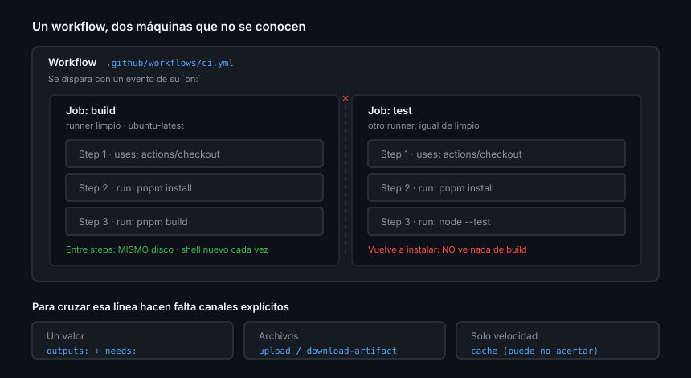

# El modelo de ejecución y el ciclo de vida de un run

> Casi todos los problemas de Actions que parecen misteriosos son el mismo
> problema: creer que dos jobs comparten algo. No comparten nada.

## 🎯 Objetivos

- Situar workflow, job, step y runner en su jerarquía
- Saber exactamente qué se comparte y qué no en cada nivel
- Entender qué implica que cada job arranque en una máquina limpia
- Controlar el ciclo de vida de un run: tiempos, cancelación y concurrencia

## 1. Qué problema resuelve

Actions ejecuta trabajo en respuesta a lo que pasa en el repositorio. Lo que
convierte esto en una herramienta y no en un YAML copiado es entender el modelo
de aislamiento: **cada job arranca en una máquina virgen y muere al terminar**.



## 2. La jerarquía

```
Workflow          un archivo .yml en .github/workflows/
└── Job           una máquina virtual limpia (un runner)
    └── Step      un comando o una action, en esa misma máquina
```

| Nivel | Qué es | Cuándo se ejecuta |
|-------|--------|-------------------|
| Workflow | Un archivo y los eventos que lo disparan | Cada vez que ocurre un evento de su `on:` |
| Job | Una unidad aislada con su propio runner | **En paralelo** con los demás, salvo `needs` |
| Step | Un `run:` o un `uses:` | Secuencialmente, en orden de declaración |

Dos jobs del mismo workflow **no se ven entre sí**: distinta máquina, distinto
disco, distintas variables de entorno, distinto todo.

### Un workflow, varios jobs

```yaml
jobs:
  lint:
    runs-on: ubuntu-latest
    steps: [...]

  test:
    runs-on: ubuntu-latest
    steps: [...]

  publicar:
    needs: [lint, test]      # espera a los dos
    runs-on: ubuntu-latest
    steps: [...]
```

`lint` y `test` arrancan a la vez. `publicar` espera a que ambos terminen bien.
El grafo lo dibuja `needs`, y GitHub lo muestra en la pestaña del run.

## 3. Qué se comparte y qué no

Esta tabla resuelve la mayoría de las preguntas de la semana.

| Entre… | Sistema de archivos | Variables de entorno | Proceso |
|--------|:-------------------:|:--------------------:|:-------:|
| Comandos del mismo `run:` | ✅ | ✅ | ✅ Mismo shell |
| Steps del mismo job | ✅ Sí | ❌ No | ❌ Shell nuevo cada vez |
| Jobs del mismo workflow | ❌ No | ❌ No | ❌ Máquina distinta |
| Runs distintos | ❌ No | ❌ No | ❌ |

Las dos consecuencias que más tiempo cuestan:

- **`pnpm install` en el job A no deja nada instalado para el job B.** Si B
  necesita dependencias, B las instala. No hay atajo
- **`export MI_VAR=x` en un step no llega al siguiente**, porque cada `run:` es
  un proceso de shell nuevo

Cómo se pasan datos de verdad es la [Teoría 02](02-datos-entre-steps-y-jobs.md)
entera.

## 4. El runner

`runs-on: ubuntu-latest` pide una máquina virtual limpia que GitHub crea, usa y
destruye. Trae bastante preinstalado (Node, Python, Go, Docker, `git`, `gh`,
`jq`, navegadores) y un disco vacío salvo lo que tú pongas.

| Etiqueta | Cuándo |
|----------|--------|
| `ubuntu-latest` | El caballo de batalla: el más rápido y el más barato |
| `windows-latest` / `macos-latest` | Solo si tu software lo necesita de verdad |
| `ubuntu-24.04`, `macos-15`… | Cuando necesitas fijar la imagen y no seguir a `latest` |
| `self-hosted` | Máquina tuya. Semana 11 |

> [!IMPORTANT]
> *"The use of standard GitHub-hosted runners is free: In public repositories."*
> Es una de las razones por las que este bootcamp trabaja en público.
>
> En privados se factura por minuto y el sistema operativo importa mucho: en
> agosto de 2026, Linux de 2 núcleos cuesta **0,006 $/min**, Windows
> **0,010 $/min** y macOS **0,062 $/min** — unas **diez veces** Linux. Elegir
> `macos-latest` "por si acaso" es una factura, no una precaución. Tarifas
> vigentes en
> [Billing for GitHub Actions](https://docs.github.com/billing/concepts/product-billing/github-actions).

### `latest` no significa "la última versión"

`ubuntu-latest` apunta a la imagen que GitHub considera estable, y **cambia**.
Cuando cambia, cosas que funcionaban dejan de funcionar: otra versión de las
herramientas preinstaladas, otro kernel. Si necesitas reproducibilidad estricta,
fija la imagen (`ubuntu-24.04`) y actualízala tú a propósito, igual que pinneas
una action por SHA.

El inventario exacto de cada imagen está en
[actions/runner-images](https://github.com/actions/runner-images).

## 5. El sistema de archivos y las variables del runner

| Variable | Qué contiene |
|----------|--------------|
| `GITHUB_WORKSPACE` | La raíz donde `actions/checkout` deja tu repositorio |
| `RUNNER_TEMP` | Directorio temporal, se borra al acabar el job |
| `RUNNER_OS` | `Linux`, `Windows` o `macOS` |
| `GITHUB_EVENT_PATH` | El JSON completo del evento que disparó el workflow |
| `GITHUB_STEP_SUMMARY` | Archivo Markdown que se muestra en la página del run |
| `GITHUB_OUTPUT` | Outputs del step actual |
| `GITHUB_ENV` | Variables de entorno para los steps siguientes |
| `GITHUB_PATH` | Directorios que se añaden al `PATH` de los steps siguientes |

Un detalle que sorprende la primera vez: **el repositorio no está ahí hasta que
lo clonas**. Sin `actions/checkout`, `GITHUB_WORKSPACE` está vacío. No es un
error, es el diseño: hay workflows que no necesitan el código.

Y nada persiste entre runs. Si un job escribe un archivo y no lo sube como
artifact, ese archivo deja de existir.

## 6. Shells y códigos de salida

Por defecto, `bash -e` en Linux y macOS: el step falla en cuanto un comando
devuelve algo distinto de cero. En Windows, PowerShell.

Ese `-e` **no** incluye `pipefail`, y ahí está la trampa:

```yaml
# ❌ El step sale en VERDE aunque los tests fallen: el código de salida que
#    cuenta es el del último comando del pipe (tee), no el de node.
- run: node --test | tee salida.txt

# ✅ Con pipefail, el fallo se propaga.
- run: set -o pipefail && node --test | tee salida.txt

# ✅ Mejor: `shell: bash` fuerza `bash -eo pipefail` en cualquier SO.
- shell: bash
  run: node --test | tee salida.txt
```

Es el fallo silencioso más caro de la semana: un CI en verde que no prueba nada.

### Steps multilínea

```yaml
- name: Varios comandos
  run: |
    echo "uno"
    echo "dos"
```

Con `|` (*block scalar*) todo va al mismo shell, así que entre esas líneas sí se
comparten variables. Con `>` (*folded*) YAML une las líneas con espacios, y casi
nunca es lo que quieres en un `run:`.

## 7. `timeout-minutes` y `continue-on-error`

```yaml
jobs:
  test:
    runs-on: ubuntu-latest
    timeout-minutes: 10          # por defecto son 360 (6 horas)
    steps:
      - name: Comprobación experimental
        continue-on-error: true  # informa, pero no tumba el job
        run: ./comprobacion-nueva.sh
```

| Ajuste | Qué hace | Por qué importa |
|--------|----------|-----------------|
| `timeout-minutes` en un job | Corta el job al llegar al límite | El defecto son **6 horas**: un test colgado quema una tarde de runner |
| `timeout-minutes` en un step | Corta ese step | Aísla el paso que sabes que puede colgarse |
| `continue-on-error` | El fallo no tumba el job | Comprobaciones informativas, **nunca** tests |

Poner `timeout-minutes` en todos los jobs de CI es de lo que mejor relación
coste-beneficio tiene en toda la semana: dos líneas y ningún run zombi.

> [!NOTE]
> `continue-on-error: true` en un job de matriz tiene un efecto extra: ese job
> **no cuenta** para `fail-fast`, así que puedes tener una versión experimental
> en la matriz sin que su fallo cancele las demás.

## 8. `concurrency`: no acumular runs inútiles

Cinco pushes seguidos al mismo PR lanzan cinco runs completos, y los cuatro
primeros ya no le importan a nadie.

```yaml
concurrency:
  group: ${{ github.workflow }}-${{ github.ref }}
  cancel-in-progress: true
```

Un grupo por workflow y rama: al entrar un run nuevo en el grupo, se cancela el
anterior. También se puede declarar por job, con su propio grupo.

> [!CAUTION]
> `cancel-in-progress: true` es correcto en CI y **peligroso en despliegues**:
> cancelar un deploy a mitad deja el sistema en un estado indeterminado. En
> workflows de despliegue, `cancel-in-progress: false` y que hagan cola.

### Qué pasa exactamente al cancelar

Cancelar no mata el proceso de inmediato: GitHub envía una señal, da un margen
de gracia y luego fuerza. Un step con `if: always()` **se ejecuta también
durante una cancelación**, lo que puede alargar la parada. Cuando lo que quieres
es "aunque haya fallado, pero no si lo cancelo", lo correcto es
`if: ${{ !cancelled() }}` — está en la
[Teoría 05](05-contexts-y-expresiones.md).

## 9. Antipatrones

| Antipatrón | Por qué duele | Qué hacer |
|------------|---------------|-----------|
| Suponer que el job B ve lo que instaló A | Máquinas distintas | Artifact, o instalar en cada job |
| `export VAR=x` esperando que persista | Cada `run:` es un shell nuevo | `$GITHUB_ENV` |
| Un job gigante con quince steps | Se pierde el paralelismo y el log es ilegible | Un job por responsabilidad |
| Steps sin `name:` | El log es una lista de comandos crudos | Nombra lo que no sea obvio |
| Olvidar `actions/checkout` | El workspace está vacío | Primer step, casi siempre |
| Tuberías sin `pipefail` | Tests rojos que salen en verde | `shell: bash` |
| Ningún `timeout-minutes` | Un cuelgue consume 6 horas de runner | 10-15 min en CI |
| `continue-on-error` en los tests | El CI deja de significar nada | Solo en comprobaciones informativas |
| `cancel-in-progress` en un deploy | Despliegue a medias | `false` |

## 10. Trucos

- **Ver el payload del evento**: `jq . "$GITHUB_EVENT_PATH"` dentro de un step
- **Resumen legible del run**: `echo "## Resultado" >> "$GITHUB_STEP_SUMMARY"`
  acepta Markdown y aparece en la página del run
- **Añadir algo al `PATH`** de los siguientes steps:
  `echo "$HOME/bin" >> "$GITHUB_PATH"`
- **Un job que depende de varios**: `needs: [lint, test]`
- **Fijar la imagen** cuando un run empiece a fallar sin que tú hayas tocado
  nada: `ubuntu-24.04` en vez de `ubuntu-latest`
- **`if: always()`** en el step que publica resultados, para que el informe suba
  aunque los tests hayan fallado

## 📚 Recursos Adicionales

- [GitHub Docs — Understanding GitHub Actions](https://docs.github.com/actions/get-started/understand-github-actions)
- [GitHub Docs — Workflow syntax](https://docs.github.com/actions/reference/workflows-and-actions/workflow-syntax)
- [GitHub Docs — Control jobs](https://docs.github.com/actions/how-tos/write-workflows/choose-what-workflows-do/control-jobs)
- [actions/runner-images](https://github.com/actions/runner-images)

## ✅ Checklist de Verificación

- [ ] Sabes decir qué comparten dos steps y qué comparten dos jobs
- [ ] Sabes por qué una tubería puede ocultar un fallo
- [ ] Sabes cuál es el `timeout-minutes` por defecto de un job
- [ ] Sabes por qué `cancel-in-progress` no va en un despliegue
