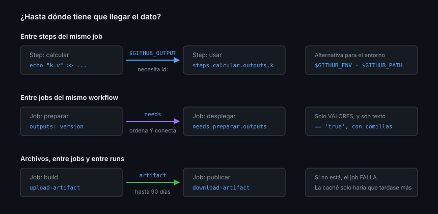

# Pasar datos entre steps y entre jobs

> Cuatro mecanismos, cada uno para una distancia distinta. Elegir el equivocado
> no da error: da un valor vacío, que es peor.

## 🎯 Objetivos

- Distinguir `$GITHUB_OUTPUT`, `$GITHUB_ENV`, `$GITHUB_PATH` y `outputs`
- Conectar jobs con `needs` y leer sus resultados
- Escribir resúmenes de run que alguien quiera leer
- Reconocer por qué un valor llega vacío

## 1. Qué problema resuelve

Un step calcula la versión; el siguiente la publica. Un job compila; otro
despliega. Como no comparten ni proceso ni máquina
([Teoría 01](01-modelo-de-ejecucion.md)), hace falta un canal explícito. Actions
da cuatro, y la distancia que cubre cada uno es distinta.



| Mecanismo | Alcance | Para qué |
|-----------|---------|----------|
| `$GITHUB_OUTPUT` | Steps del mismo job | Un valor calculado |
| `$GITHUB_ENV` | Steps del mismo job | Una variable de entorno |
| `$GITHUB_PATH` | Steps del mismo job | Un directorio en el `PATH` |
| `outputs` + `needs` | Entre jobs | Un valor calculado |
| Artifact | Entre jobs y entre runs | **Archivos** |

Regla corta: **valores** por outputs, **archivos** por artifacts.

## 2. Entre steps: `$GITHUB_OUTPUT`

El step que emite necesita un `id:`; el que consume lo referencia por ese id.

```yaml
- name: Calcular la versión
  id: version
  run: |
    NUM=$(node -p "require('./package.json').version")
    echo "numero=$NUM" >> "$GITHUB_OUTPUT"

- name: Usarla
  env:
    VERSION: ${{ steps.version.outputs.numero }}
  run: echo "Compilando la versión $VERSION"
```

### Valores multilínea

Un `clave=valor` no admite saltos de línea. Para eso hay sintaxis de delimitador:

```yaml
- id: notas
  run: |
    {
      echo 'cuerpo<<FIN_DEL_VALOR'
      git log --oneline -10
      echo 'FIN_DEL_VALOR'
    } >> "$GITHUB_OUTPUT"
```

El delimitador tiene que ser una cadena que **no** aparezca sola en una línea
del contenido. La documentación es tajante con el caso peligroso:

> "Make sure the delimiter you're using won't occur on a line of its own within
> the value. If the value is completely arbitrary then you shouldn't use this
> format."

Traducido a la práctica: si el contenido lo controla alguien de fuera (un título
de PR, el cuerpo de un comentario), **no** lo metas en un output multilínea. Y si
el contenido es tuyo pero variable, genera el delimitador al vuelo:
`FIN_$(openssl rand -hex 8)`.

## 3. Entre steps: `$GITHUB_ENV` y `$GITHUB_PATH`

```yaml
- run: |
    echo "NODE_ENV=production" >> "$GITHUB_ENV"
    echo "$HOME/.local/bin" >> "$GITHUB_PATH"

- run: |
    echo "$NODE_ENV"     # production
    mi-herramienta       # se encuentra: el PATH ya la incluye
```

| | `$GITHUB_OUTPUT` | `$GITHUB_ENV` |
|---|---|---|
| Cómo se lee | `steps.<id>.outputs.<clave>` | Como variable de entorno normal |
| Requiere `id:` | ✅ Sí | ❌ No |
| Se puede exportar entre jobs | ✅ Vía `outputs` del job | ❌ No |
| Cuándo usarlo | Un dato concreto que otro step consume | Configurar el entorno de los steps siguientes |

Cuando dudes, `$GITHUB_OUTPUT`: es explícito sobre quién produce qué, y se ve en
el YAML de quién viene el dato.

## 4. Entre jobs: `outputs` y `needs`

Un job no expone nada por defecto. Hay que declararlo:

```yaml
jobs:
  preparar:
    runs-on: ubuntu-latest
    outputs:
      version: ${{ steps.v.outputs.numero }}
      publicar: ${{ steps.v.outputs.hay_cambios }}
    steps:
      - id: v
        run: |
          echo "numero=1.4.2"      >> "$GITHUB_OUTPUT"
          echo "hay_cambios=true"  >> "$GITHUB_OUTPUT"

  desplegar:
    needs: preparar
    if: needs.preparar.outputs.publicar == 'true'
    runs-on: ubuntu-latest
    steps:
      - env:
          VERSION: ${{ needs.preparar.outputs.version }}
        run: echo "Desplegando $VERSION"
```

`needs` hace **dos cosas a la vez**:

1. **Ordena**: `desplegar` espera a `preparar`
2. **Conecta**: `desplegar` puede leer `needs.preparar.outputs.*`

Sin `needs`, `needs.preparar` no existe y la expresión se evalúa a vacío. Sin
error, sin aviso: vacío.

> [!WARNING]
> Todo output de job es **texto**. `'true'` es una cadena, no un booleano, y por
> eso la condición se escribe `== 'true'` con comillas. Comparar contra `true`
> sin comillas no hace lo que parece.

### `needs.<job>.result`

Además de los outputs, `needs` expone el resultado:

```yaml
  resumen:
    needs: [lint, test]
    if: ${{ !cancelled() }}
    runs-on: ubuntu-latest
    steps:
      - env:
          LINT: ${{ needs.lint.result }}
          TEST: ${{ needs.test.result }}
        run: |
          echo "lint=$LINT test=$TEST"
          [ "$LINT" = "success" ] && [ "$TEST" = "success" ]
```

`result` vale `success`, `failure`, `cancelled` o `skipped`. Este patrón —un job
agregador con nombre fijo que resume una matriz variable— es justo lo que
necesita el ruleset de la Semana 08, y se construye en la
[Práctica 02](../2-practicas/02-matriz-de-versiones.md).

> [!IMPORTANT]
> Un job con `if:` propio **deja de heredar el fallo de sus `needs`**: si la
> matriz falla, el job agregador se ejecuta igual y sale en verde salvo que
> compruebe `result` a mano. Es el fallo silencioso número uno de este patrón.

## 5. Archivos: no hay atajo

`outputs` es para valores cortos, no para contenido. Un binario compilado, una
carpeta `dist/`, un informe de cobertura: eso viaja como **artifact**, y va en la
[Teoría 07](07-artifacts-y-cache.md).

Intentar pasar un archivo por un output —leyéndolo en base64, por ejemplo— falla
en cuanto crece: los outputs tienen límites de tamaño y el YAML se vuelve
ilegible. Si el job siguiente **no puede funcionar sin ello**, es un artifact.

## 6. `$GITHUB_STEP_SUMMARY`

El canal que más se infrautiliza. Escribe Markdown y aparece en la portada del
run, sin que nadie tenga que abrir logs:

```yaml
- name: Escribir el resumen
  if: ${{ !cancelled() }}
  env:
    VERSION: ${{ steps.version.outputs.numero }}
  run: |
    {
      echo "## Resultado de CI"
      echo
      echo "| Comprobación | Estado |"
      echo "|---|---|"
      echo "| Versión | \`$VERSION\` |"
      echo "| Tests | ✅ |"
    } >> "$GITHUB_STEP_SUMMARY"
```

Acepta tablas, listas, `<details>` y hasta diagramas Mermaid. Un CI que resume
qué ha comprobado vale mucho más que uno que solo se pone verde.

## 7. Por qué un valor llega vacío

La lista de causas, por frecuencia:

| Causa | Cómo se ve | Arreglo |
|-------|-----------|---------|
| Falta el `id:` en el step que emite | `steps.x.outputs.y` vacío | Añade `id:` |
| Falta `needs:` en el job que consume | `needs.x.outputs.y` vacío | Añade `needs:` |
| El job no declaró `outputs:` | Vacío aunque el step sí lo emita | Declara `outputs:` en el job |
| `export VAR=` en vez de `$GITHUB_ENV` | Vacío en el step siguiente | `>> "$GITHUB_ENV"` |
| El step que emite se saltó | Vacío, sin error | Revisa su `if:` |
| Nombre mal escrito | Vacío, sin error | Las expresiones **no** avisan de claves inexistentes |

El patrón común: **una expresión que no resuelve no da error, da cadena vacía**.
Por eso el step que consume debe comprobar lo que recibe:

```yaml
- env:
    VERSION: ${{ needs.preparar.outputs.version }}
  run: |
    : "${VERSION:?la versión llegó vacía: revisa outputs y needs}"
    echo "Desplegando $VERSION"
```

## 8. Antipatrones

| Antipatrón | Por qué duele | Qué hacer |
|------------|---------------|-----------|
| `export` entre steps | Shell nuevo cada vez | `$GITHUB_ENV` |
| Pasar archivos por `outputs` | Límites de tamaño, YAML ilegible | Artifact |
| `if: needs.x.outputs.y == true` | Los outputs son texto | `== 'true'` |
| Job agregador sin comprobar `result` | Verde con la matriz roja | `[ "$RESULTADO" = "success" ]` |
| Delimitador fijo con contenido ajeno | Inyección de outputs | Delimitador aleatorio |
| No comprobar un valor recibido | Falla veinte líneas después | `: "${VAR:?mensaje}"` |
| `::set-output` | Sintaxis antigua, ya no soportada | `>> "$GITHUB_OUTPUT"` |

## 9. Trucos

- **Depurar todo lo que llega de golpe**: `${{ toJSON(needs) }}` pasado por `env:`
- **Un output condicional**: emite la clave solo cuando toca; el consumidor la
  recibe vacía y decide
- **Tablas en el resumen**: `$GITHUB_STEP_SUMMARY` renderiza Markdown completo
- **`needs` acepta lista**: `needs: [lint, test, build]`
- **Encadenar comprobaciones**: `[ "$A" = success ] && [ "$B" = success ]` en un
  `run:` es más legible que un `if:` gigante
- **Los outputs de un job de matriz** son los del **último** job que terminó: si
  necesitas uno por combinación, usa artifacts con el valor de la matriz en el
  nombre

## 📚 Recursos Adicionales

- [GitHub Docs — Workflow commands for GitHub Actions](https://docs.github.com/actions/reference/workflows-and-actions/workflow-commands)
- [GitHub Docs — Passing information between jobs](https://docs.github.com/actions/how-tos/write-workflows/choose-what-workflows-do/control-jobs)
- [GitHub Docs — Variables reference](https://docs.github.com/actions/reference/workflows-and-actions/variables)

## ✅ Checklist de Verificación

- [ ] Distingues `$GITHUB_OUTPUT` de `$GITHUB_ENV`
- [ ] Sabes las dos cosas que hace `needs`
- [ ] Sabes por qué los outputs se comparan con comillas
- [ ] Sabes por qué un job agregador puede salir verde con la matriz roja
