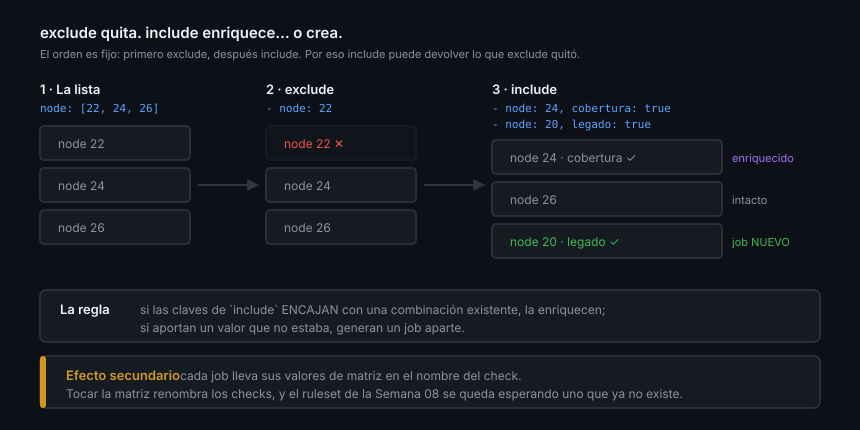

# Matrices

> Una matriz multiplica jobs. Lo que casi nadie anticipa es que también
> multiplica —y renombra— los checks que tu ruleset está exigiendo.

## 🎯 Objetivos

- Construir matrices con varias dimensiones
- Saber cuándo `include` enriquece y cuándo crea un job nuevo
- Elegir `fail-fast` y `max-parallel` con criterio
- Construir matrices dinámicas y sobrevivir al renombrado de los checks

## 1. Qué problema resuelve

Dices que tu librería funciona en tres versiones de Node. ¿Lo has probado? Una
matriz genera un job por combinación, con su runner limpio, en paralelo.

```yaml
strategy:
  fail-fast: false
  matrix:
    node: [22, 24, 26]
    os: [ubuntu-latest, windows-latest]
```

Seis jobs. Y seis checks en el PR: `Tests (22, ubuntu-latest)`,
`Tests (24, windows-latest)`…



## 2. Los límites

- Máximo **256 jobs** por workflow run
- `fail-fast` vale **`true` por defecto**: un job que falla cancela los demás
- `max-parallel` limita cuántos corren a la vez

### `fail-fast`

En CI casi siempre quieres `false`. La diferencia es informativa:

| | `fail-fast: true` (defecto) | `fail-fast: false` |
|---|---|---|
| Un job falla | Los demás se cancelan | Los demás terminan |
| Lo que aprendes | "Falla algo" | "Falla **solo** en Node 26" |
| Lo que ahorras | Unos minutos de runner | — |

En repositorios públicos los runners son gratis, así que el ahorro es cero y la
información vale mucho. `fail-fast: true` tiene sentido cuando la matriz es
enorme y cada job cuesta dinero.

### `max-parallel`

```yaml
strategy:
  max-parallel: 2
  matrix:
    entorno: [dev, staging, qa, demo]
```

Sirve cuando los jobs comparten algo que no escala: una base de datos de
pruebas, una API de terceros con límite de peticiones, una licencia. Sin él, los
cuatro arrancan a la vez y se pisan.

## 3. `include` y `exclude`

`exclude` quita combinaciones. `include` tiene **dos comportamientos** según
encaje o no con lo que ya existe.

```yaml
strategy:
  matrix:
    node: [22, 24, 26]
    exclude:
      - node: 22            # quita el job de Node 22
    include:
      - node: 24
        cobertura: true     # AÑADE una propiedad al job que ya existe
      - node: 20
        legado: true        # CREA un job nuevo: 20 no estaba en la lista
```

Resultado: tres jobs. El de 24 enriquecido con `cobertura`, el de 26 tal cual, y
uno nuevo de Node 20.

La regla completa:

| Situación | Qué hace `include` |
|-----------|--------------------|
| Sus claves encajan con una combinación existente | La **enriquece** con las claves nuevas |
| Aporta un valor que no está en la lista original | **Crea** un job aparte |
| Sobrescribiría un valor original | **Crea** un job aparte, no lo sobrescribe |

Y el orden importa: **`exclude` se aplica antes que `include`**, así que
`include` puede volver a meter algo que `exclude` acababa de quitar.

> [!NOTE]
> Un job enriquecido por `include` **cambia de nombre**, porque GitHub compone el
> nombre del check con los valores de matriz de ese job. No lo deduzcas: léelo
> con `gh pr checks --json name --jq '[.[].name]'`.

### Usos reales de `include`

```yaml
matrix:
  node: [22, 24, 26]
  include:
    # La versión "principal" hace además cobertura y sube el informe
    - node: 24
      principal: true
    # Un job extra en macOS solo para la versión que publicamos
    - node: 24
      os: macos-latest
```

Y de `exclude`:

```yaml
matrix:
  node: [22, 24, 26]
  os: [ubuntu-latest, windows-latest, macos-latest]
  exclude:
    # macOS es diez veces más caro: solo la versión principal
    - os: macos-latest
      node: 22
    - os: macos-latest
      node: 26
```

## 4. Matrices dinámicas

Cuando las combinaciones no se saben hasta el momento de ejecutar —los paquetes
de un monorepo, las versiones soportadas leídas de un archivo— la matriz se
calcula en un job previo:

```yaml
jobs:
  preparar:
    runs-on: ubuntu-latest
    outputs:
      versiones: ${{ steps.calcular.outputs.versiones }}
    steps:
      - uses: actions/checkout@3d3c42e5aac5ba805825da76410c181273ba90b1 # v7.0.1
      - id: calcular
        run: |
          # Un JSON de una sola línea, tal cual lo espera fromJSON
          echo 'versiones=["22","24","26"]' >> "$GITHUB_OUTPUT"

  test:
    needs: preparar
    strategy:
      fail-fast: false
      matrix:
        node: ${{ fromJSON(needs.preparar.outputs.versiones) }}
    runs-on: ubuntu-latest
    steps: [...]
```

Requisitos, los tres: el output es **texto JSON válido**, en **una sola línea**,
y el job de la matriz declara `needs`.

> [!TIP]
> Depura el JSON antes de usarlo. Un output mal formado da un error de matriz
> vacía que no dice dónde está el problema:
> `echo "$VERSIONES" | jq -e 'type == "array"'`.

## 5. El efecto secundario que rompe el ruleset

Este es el punto que conecta la semana con la anterior.

Un job llamado `Tests` produce un check llamado `Tests`. En cuanto le pones una
matriz, ese check **deja de existir** y en su lugar aparecen `Tests (22)`,
`Tests (24)`, `Tests (26)`. Si el ruleset de la Semana 08 exigía `Tests`, ahora
espera un check que nadie va a reportar nunca: el PR queda bloqueado para
siempre, con los tests en verde.

Hay dos salidas y solo una escala:

❌ **Exigir los tres contexts con paréntesis.** Funciona hasta que cambies la
matriz —añadir Node 28, quitar el 22— y entonces vuelves a estar bloqueado.

✅ **Un job agregador con nombre fijo:**

```yaml
  ci-ok:
    name: CI
    needs: test
    if: ${{ !cancelled() }}
    runs-on: ubuntu-latest
    steps:
      - env:
          RESULTADO: ${{ needs.test.result }}
        run: |
          echo "La matriz terminó con: $RESULTADO"
          [ "$RESULTADO" = "success" ]
```

El ruleset exige `CI`, y la matriz puede cambiar cuanto quiera. Tres detalles que
no son decorativos:

| Detalle | Por qué |
|---------|---------|
| `needs: test` | Espera a **todos** los jobs de la matriz, no a uno |
| `if: ${{ !cancelled() }}` | Sin él, el `success()` implícito lo saltaría cuando la matriz falla, y el check quedaría *skipped* en vez de rojo |
| `[ "$RESULTADO" = "success" ]` | Con un `if:` explícito el job **no hereda** el fallo: hay que comprobarlo a mano |

## 6. Antipatrones

| Antipatrón | Por qué duele | Qué hacer |
|------------|---------------|-----------|
| `fail-fast: true` en CI | Cancela el job que te iba a dar la pista | `false` |
| Matriz sin `max-parallel` contra un recurso compartido | Los jobs se pisan | `max-parallel` |
| Exigir los contexts con paréntesis en el ruleset | Se rompe al cambiar la matriz | Job agregador |
| Job agregador sin comprobar `result` | Verde con la matriz roja | `[ "$R" = "success" ]` |
| Matriz de 5×5 "por completitud" | 25 jobs para probar lo mismo | Las combinaciones que de verdad importan |
| Versiones sin soporte en la matriz | Runners gastados en algo que nadie usa | Revísalas cada trimestre |
| `fromJSON` sobre un output multilínea | Matriz vacía sin explicación | JSON en una sola línea |

## 7. Trucos

- **Ver los nombres reales de los checks**: `gh pr checks --json name --jq '[.[].name]'`
- **`strategy.job-index`** numera los jobs de la matriz, útil para repartir tests
- **`continue-on-error: true`** en un job de matriz lo excluye de `fail-fast`:
  es la forma de tener una versión experimental sin que tumbe las demás
- **`matrix` completo para depurar**: `${{ toJSON(matrix) }}` por `env:`
- **El nombre del artifact necesita la matriz dentro**, o el segundo upload falla
- **Si cambias la matriz, revisa el ruleset** antes de mergear

## 📚 Recursos Adicionales

- [GitHub Docs — Running variations of jobs in a workflow](https://docs.github.com/actions/how-tos/write-workflows/choose-what-workflows-do/run-job-variations)
- [GitHub Docs — Workflow syntax: `strategy`](https://docs.github.com/actions/reference/workflows-and-actions/workflow-syntax)
- [Node.js — Previous releases](https://nodejs.org/en/about/previous-releases) — qué versiones tienen soporte hoy

## ✅ Checklist de Verificación

- [ ] Sabes cuándo `include` enriquece y cuándo crea un job nuevo
- [ ] Sabes en qué orden se aplican `exclude` e `include`
- [ ] Sabes por qué una matriz rompe un check requerido
- [ ] Sabes los tres requisitos de una matriz dinámica
