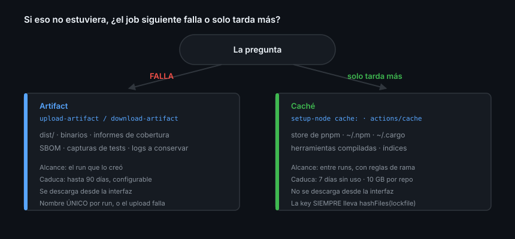

# Artifacts y caché

> Se confunden constantemente porque los dos "guardan cosas". La diferencia se
> resuelve con una pregunta: si no está, ¿el job **falla** o solo **tarda más**?

## 🎯 Objetivos

- Publicar y consumir artifacts entre jobs sin sorpresas de nombres
- Escribir una `key` de caché que acierte y que invalide cuando debe
- Conocer los límites reales de ambos y qué se borra cuándo
- Decidir cuál usar en cada caso

## 1. Qué problema resuelve

Un job compila y otro despliega, pero no comparten disco
([Teoría 01](01-modelo-de-ejecucion.md)). Y `pnpm install` tarda lo mismo en
cada run aunque las dependencias no hayan cambiado.

Dos problemas distintos, dos mecanismos distintos.



## 2. Artifacts

Archivos que sobreviven al job y se pueden descargar desde la interfaz.

```yaml
- uses: actions/upload-artifact@043fb46d1a93c77aae656e7c1c64a875d1fc6a0a # v7.0.1
  with:
    name: build-${{ matrix.node }}
    path: dist/
    retention-days: 7
    if-no-files-found: error
    compression-level: 6
```

```yaml
- uses: actions/download-artifact@3e5f45b2cfb9172054b4087a40e8e0b5a5461e7c # v8.0.1
  with:
    name: build-24
    path: dist/
```

### Las tres cosas que se aprenden tropezando

**1. El nombre debe ser único dentro del run.** Subir dos veces el mismo nombre
falla, salvo `overwrite: true`. En una matriz, mete la variable en el nombre o
los seis jobs pelearán por `build`.

**2. `if-no-files-found: error`.** El valor por defecto es `warn`: si tu `path`
está mal escrito, el step sale **en verde** y el artifact llega vacío. Lo
descubres tres jobs después, cuando el que lo descarga no encuentra nada.

**3. `if: ${{ !cancelled() }}` en los informes.** El `success()` implícito impide
subir el informe de tests justo cuando los tests han fallado, que es cuando hace
falta.

### Descargar varios de golpe

```yaml
- uses: actions/download-artifact@3e5f45b2cfb9172054b4087a40e8e0b5a5461e7c # v8.0.1
  with:
    pattern: build-*
    path: builds/
    merge-multiple: false     # cada uno en su subcarpeta
```

Con `merge-multiple: true` todos caen en el mismo directorio, lo que es cómodo
hasta que dos artifacts traen un archivo con el mismo nombre.

### Límites

| | |
|---|---|
| Retención | 90 días por defecto en repos públicos, configurable por repo y por artifact |
| Tamaño | Cuenta contra el almacenamiento de Actions de la cuenta |
| Alcance | El run que lo creó; otro run necesita `github-token` y `run-id` |
| Inmutabilidad | Un artifact subido no se modifica: se sube otro o se sobrescribe entero |

`retention-days` por artifact es lo que evita que los informes de CI de hace
tres meses ocupen espacio: 7 días para lo desechable, el defecto para lo que de
verdad quieras conservar.

## 3. Caché

La caché no cambia el resultado, solo el tiempo. Si no acierta, el job hace lo
mismo, más despacio.

### Lo habitual: que la gestione `setup-node`

```yaml
- uses: pnpm/action-setup@0977fd99725f1db4007ccb2928dbb4e90d06cc86 # v6.0.10
  with:
    version: 10

- uses: actions/setup-node@820762786026740c76f36085b0efc47a31fe5020 # v7.0.0
  with:
    node-version: 22
    cache: pnpm

- run: pnpm install --frozen-lockfile
```

> [!IMPORTANT]
> `pnpm/action-setup` va **antes** que `setup-node`, que necesita `pnpm` en el
> PATH para localizar el store que va a cachear. Al revés falla, con un mensaje
> de error poco evidente.

`cache:` acepta `npm`, `yarn` y `pnpm`, y expone tres outputs: `cache-hit`,
`cache-primary-key` y `cache-matched-key`.

> [!WARNING]
> **Sin lockfile no hay caché posible.** La documentación de `setup-node` es
> explícita: *"If you choose not to use a lockfile, you must ensure that caching
> is disabled. The `cache` feature relies on the lockfile to generate a unique
> key for the cache entry."* Si tu proyecto aún no tiene dependencias, pon
> `package-manager-cache: false` y vuelve a esto cuando las tenga.

### A mano, con `actions/cache`

```yaml
- uses: actions/cache@55cc8345863c7cc4c66a329aec7e433d2d1c52a9 # v6.1.0
  id: cache-herramienta
  with:
    path: ~/.cache/mi-herramienta
    key: ${{ runner.os }}-mi-herramienta-${{ hashFiles('**/pnpm-lock.yaml') }}
    restore-keys: |
      ${{ runner.os }}-mi-herramienta-

- name: Compilar solo si no acertó la caché
  if: steps.cache-herramienta.outputs.cache-hit != 'true'
  run: ./compilar-herramienta.sh
```

| Parte de la clave | Para qué |
|-------------------|----------|
| `runner.os` | Una caché de Linux no sirve en Windows |
| Un identificador | Distinguir esta caché de las demás del repo |
| `hashFiles(lockfile)` | **Invalida** cuando cambian las dependencias |
| `restore-keys` | Acierto parcial: mejor una caché algo vieja que ninguna |

Una `key` fija sin hash del lockfile es **peor que no tener caché**: sirve
dependencias obsoletas indefinidamente y produce fallos que no se reproducen en
local.

> [!NOTE]
> `cache-hit` vale `'true'` como **cadena**, no como booleano, y solo es `'true'`
> con acierto **exacto** de `key`. Un acierto por `restore-keys` deja `cache-hit`
> en `'false'` aunque sí haya restaurado algo. Para saber qué se restauró de
> verdad, mira `cache-matched-key`.

### Límites y alcance

- **10 GB por repositorio** por defecto
- Las entradas **no usadas en 7 días se borran**
- Al llegar al límite se expulsa por **fecha de último acceso**, de la más
  antigua a la más reciente
- Una rama restaura cachés **de sí misma, de su rama base y de la rama por
  defecto** — no de ramas hermanas ni hijas
- Una caché creada por un PR **solo la restauran las reejecuciones de ese PR**

Los dos últimos puntos explican el desconcierto más común: tu rama nueva no
acierta porque la caché la creó otra rama de feature. El patrón que funciona es
que la rama por defecto llene la caché, y todas las demás tiren de ahí.

### Cuándo la caché no compensa

- Si restaurarla tarda casi lo mismo que reinstalar. Muy común con
  `node_modules` grandes: comprimir y descomprimir 500 MB no siempre gana a un
  `pnpm install` con store caliente
- Si la clave cambia en cada run. Una `key` con `github.sha` dentro nunca acierta
- Si lo que cacheas es el resultado de compilar código que cambia siempre

Mídelo: compara la duración del job con y sin caché antes de dar por hecho que
mejora.

## 4. Artifact frente a caché

| | Artifact | Caché |
|---|---|---|
| Para qué | Un **resultado** que conservar o mover | Acelerar un paso repetido |
| Si no está | El job siguiente **falla** | Solo **tarda más** |
| Alcance | Un run (otro run necesita token) | Entre runs, con reglas de rama |
| Se descarga desde la UI | ✅ Sí | ❌ No |
| Caducidad | Hasta 90 días, configurable | 7 días sin uso, o expulsión por tamaño |
| Se sobrescribe | Con `overwrite: true` | Nunca: una `key` usada es inmutable |

Una sola pregunta decide: si el job siguiente **no puede funcionar sin ello**, es
un artifact; si solo iría más lento, es una caché.

El error clásico es usar la caché como si fuera un artifact —cachear `dist/`
para que lo lea el job de deploy— y descubrir en producción que un día no
acertó y se desplegó una versión vieja.

## 5. Antipatrones

| Antipatrón | Por qué duele | Qué hacer |
|------------|---------------|-----------|
| Mismo nombre de artifact en una matriz | El segundo upload falla | `matrix.*` en el nombre |
| `if-no-files-found` por defecto | Artifact vacío en verde | `error` |
| `if: success()` implícito en el informe de tests | No se sube cuando más falta hace | `if: ${{ !cancelled() }}` |
| `key` sin hash del lockfile | Dependencias obsoletas para siempre | `hashFiles(...)` |
| `key` con `github.sha` | No acierta jamás | Hash del lockfile |
| Caché para pasar archivos entre jobs | Falla en silencio al no acertar | Artifact |
| `setup-node` antes de `pnpm/action-setup` | No encuentra el store | Invierte el orden |
| `cache-hit == true` sin comillas | Es una cadena | `!= 'true'` |
| Artifacts sin `retention-days` | 90 días de informes de CI | 7 para lo desechable |

## 6. Trucos

- **Ver cachés y tamaño**: `gh cache list`; borrar una, `gh cache delete <key>`
- **Vaciar todas las cachés** cuando sospechas que una está envenenada:
  `gh cache delete --all`
- **Descargar los artifacts de un run**: `gh run download <run-id>`
- **Nombres únicos entre runs**: `github.run_id` dentro del nombre
- **Qué se restauró de verdad**: `cache-matched-key`, no `cache-hit`
- **Medir si la caché compensa**: `gh run list --workflow=ci.yml --json databaseId,createdAt,updatedAt`
- **Un artifact de otro run** necesita `github-token`, `repository` y `run-id` en
  `download-artifact`

## 📚 Recursos Adicionales

- [GitHub Docs — Store and share data with workflow artifacts](https://docs.github.com/actions/how-tos/write-workflows/choose-what-workflows-do/store-artifacts)
- [GitHub Docs — Dependency caching reference](https://docs.github.com/actions/reference/workflows-and-actions/dependency-caching)
- [actions/cache](https://github.com/actions/cache) — ejemplos por lenguaje en su README

## ✅ Checklist de Verificación

- [ ] Decides entre artifact y caché con una sola pregunta
- [ ] Sabes por qué la `key` necesita el hash del lockfile
- [ ] Sabes por qué `cache-hit` puede ser `'false'` habiendo restaurado algo
- [ ] Sabes por qué una rama nueva no acierta en la caché de otra rama
