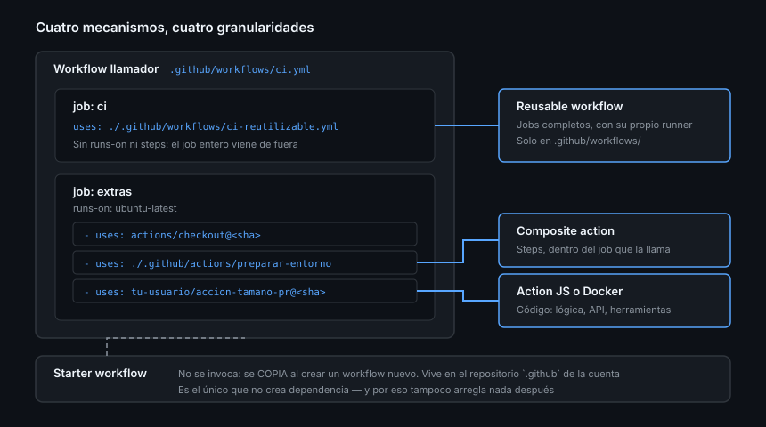

# Qué reutilizar y cómo elegir

> El segundo repositorio con el mismo `ci.yml` copiado no es un problema. El
> quinto, con cinco versiones distintas del mismo YAML que ya nadie sabe cuál es
> la buena, sí.

## 🎯 Objetivos

- Reconocer qué duplicación merece la pena eliminar y cuál no
- Distinguir los cuatro mecanismos de reutilización de Actions
- Elegir el mecanismo por el **tamaño de lo que reutilizas**, no por gusto
- Saber dónde puede vivir lo compartido y quién puede usarlo
- Asumir el coste real de mantener algo que usan otros

## 1. Qué problema resuelve

La Semana 09 dejó un `ci.yml` que funciona. En cuanto haya un segundo proyecto,
ese archivo se copia. Y a partir de ahí empieza la deriva: en uno se arregla el
`pipefail`, en otro se sube la versión de Node, en el tercero se añade la caché.
Seis meses después, arreglar un fallo significa arreglarlo cinco veces — y
encontrar los cinco sitios.

Reutilizar en Actions es exactamente eso: **tener un solo sitio donde arreglarlo**.

Con un matiz importante, porque la reutilización tiene un coste: en cuanto algo
lo usan otros, cambiarlo puede romperlos. Deja de ser un archivo y pasa a ser una
**interfaz**.

## 2. Los cuatro mecanismos

| Mecanismo | Qué reutiliza | Se invoca con | Vive en |
|-----------|---------------|---------------|---------|
| **Starter workflow** | Un workflow entero, como plantilla inicial | El botón *New workflow* | El repositorio `.github` de la cuenta u organización |
| **Reusable workflow** | Uno o varios **jobs** completos | `jobs.<id>.uses:` | Cualquier repositorio, en `.github/workflows/` |
| **Composite action** | Una secuencia de **steps** | `steps[].uses:` | Cualquier ruta de un repositorio |
| **Action JS o Docker** | **Código** que hace algo que el YAML no sabe hacer | `steps[].uses:` | Cualquier repositorio, `action.yml` en su raíz para publicarla |

La diferencia entre los dos del medio es la que más cuesta al principio, y es
puramente de **granularidad**:

```
Workflow llamador
└── job: uses: … ← REUSABLE WORKFLOW: sustituye el job entero (runs-on incluido)
    └── steps:
        ├── uses: actions/checkout@…
        └── uses: ./.github/actions/preparar   ← COMPOSITE: sustituye varios steps
```

Un reusable workflow **trae su propio `runs-on`** y puede tener varios jobs con
`needs` entre ellos. Una composite action se ejecuta **dentro** del job de quien
la llama, en su máquina y con su entorno.



## 3. La tabla de decisión

| Necesitas… | Mecanismo |
|------------|-----------|
| Que un repositorio nuevo empiece con un CI decente | Starter workflow |
| El mismo pipeline (con sus jobs y su matriz) en varios repositorios | Reusable workflow |
| Los mismos 5 steps al principio de todos tus jobs | Composite action |
| Llamar a la API, transformar datos, hacer algo con lógica de verdad | Action en JavaScript |
| Una herramienta que no es JavaScript y trae dependencias del sistema | Action en Docker |
| Ejecutar algo una sola vez en un solo repositorio | **Nada**: un `run:` y ya |

Y la regla que resume todo: **el mecanismo más pequeño que resuelve el
problema**. Cada escalón hacia arriba añade un artefacto que versionar, publicar
y mantener.

### Señales de que te has pasado

- Una action de JavaScript de 30 líneas que solo hace `echo` y un `curl`: eso es
  un `run:`
- Un reusable workflow con un solo job de un solo step: eso es una composite
- Una composite action usada en un único sitio: eso son steps

## 4. Dónde vive y quién puede usarlo

| Origen | Cómo se referencia | Requisitos |
|--------|--------------------|-----------|
| El mismo repositorio | `./.github/workflows/ci.yml` · `./.github/actions/x` | Para las actions locales, `actions/checkout` **antes** |
| Otro repositorio público | `owner/repo/.github/workflows/ci.yml@<ref>` · `owner/repo@<ref>` | Ninguno |
| Otro repositorio privado de tu cuenta u organización | Igual | Hay que **permitirlo** en la configuración de Actions del repositorio origen |
| Marketplace | `owner/repo@<ref>` | Es un repositorio público como cualquier otro |

Dos detalles que ahorran una tarde:

- Una action local (`./…`) **no existe hasta que haces checkout**: el runner
  arranca con el disco vacío ([Semana 09](../../week-09-actions_fundamentos/1-teoria/01-modelo-de-ejecucion.md))
- Un reusable workflow **solo** puede vivir en `.github/workflows/`, no en
  subcarpetas. Las actions pueden estar en cualquier ruta

## 5. El coste de compartir

Lo que cambia el día que otro repositorio depende de tu workflow o de tu action:

| Antes | Después |
|-------|---------|
| Editas y ya | Tienes que versionar ([Teoría 07](07-versionar-publicar-y-compartir.md)) |
| Si rompes algo, lo arreglas | Si rompes algo, rompes a otros |
| No hay documentación | Los `inputs` son una API y hay que documentarla |
| Lo pruebas usándolo | Necesita sus propios tests ([Teoría 06](06-probar-y-mantener-una-action.md)) |

Por eso la pregunta previa a todo esto no es "¿puedo reutilizarlo?" sino
**"¿esto lo va a usar alguien más de una vez?"**. Si la respuesta es no, copiar y
pegar es la decisión correcta.

## 6. Antipatrones

| Antipatrón | Por qué duele | Qué hacer |
|------------|---------------|-----------|
| Copiar `ci.yml` en cinco repositorios | Cinco versiones que divergen | Reusable workflow |
| Factorizarlo todo el primer día | Abstraes lo que aún no sabes cómo va a cambiar | Espera al tercer uso |
| Action de JavaScript para un `curl` | Un artefacto que versionar por dos líneas | `run:` |
| Reusable workflow con un solo step | Traes un job entero para nada | Composite action |
| Composite en un único repositorio y un único job | Indirección sin ganancia | Steps normales |
| Action local sin `checkout` antes | `Can't find 'action.yml'` y media hora perdida | `actions/checkout` primero |
| Compartir sin versionar | Un cambio tuyo rompe a otros sin avisar | Tags y SemVer |
| Un repositorio "utils" con veinte actions dentro | Ninguna se puede versionar por separado | Un repositorio por action publicada |

## 7. Trucos

- **La regla del tercer uso**: la primera vez lo escribes, la segunda lo copias,
  la tercera lo factorizas. Antes no sabes qué parte varía
- **Empieza dentro del mismo repositorio** (`./.github/actions/…`): es reutilización
  real, sin publicar nada y sin versionar
- **Busca la duplicación con una consulta**:
  `gh search code 'org:tu-org path:.github/workflows setup-node'` — si el mismo
  bloque aparece en cinco repos, ahí está tu primer candidato
- **Los inputs son la parte difícil.** Antes de extraer, escribe la llamada que
  te gustaría poder escribir; luego construye lo que la haga posible
- **Nombra por lo que hace, no por dónde vive**: `preparar-entorno`, no
  `action-comun-2`

## 📚 Recursos Adicionales

- [GitHub Docs — Avoid duplication](https://docs.github.com/actions/how-tos/reuse-automations)
- [GitHub Docs — Reusing workflows](https://docs.github.com/actions/how-tos/reuse-automations/reuse-workflows)
- [GitHub Docs — About custom actions](https://docs.github.com/actions/concepts/workflows-and-actions/custom-actions)
- [GitHub Docs — Creating starter workflows](https://docs.github.com/actions/how-tos/reuse-automations/create-workflow-templates)

## ✅ Checklist de Verificación

- [ ] Sabes decir en una frase la diferencia entre reusable workflow y composite
- [ ] Sabes qué mecanismo elegirías para cada fila de la tabla del punto 3
- [ ] Sabes por qué una action local necesita `checkout` antes
- [ ] Puedes nombrar dos costes de compartir algo que antes era tuyo
