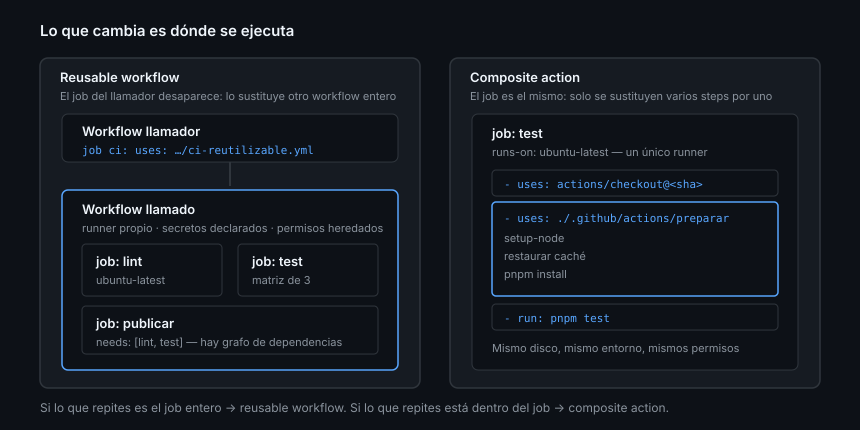

# Composite actions

> Cinco steps que se repiten al principio de todos tus jobs, convertidos en uno.
> Es el mecanismo de reutilización con menos ceremonia de los cuatro, y el que
> más rendimiento da al principio.

## 🎯 Objetivos

- Escribir un `action.yml` de tipo `composite` con inputs y outputs
- Saber qué contextos hay dentro y cuál falta (y por qué)
- Referenciar scripts que viajan con la action
- Usarla desde el mismo repositorio y desde otro
- Elegir entre composite y reusable workflow sin dudar

## 1. Qué problema resuelve

Todo job de tu CI empieza igual: checkout, instalar Node, activar pnpm, restaurar
la caché, instalar dependencias. Son cinco steps que ni cambian ni interesan a
nadie, y que están copiados en cada job y en cada repositorio.

Una composite action los empaqueta en un solo `uses:`. A diferencia del reusable
workflow, **no trae job propio**: se ejecuta dentro del job de quien la llama,
en su runner y con su sistema de archivos.



## 2. La forma mínima

```yaml
# .github/actions/preparar-entorno/action.yml
name: Preparar entorno
description: Instala Node y las dependencias del proyecto, con caché
author: tu-usuario

inputs:
  node-version:
    description: Versión de Node
    required: false
    default: "24"
  instalar:
    description: Si se ejecuta la instalación de dependencias
    required: false
    default: "true"

outputs:
  cache-hit:
    description: Si la caché de dependencias acertó
    value: ${{ steps.node.outputs.cache-hit }}

runs:
  using: composite
  steps:
    - uses: pnpm/action-setup@0977fd99725f1db4007ccb2928dbb4e90d06cc86 # v6.0.10

    - id: node
      uses: actions/setup-node@820762786026740c76f36085b0efc47a31fe5020 # v7.0.0
      with:
        node-version: ${{ inputs.node-version }}
        cache: pnpm

    - if: ${{ inputs.instalar == 'true' }}
      shell: bash
      run: pnpm install --frozen-lockfile
```

Y se usa así:

```yaml
      - uses: actions/checkout@3d3c42e5aac5ba805825da76410c181273ba90b1 # v7.0.1
      - uses: ./.github/actions/preparar-entorno
        with:
          node-version: "22"
```

El `checkout` va **antes**, siempre: una action local no existe en el runner
hasta que el repositorio está clonado.

## 3. Las cuatro reglas que hay que memorizar

### `shell` es obligatorio

Todo step con `run:` dentro de una composite **tiene que declarar `shell:`**. En
un workflow normal se puede omitir; aquí no, y el error que sale si falta no
menciona la palabra `shell` de forma evidente.

```yaml
    - shell: bash
      run: pnpm install --frozen-lockfile
```

Usa `bash` salvo que necesites otra cosa: en Windows también funciona, y trae
`pipefail` ([Semana 09](../../week-09-actions_fundamentos/1-teoria/01-modelo-de-ejecucion.md)).

### Todos los inputs son cadenas

`default: "true"` es la cadena `"true"`, no un booleano. Por eso las condiciones
se escriben comparando texto:

```yaml
    - if: ${{ inputs.instalar == 'true' }}
```

Comparar contra el booleano `true` funciona por casualidad en algunos casos y
falla en otros; comparar contra `'true'` funciona siempre.

### No hay contexto `secrets`

> [!IMPORTANT]
> *"The `secrets` context is not available for composite actions due to security
> reasons. If you want to pass a secret to a composite action, you need to do it
> explicitly as an input."*

Es una decisión de seguridad: una action de terceros no puede leerse tus secretos
por su cuenta. Si tu action necesita un token, se declara como input y quien la
usa decide qué le pasa:

```yaml
inputs:
  token:
    description: Token con permiso de lectura del repositorio
    required: true
```

```yaml
      - uses: ./.github/actions/preparar-entorno
        with:
          token: ${{ secrets.GITHUB_TOKEN }}
```

### Los outputs se mapean a mano

Un step de dentro no publica nada hacia fuera por sí solo: hay que declararlo en
`outputs` apuntando a `steps.<id>.outputs.<clave>`. De ahí el `id:` del ejemplo.

## 4. Scripts que viajan con la action

Cuando la lógica pasa de tres líneas, el `run:` se convierte en un script en su
propio archivo. La ruta se resuelve con `github.action_path`, que apunta al
directorio de la action **en el runner**:

```yaml
    - shell: bash
      run: ${{ github.action_path }}/scripts/comprobar.sh
```

Sin eso, la ruta relativa apunta al `GITHUB_WORKSPACE` del repositorio que la
llama, no a donde vive la action. Es el segundo error más común.

## 5. Composite o reusable workflow

| | Composite action | Reusable workflow |
|---|------------------|-------------------|
| Sustituye | Steps | Jobs completos |
| Trae `runs-on` | No: corre en el job del llamador | Sí |
| Varios jobs con `needs` | No | Sí |
| Matriz propia | No | Sí |
| Acceso a `secrets` | Solo por input | Declarados o `inherit` |
| Se puede publicar en Marketplace | Sí | No |
| Ubicación | Cualquier ruta | Solo `.github/workflows/` |
| Anidamiento | Puede usar otras actions | Hasta diez niveles |

Traducción: **si lo que repites está dentro de un job, composite; si lo que
repites es el job entero, reusable workflow.**

## 6. Antipatrones

| Antipatrón | Por qué duele | Qué hacer |
|------------|---------------|-----------|
| `run:` sin `shell:` | Falla con un error poco claro | `shell: bash` siempre |
| Esperar `secrets` dentro de la action | No existe ahí | Input explícito |
| Comparar `inputs.x == true` | Los inputs son cadenas | `== 'true'` |
| Ruta relativa a un script propio | Apunta al workspace, no a la action | `${{ github.action_path }}` |
| Usarla sin `checkout` previo | `Can't find 'action.yml'` | `checkout` primero |
| Composite con quince inputs | Hace demasiadas cosas | Divídela |
| Meter la caché dentro sin pensarlo | El llamador pierde el control de la `key` | Input para la clave, o déjalo fuera |
| Actions de terceros sin pinnear dentro de la tuya | Tu action hereda el riesgo ajeno | Pin por SHA (Semana 11) |

## 7. Trucos

- **Empieza local** (`./.github/actions/…`): reutilizas dentro del repositorio sin
  publicar ni versionar nada
- **`if:` funciona en los steps de la composite**, así que un input booleano
  convierte un paso en opcional
- **Un `README.md` junto al `action.yml`** con la tabla de inputs y un ejemplo
  copiable: es lo que la gente lee, no el YAML
- **Nombra los `id:`** de los steps cuyos outputs vayas a exponer: sin `id` no hay
  output
- **Prueba la action en el propio repositorio** antes de moverla a otro sitio: el
  ciclo es mucho más corto
- **Si el `run:` pasa de diez líneas**, sácalo a un script y ejecútalo con
  `${{ github.action_path }}` — se puede probar en local

## 📚 Recursos Adicionales

- [GitHub Docs — Create a composite action](https://docs.github.com/actions/tutorials/create-actions/create-a-composite-action)
- [GitHub Docs — Metadata syntax for GitHub Actions](https://docs.github.com/actions/reference/workflows-and-actions/metadata-syntax)
- [GitHub Docs — Contexts](https://docs.github.com/actions/reference/workflows-and-actions/contexts)

## ✅ Checklist de Verificación

- [ ] Tienes una composite action en `.github/actions/` usada por tu CI
- [ ] Todos sus steps con `run:` declaran `shell:`
- [ ] Sus inputs booleanos se comparan contra `'true'`
- [ ] Sabes por qué no puede leer `secrets` y cómo se le pasa un token
- [ ] Sabes cuándo usarías un reusable workflow en su lugar
