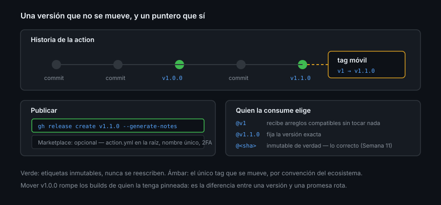

# Versionar, publicar y compartir

> Una action sin versiones es una action que nadie puede usar en serio: cada
> `push` tuyo a `main` entra en el CI de otra persona sin avisar.

## 🎯 Objetivos

- Etiquetar releases de una action y mantener el tag mayor móvil
- Publicar en GitHub Marketplace sabiendo qué exige
- Explicar a quien te use qué referencia debe poner
- Compartir dentro de una organización, con repositorios privados incluidos
- Ofrecer starter workflows para que un repositorio nuevo empiece bien

## 1. Qué problema resuelve

Quien escribe `uses: tu-usuario/tu-action@main` está ejecutando en su CI el
último commit que hayas hecho, sea el que sea. Funciona hasta el día que no.

Las versiones son el contrato: **`v1` significa "no te voy a romper"**.



## 2. El esquema de tags

La convención del ecosistema —la que usan `actions/checkout` y compañía— son dos
tipos de etiqueta a la vez:

| Tag | Qué es | Se mueve |
|-----|--------|:--------:|
| `v1.2.3` | La versión exacta, inmutable | ❌ Nunca |
| `v1` | Puntero a la última `v1.x.x` | ✅ En cada release compatible |

```bash
# Publicar la versión
git tag -a v1.2.3 -m "v1.2.3"
git push origin v1.2.3

# Mover el tag mayor a esa misma versión
git tag -f -a v1 -m "v1 → v1.2.3"
git push -f origin v1
```

> [!WARNING]
> Ese `push -f` sobre `v1` es la **única** reescritura de historia aceptada del
> bootcamp, y solo porque el ecosistema entero funciona así. No lo hagas nunca
> con `v1.2.3`: una versión publicada que cambia de contenido rompe todo lo que
> la tenía pinneada por SHA y la reproducibilidad de builds ajenos.

Si te incomoda mover tags, la alternativa aceptada es una **rama** `v1` que
avanza igual. Muchos proyectos usan ese esquema y es igual de válido.

Qué versión sube según el cambio, con las reglas de la
[Semana 07](../../week-07-code_review_y_convenciones/1-teoria/04-semver-y-changelog.md):

| Cambio en la action | Incremento |
|---------------------|:----------:|
| Corriges un fallo sin cambiar el contrato | PARCHE |
| Añades un input **opcional** o un output | MENOR |
| Renombras o eliminas un input | **MAYOR** |
| Cambias el valor por defecto de un input | **MAYOR** casi siempre |
| Necesitas un permiso nuevo del `GITHUB_TOKEN` | **MAYOR**: rompes a quien tenga permisos mínimos |
| Cambias `node20` por `node24` | MAYOR si dejas de soportar runners viejos |

Ese penúltimo se olvida mucho: pedir un permiso nuevo rompe a todo el que declare
`permissions` al mínimo, que es justo la gente que lo hace bien.

## 3. Publicar la release

```bash
gh release create v1.2.3 \
  --title "v1.2.3" \
  --notes "Añade el input umbral-grande. Sin cambios incompatibles."
```

Una release es lo que hace que la versión sea visible, citable y descargable. Y
en el caso de una action, es también la puerta al Marketplace.

## 4. GitHub Marketplace

Requisitos, verificados en agosto de 2026 contra
[Publishing an action](https://docs.github.com/actions/how-tos/create-and-publish-actions/publish-in-github-marketplace):

| Requisito | Detalle |
|-----------|---------|
| Repositorio **público** | Uno por action |
| `action.yml` **en la raíz** | Un único archivo de metadatos por repositorio |
| Nombre único | No puede coincidir con otra action, ni con una categoría o feature de GitHub |
| Autenticación en dos pasos | Obligatoria en la cuenta que publica |
| Aceptar los términos | Acuerdo de desarrollador del Marketplace |

El flujo: en la página del repositorio aparece un banner sobre el `action.yml` →
*Draft a release* → marcar **Publish this Action to the GitHub Marketplace** →
elegir categorías → publicar. No hay revisión previa: se publica al momento.

Y lo que hace que se entienda de un vistazo en el listado:

```yaml
branding:
  icon: tag        # un icono de Feather
  color: blue      # white, black, yellow, blue, green, orange, red, purple, gray-dark
```

> [!NOTE]
> Publicar en el Marketplace es **opcional**. Una action en un repositorio
> público ya se puede usar con `uses: tu-usuario/tu-action@v1` sin publicar nada.
> El Marketplace solo añade descubribilidad.

## 5. Qué le dices a quien te usa

| Referencia | Quién debería usarla |
|------------|----------------------|
| `@v1` | Uso general: recibe arreglos sin romperse |
| `@v1.2.3` | Quien quiere fijar la versión exacta |
| `@<sha de 40>` | Cualquiera que se tome en serio la cadena de suministro |
| `@main` | Nadie |

En el README pon el ejemplo con `@v1` —es lo que la gente copia— y menciona el
pin por SHA para quien lo necesite. Ese pin es la práctica que la Semana 11
convierte en obligatoria, y la que hace que Dependabot pueda proponerte
actualizaciones con su changelog al lado.

## 6. Compartir dentro de una organización

| Caso | Qué hace falta |
|------|----------------|
| Repositorio de la action **público** | Nada: cualquiera puede usarlo |
| Repositorio **privado** de tu cuenta u organización | Habilitar el acceso desde otros repositorios en `Settings → Actions → General → Access` del repositorio que **contiene** la action |
| Reusable workflow en repositorio privado | Lo mismo |

Sin ese ajuste, el consumidor recibe un error de que el workflow o la action "no
existe", que es exactamente lo que parece un fallo de ruta.

### Starter workflows

Un **starter workflow** es la plantilla que aparece en la pestaña *Actions* al
crear un workflow nuevo. Vive en el repositorio `.github` de tu cuenta u
organización:

```
.github/
└── workflow-templates/
    ├── ci-node.yml
    └── ci-node.properties.json
```

```json
{
  "name": "CI de Node",
  "description": "Tests en matriz con caché, listo para pegar",
  "iconName": "example-icon",
  "categories": ["Continuous integration", "JavaScript"]
}
```

Dentro del YAML se puede usar `$default-branch` como marcador, que GitHub
sustituye por la rama por defecto del repositorio donde se copia.

Es el mecanismo con menos acoplamiento de los cuatro: la plantilla se **copia**,
así que quien la usa se lleva un punto de partida y no una dependencia.

## 7. Antipatrones

| Antipatrón | Por qué duele | Qué hacer |
|------------|---------------|-----------|
| Recomendar `@main` en el README | Todos tus usuarios corren tu último commit | `@v1` |
| No mover el tag `v1` | Nadie recibe tus arreglos | Muévelo en cada release compatible |
| Mover `v1.2.3` | Rompes builds reproducibles ajenos | Solo se mueve el tag mayor |
| Renombrar un input en una versión menor | Rompes a quien confió en SemVer | Versión mayor y deprecación |
| Pedir un permiso nuevo sin subir mayor | Rompes a quien tiene permisos mínimos | MAYOR y dilo en el changelog |
| Varias actions en un mismo repositorio y publicarlas | Solo se admite un `action.yml` en la raíz | Un repositorio por action publicada |
| Publicar sin README | Nadie sabe qué inputs tiene | Documenta el contrato |
| Action privada usada desde otro repositorio sin habilitar el acceso | "No existe", y parece un error de ruta | Ajusta el acceso en Settings |

## 8. Trucos

- **Automatiza el tag mayor**: un workflow con `on: release: [published]` que
  mueva `vN` es tres líneas y evita el olvido
- **`gh release create --generate-notes`** redacta las notas a partir de los PRs
  desde la última etiqueta
- **Un `CHANGELOG.md` en la action** vale más que las notas de release: se lee
  entero antes de actualizar
- **Comprueba cómo te ven**: `gh api repos/{owner}/tu-action/tags --jq '.[].name'`
- **Prueba la versión publicada** desde otro repositorio antes de anunciarla
- **Guarda el SHA de cada tag** en el changelog: quien pinnea por SHA lo
  agradecerá
- **Si el nombre está cogido en el Marketplace**, mejor cambiarlo ahora que
  descubrirlo con la release a medio publicar

## 📚 Recursos Adicionales

- [GitHub Docs — Publish an action in GitHub Marketplace](https://docs.github.com/actions/how-tos/create-and-publish-actions/publish-in-github-marketplace)
- [GitHub Docs — Release and maintain actions](https://docs.github.com/actions/how-tos/create-and-publish-actions/manage-custom-actions)
- [GitHub Docs — Create starter workflows](https://docs.github.com/actions/how-tos/reuse-automations/create-workflow-templates)
- [GitHub Docs — Share actions and workflows](https://docs.github.com/actions/how-tos/reuse-automations/share-across-private-repositories)

## ✅ Checklist de Verificación

- [ ] Tu action tiene un tag `v1.0.0` y un tag `v1` que apunta a él
- [ ] El README recomienda `@v1` y menciona el pin por SHA
- [ ] Sabes qué exige el Marketplace y si te interesa publicar ahí
- [ ] Sabes qué cambios obligan a subir la versión mayor
- [ ] Sabes qué hay que habilitar para compartir desde un repositorio privado
