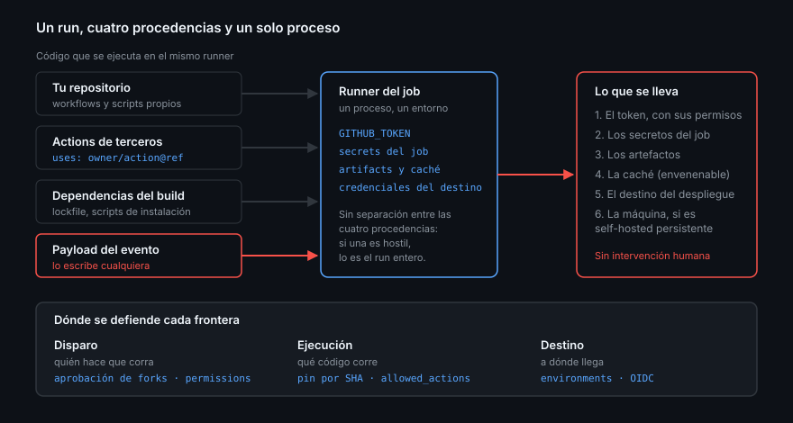

# La superficie de ataque de un pipeline

> Un runner es una máquina que descarga código de varias procedencias, le da un
> token de tu repositorio y lo ejecuta sin que nadie mire. Esta semana empieza
> por entender exactamente cuánto es "todo lo que puede salir mal".

## 🎯 Objetivos

- Nombrar lo que un atacante gana si controla un run de tu CI
- Distinguir las tres fronteras de confianza de un pipeline
- Configurar las políticas de Actions del repositorio por API
- Saber qué protege cada política y qué **no** protege

## 1. Qué problema resuelve

La Semana 09 dejó un CI que funciona y la 10 lo repartió en piezas reutilizables.
Las dos semanas asumieron algo que no es gratis: que el código que corre en el
runner es el que tú crees.

En un run cualquiera se ejecuta código de **cuatro procedencias distintas**:

| Procedencia | Ejemplo | Quién lo controla |
|-------------|---------|-------------------|
| Tu repositorio | `.github/workflows/ci.yml`, tus scripts | Tú y quien pueda mergear |
| Actions de terceros | `actions/checkout`, cualquier `uses:` | El mantenedor de esa action |
| Dependencias del build | `npm ci` y los `postinstall` de 800 paquetes | El registro y sus autores |
| El payload del evento | El título de un PR, el nombre de una rama | **Cualquiera** |

Las cuatro corren en el mismo proceso, con las mismas variables de entorno y con
el mismo `GITHUB_TOKEN`. No hay separación: si una de las cuatro es hostil, lo es
el run entero.

## 2. Qué se lleva quien controla un run

No es una lista teórica; es lo que ocurrió en los incidentes reales de los
últimos años:

1. **El `GITHUB_TOKEN`**, con los permisos que le hayas dado. Si es de escritura,
   puede commitear en `main`, publicar releases o aprobar PRs
2. **Los secretos disponibles en ese job**, que salen en claro en memoria aunque
   estén enmascarados en los logs
3. **Los artefactos**, incluido lo que subiste "para depurar"
4. **La caché**, que se puede envenenar desde una rama y se sirve a `main`
5. **El destino del despliegue**: si el pipeline puede publicar, quien lo
   controla también
6. **La máquina**, si el runner es self-hosted y no es efímero
   ([teoría 06](06-runners-hosted-y-self-hosted.md))

Y todo eso ocurre sin intervención humana, de madrugada, con el resultado en
verde.



## 3. Las tres fronteras de confianza

Todo el temario de la semana cae en una de estas tres:

| Frontera | Pregunta | Dónde se defiende |
|----------|----------|-------------------|
| **Disparo** | ¿Quién puede hacer que este workflow corra? | Eventos, aprobación de forks, `permissions` |
| **Ejecución** | ¿Qué código concreto corre dentro? | Pinning por SHA, política de actions permitidas |
| **Destino** | ¿A qué puede llegar el run cuando termina? | Environments, OIDC, secretos con alcance |

La Semana 09 trabajó la primera (eventos, `pull_request_target`, inyección).
Esta semana cierra la segunda y la tercera.

## 4. Las políticas del repositorio

Antes de tocar un solo YAML hay cuatro ajustes de repositorio que valen más que
cualquier workflow bien escrito, porque aplican a **todos** los workflows,
incluidos los que escriba alguien más el mes que viene.

### Permisos por defecto del `GITHUB_TOKEN`

```bash
gh api repos/{owner}/{repo}/actions/permissions/workflow
# {"default_workflow_permissions":"read","can_approve_pull_request_reviews":false}
```

```bash
gh api repos/{owner}/{repo}/actions/permissions/workflow --method PUT \
  -f default_workflow_permissions=read \
  -F can_approve_pull_request_reviews=false
```

`read` significa que un workflow que se olvide de declarar `permissions:` recibe
un token de solo lectura en vez de uno de escritura. Es la red de seguridad para
el día en que se te olvide, y se te va a olvidar.

`can_approve_pull_request_reviews: false` impide que un workflow **apruebe** un
pull request. Un bot que se aprueba a sí mismo convierte "requiere una
aprobación" en un trámite.

### Qué actions se pueden usar

```bash
gh api repos/{owner}/{repo}/actions/permissions
# {"enabled":true,"allowed_actions":"all","sha_pinning_required":false}
```

| Campo | Valores | Qué hace |
|-------|---------|----------|
| `enabled` | `true` / `false` | Actions activado en el repositorio |
| `allowed_actions` | `all`, `local_only`, `selected` | Qué procedencias se admiten |
| `sha_pinning_required` | `true` / `false` | Rechaza cualquier `uses:` que no sea un SHA completo |

Con `selected` se afina en un endpoint aparte:

```bash
gh api repos/{owner}/{repo}/actions/permissions/selected-actions --method PUT \
  --input - <<'JSON'
{
  "github_owned_allowed": true,
  "verified_allowed": false,
  "patterns_allowed": ["ergrato-dev/*"]
}
JSON
```

> [!NOTE]
> `sha_pinning_required` es la política que convierte el consejo de la
> [teoría 02](02-pinning-y-dependencias-del-workflow.md) en una regla que no se
> puede saltar por descuido. Disponible a nivel de repositorio, organización y
> empresa desde agosto de 2025;
> [changelog](https://github.blog/changelog/2025-08-15-github-actions-policy-now-supports-blocking-and-sha-pinning-actions/).
> Verificado en agosto de 2026.

### Aprobación de los PR de forks

```bash
gh api repos/{owner}/{repo}/actions/permissions/fork-pr-contributor-approval
# {"approval_policy":"first_time_contributors"}
```

Tres valores posibles, de más permisivo a más estricto:

| `approval_policy` | Necesita aprobación manual |
|-------------------|----------------------------|
| `first_time_contributors_new_to_github` | Solo cuentas recién creadas |
| `first_time_contributors` | Quien nunca ha contribuido a tu repo |
| `all_external_contributors` | Cualquiera que no tenga permisos de escritura |

En un repositorio público que acepta contribuciones, `all_external_contributors`
es la opción sensata: nadie ejecuta nada en tu CI sin que tú le des al botón.

### Retención de artefactos y logs

```bash
gh api repos/{owner}/{repo}/actions/permissions/artifact-and-log-retention
# {"days":90,"maximum_allowed_days":90}
```

Un artefacto es un archivo público en un repositorio público. Noventa días es
mucho tiempo para un `.env` subido por error. Bajarlo a treinta reduce la
ventana, y **no** sustituye a no subirlo.

## 5. Lo que estas políticas no protegen

Es tan importante como lo anterior:

- **No filtran las dependencias de tu build.** `npm ci` sigue descargando lo que
  diga el lockfile; eso es la Semana 13
- **No leen tus scripts.** Un `run:` tuyo que hace `curl | bash` pasa todas las
  políticas
- **No impiden que tú mismo te equivoques con `pull_request_target`**
- **No cifran nada extra.** Un secreto en un log sigue siendo un secreto en un log

## 6. Antipatrones

| Antipatrón | Por qué duele | Qué hacer |
|------------|---------------|-----------|
| Dejar el token por defecto en escritura | Cada workflow nuevo nace con permisos de más | `default_workflow_permissions=read` |
| Permitir que los workflows aprueben PR | La revisión obligatoria se vuelve decorativa | `can_approve_pull_request_reviews=false` |
| `allowed_actions: all` "porque es un repo pequeño" | El repo pequeño es el que nadie audita | `selected` con patrones, o al menos SHA obligatorio |
| Subir logs de depuración como artefacto | Noventa días de tu entorno a la vista | Borrar el artefacto y rotar lo que hubiera dentro |
| Confiar en que "solo yo tengo acceso" | Los PR de forks no necesitan acceso | Política de aprobación de contribuidores externos |
| Tratar la seguridad del pipeline como algo de la última semana | Cuando hay despliegue ya es tarde | Endurecer antes de conectar el primer destino |

## 7. Trucos

- **Audita el estado actual en una sola línea**:

  ```bash
  for e in permissions permissions/workflow permissions/fork-pr-contributor-approval; do
    gh api "repos/{owner}/{repo}/actions/$e"
  done
  ```

- **Los `{owner}` y `{repo}` los rellena `gh`** si el comando se ejecuta dentro
  de un repositorio clonado; fuera hay que escribirlos
- **`gh api` con `--method PUT` no devuelve nada cuando funciona**: el silencio
  es el éxito, y se comprueba volviendo a hacer el `GET`
- **Empieza por el token**: de los cuatro ajustes, `default_workflow_permissions`
  es el que más superficie quita por menos esfuerzo
- **Los ajustes viven en la API, no en el repositorio**: no se copian al hacer un
  fork ni al clonar una plantilla. Documenta los tuyos en el README

## 📚 Recursos Adicionales

- [Security hardening for GitHub Actions](https://docs.github.com/actions/reference/security/secure-use)
- [REST — Actions permissions](https://docs.github.com/rest/actions/permissions)
- [Approving workflow runs from public forks](https://docs.github.com/actions/how-tos/manage-workflow-runs/approve-runs-from-forks)
- [Changelog — SHA pinning policy (agosto 2025)](https://github.blog/changelog/2025-08-15-github-actions-policy-now-supports-blocking-and-sha-pinning-actions/)

## ✅ Checklist de Verificación

- [ ] Sabes qué cuatro procedencias de código corren en un mismo run
- [ ] Puedes nombrar seis cosas que se lleva quien controla un run
- [ ] Tu repositorio tiene el token por defecto en `read`
- [ ] Sabes qué hace `sha_pinning_required` y a qué nivel se activa
- [ ] Has consultado tu política de aprobación de PR de forks
