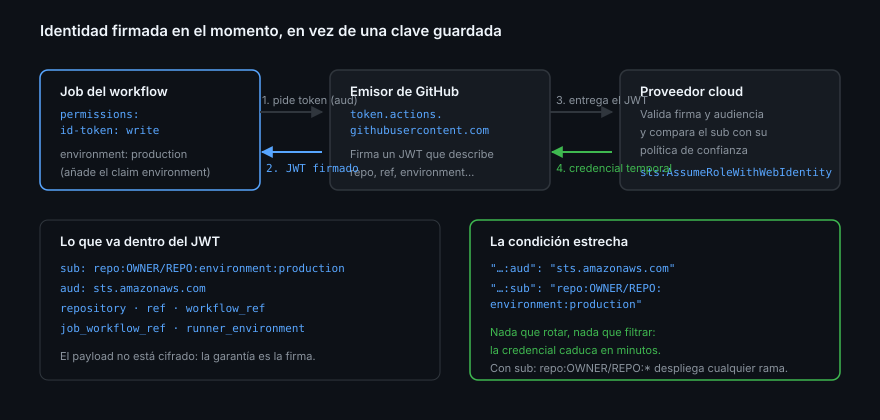

# OIDC: identidad en vez de secretos

> El pipeline deja de demostrar quién es enseñando una contraseña guardada, y
> pasa a demostrarlo enseñando un carné que GitHub firma en el momento y caduca
> en minutos.

## 🎯 Objetivos

- Explicar el intercambio OIDC entre un run y un proveedor externo
- Pedir un token OIDC desde un workflow y leer sus claims
- Escribir una condición de confianza que ate el acceso a **un** repositorio,
  **una** rama o **un** environment
- Personalizar el `sub` cuando la plantilla por defecto no basta
- Reconocer las condiciones de confianza demasiado amplias

## 1. Qué problema resuelve

La [teoría 03](03-secretos-y-su-ciclo-de-vida.md) terminó con una credencial
cloud estática: no caduca, es amplia y es imposible de auditar. OIDC la elimina.

La idea, en una frase: **el proveedor no confía en un valor secreto, confía en
GitHub**. Cada run pide a GitHub un JWT firmado que describe quién es —qué
repositorio, qué rama, qué environment, qué workflow—, se lo entrega al
proveedor, y el proveedor decide si esa descripción encaja con alguna regla suya.
Si encaja, devuelve una credencial temporal.

No hay nada que guardar en `secrets`. No hay nada que rotar. Lo que se filtre
caduca solo.



## 2. El intercambio, paso a paso

1. El job declara `permissions: id-token: write`. Sin eso, no hay token
2. El runner recibe dos variables: `ACTIONS_ID_TOKEN_REQUEST_URL` y
   `ACTIONS_ID_TOKEN_REQUEST_TOKEN`
3. El step pide el JWT a esa URL, indicando la **audiencia** que espera el
   proveedor
4. GitHub firma el JWT con la clave de `https://token.actions.githubusercontent.com`
5. El step envía el JWT al proveedor
6. El proveedor valida la firma contra las claves públicas del emisor y compara
   los claims con su política de confianza
7. Si encaja, devuelve credenciales temporales (minutos, no meses)

`id-token: write` suena alarmante y no lo es: no da permisos sobre el
repositorio, solo permite **pedir** un token de identidad. Lo que ese token abra
lo decide el otro lado.

## 3. Los claims

Lo que va dentro del JWT es lo que puedes exigir en el otro extremo:

| Claim | Ejemplo | Para qué sirve |
|-------|---------|----------------|
| `iss` | `https://token.actions.githubusercontent.com` | Identifica a GitHub como emisor |
| `aud` | `sts.amazonaws.com` | Para quién es el token; se elige al pedirlo |
| `sub` | `repo:OWNER/REPO:environment:production` | El resumen: es el claim que se condiciona |
| `repository` | `OWNER/REPO` | Repositorio |
| `repository_owner` | `OWNER` | Cuenta u organización |
| `ref` / `ref_type` | `refs/heads/main` · `branch` | Referencia que dispara el run |
| `environment` | `production` | Solo aparece si el job declara `environment:` |
| `workflow_ref` | `OWNER/REPO/.github/workflows/deploy.yml@refs/heads/main` | Qué workflow |
| `job_workflow_ref` | Igual, pero del reusable que ejecuta el job | Ata la confianza a un workflow concreto |
| `runner_environment` | `github-hosted` · `self-hosted` | Distingue el tipo de runner |
| `exp`, `iat`, `jti`, `nbf` | — | Los estándar de cualquier JWT |

El `sub` por defecto se compone así:

```text
repo:OWNER/REPO:ref:refs/heads/main            # push a una rama
repo:OWNER/REPO:pull_request                   # un pull request
repo:OWNER/REPO:environment:production         # job con environment: production
```

> [!NOTE]
> Desde abril de 2026, el `sub` de los repositorios nuevos incluye **IDs
> inmutables** de la cuenta y del repositorio
> (`repo:owner@158541050/repo@1336706488:...`), de forma que renombrar o
> recrear un repositorio no permite heredar la confianza del anterior. Se aplica
> automáticamente a los repositorios creados a partir del 15 de julio de 2026
> ([changelog](https://github.blog/changelog/2026-04-23-immutable-subject-claims-for-github-actions-oidc-tokens/)).
> Consulta el tuyo con
> `gh api repos/{owner}/{repo}/actions/oidc/customization/sub`.

## 4. Pedir el token a mano

Para ver los claims con tus propios ojos, sin proveedor cloud de por medio:

```yaml
permissions:
  contents: read
  id-token: write

jobs:
  claims:
    runs-on: ubuntu-latest
    environment: production          # ← hace aparecer el claim environment
    steps:
      - name: Pedir el token y mostrar los claims
        run: |
          RESPUESTA=$(curl -sS \
            -H "Authorization: bearer $ACTIONS_ID_TOKEN_REQUEST_TOKEN" \
            "$ACTIONS_ID_TOKEN_REQUEST_URL&audience=bc-github")
          TOKEN=$(echo "$RESPUESTA" | jq -r '.value')
          echo "::add-mask::$TOKEN"
          # El payload es base64url y viene sin relleno: hay que reponerlo
          echo "$TOKEN" | cut -d. -f2 | python3 -c \
            'import sys,base64; d=sys.stdin.read().strip(); sys.stdout.write(base64.urlsafe_b64decode(d + "=" * (-len(d) % 4)).decode())' \
            | jq '{sub, aud, repository, ref, environment, job_workflow_ref, runner_environment}'
```

Tres cosas de ese bloque:

- El token **no** se pasa por la línea de comandos: viaja en una variable de
  entorno que el runner ya tiene puesta
- `::add-mask::` antes de tocarlo: el JWT es una credencial mientras no caduque
- El *payload* de un JWT es base64url sin cifrar. Poder leerlo no es un fallo:
  la seguridad está en la firma, no en el secreto de su contenido

Con el toolkit de la Semana 10, lo mismo es una línea: `await core.getIDToken('bc-github')`.

## 5. La condición de confianza en el proveedor

El trabajo de verdad está en el otro lado. En AWS, la política de confianza del
rol se ve así:

```json
{
  "Effect": "Allow",
  "Principal": { "Federated": "arn:aws:iam::<ID-CUENTA>:oidc-provider/token.actions.githubusercontent.com" },
  "Action": "sts:AssumeRoleWithWebIdentity",
  "Condition": {
    "StringEquals": {
      "token.actions.githubusercontent.com:aud": "sts.amazonaws.com",
      "token.actions.githubusercontent.com:sub": "repo:<TU-USUARIO>/<TU-REPO>:environment:production"
    }
  }
}
```

Y el workflow queda sin un solo secreto:

```yaml
      - uses: aws-actions/configure-aws-credentials@e6de054238d6b7531b4efff3b6587d9aade6a06c # v6.2.3
        with:
          role-to-assume: arn:aws:iam::<ID-CUENTA>:role/despliegue-bootcamp
          aws-region: eu-west-1
```

El equivalente en Azure es
[`azure/login`](https://github.com/Azure/login) con `client-id`, `tenant-id` y
`subscription-id`; en Google Cloud,
[`google-github-actions/auth`](https://github.com/google-github-actions/auth) con
`workload_identity_provider`. Cambia el nombre de la action; el mecanismo es el
mismo.

## 6. Condiciones demasiado amplias

Aquí es donde OIDC se estropea, y el fallo no da ningún error:

| Condición | Qué permite de más |
|-----------|--------------------|
| `sub: repo:OWNER/REPO:*` | Cualquier rama, cualquier PR, cualquier fork con permiso de push |
| `sub: repo:OWNER/*` | Cualquier repositorio de la cuenta, incluido el que crees mañana |
| `StringLike` con `*` en medio | Casi siempre más de lo que crees |
| Solo `repository_owner` | Toda la organización |
| Sin comprobar `aud` | Un token emitido para otro proveedor podría reutilizarse |

La condición correcta para un despliegue de producción ata **repositorio +
environment**: `repo:OWNER/REPO:environment:production`. Como el claim
`environment` solo aparece si el job declara `environment:`, y el environment
tiene revisores, la credencial cloud queda detrás de una aprobación humana. Esa
combinación —OIDC + environment— es la pieza central de la semana.

## 7. Personalizar el `sub`

Cuando la plantilla por defecto no encaja —por ejemplo, quieres condicionar por
workflow y no por rama— se personaliza:

```bash
gh api repos/{owner}/{repo}/actions/oidc/customization/sub --method PUT \
  --input - <<'JSON'
{
  "use_default": false,
  "include_claim_keys": ["repo", "context", "job_workflow_ref"]
}
JSON
```

Y para volver atrás:

```bash
gh api repos/{owner}/{repo}/actions/oidc/customization/sub --method PUT \
  -F use_default=true
```

> [!WARNING]
> Cambiar el `sub` **rompe todas las condiciones de confianza existentes** en el
> mismo instante. El orden seguro es: añadir la condición nueva en el proveedor,
> cambiar el `sub`, comprobar, retirar la vieja.

## 8. Antipatrones

| Antipatrón | Por qué duele | Qué hacer |
|------------|---------------|-----------|
| `id-token: write` en todo el workflow | Cualquier step puede pedir identidad | Solo en el job que despliega |
| Condición con `sub: repo:OWNER/REPO:*` | Cualquier rama despliega a producción | Atar a `environment:` o a `ref` |
| Guardar el JWT como artefacto | Es una credencial, aunque caduque pronto | Usarlo y olvidarlo |
| Mantener la clave estática "por si acaso" | El agujero sigue abierto | Borrarla en cuanto OIDC funcione |
| Usar la audiencia por defecto sin comprobarla | El proveedor puede rechazarlo o aceptar de más | Fijar `aud` y exigirlo en la condición |
| Cambiar el `sub` sin avisar al proveedor | Todo falla a la vez, sin pista clara | Añadir, cambiar, comprobar, retirar |

## 9. Trucos

- **Los claims se leen en el propio run**: imprime el payload en
  `$GITHUB_STEP_SUMMARY` cuando montes la confianza por primera vez
- **El claim `environment` es tu mejor condición**: es el único que no puede
  falsificar una rama cualquiera
- **`runner_environment`** distingue hosted de self-hosted: si tu despliegue solo
  debe salir de runners de GitHub, exígelo
- **GitHub Pages ya usa este mecanismo**: por eso el job de despliegue de la
  [teoría 05](05-environments-como-puerta-de-despliegue.md) pide `id-token: write`
- **Si el proveedor devuelve "not authorized"**, compara literal a literal el
  `sub` del token con el de la condición: casi siempre sobra o falta un segmento
- **Un rol por repositorio**: compartir rol entre repositorios convierte la
  condición en un comodín

## 📚 Recursos Adicionales

- [About security hardening with OpenID Connect](https://docs.github.com/actions/concepts/security/openid-connect)
- [OIDC reference — claims y personalización del `sub`](https://docs.github.com/actions/reference/security/oidc)
- [Configuring OpenID Connect in Amazon Web Services](https://docs.github.com/actions/how-tos/secure-your-work/security-harden-deployments/oidc-in-aws)
- [Changelog — immutable subject claims (abril 2026)](https://github.blog/changelog/2026-04-23-immutable-subject-claims-for-github-actions-oidc-tokens/)

## ✅ Checklist de Verificación

- [ ] Puedes describir el intercambio OIDC en siete pasos
- [ ] Sabes qué hace y qué no hace `id-token: write`
- [ ] Has leído los claims de un token emitido para tu repositorio
- [ ] Sabes escribir una condición que ate el acceso a un environment
- [ ] Reconoces por qué `repo:OWNER/REPO:*` es demasiado ancho
