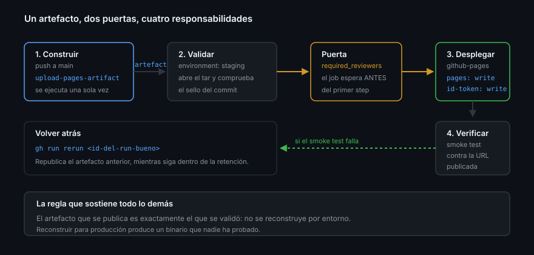

# Environments como puerta de despliegue

> La Semana 08 configuró los environments desde la pestaña de ajustes. Esta
> semana se ven desde el otro lado: qué le pasa a un job cuando declara
> `environment:`, qué queda registrado y cómo se aprueba sin abrir el navegador.

## 🎯 Objetivos

- Saber qué provoca exactamente la clave `environment:` en un job
- Leer la historia de despliegues por API
- Aprobar o rechazar un despliegue detenido desde la terminal
- Usar `concurrency` para que dos despliegues no se pisen
- Endurecer el environment `github-pages`, que se crea solo

## 1. Qué problema resuelve

Un pipeline sin environments despliega igual que despliega un `scp` desde un
portátil: funciona, y nadie sabe qué versión hay arriba, quién la puso ni con qué
permiso.

La clave `environment:` convierte el despliegue en un objeto de primera clase de
GitHub: con historia, con URL, con revisores y con una API que se puede consultar
después.

## 2. Qué hace la clave `environment:`

```yaml
permissions:
  contents: read

jobs:
  desplegar:
    runs-on: ubuntu-latest
    environment:
      name: production
      url: ${{ steps.deploy.outputs.page_url }}
    steps:
      - id: deploy
        run: ./desplegar.sh
```

Cuatro efectos, todos a la vez:

1. **Los secretos y variables de ese environment pasan a estar disponibles** en
   el job; sin la clave, llegan vacíos
2. **Las reglas de protección se aplican**: si hay revisores, el job se queda en
   *Waiting* antes de ejecutar un solo step
3. **Se registra un despliegue**, visible en la pestaña del repositorio y en la
   API de deployments
4. **La `url` queda enlazada** en la interfaz, junto al run y en la portada del
   repositorio

El punto 2 es el que importa: la puerta está **antes** del primer step, no
dentro. Un job que espera aprobación todavía no ha visto tu código de despliegue
ni tus secretos.



## 3. La historia de despliegues

```bash
# Últimos despliegues de un environment
gh api "repos/{owner}/{repo}/deployments?environment=production" \
  --jq '.[] | {id, sha: .sha[0:7], created_at, creator: .creator.login}'

# En qué acabó uno concreto
gh api repos/{owner}/{repo}/deployments/<id>/statuses \
  --jq '.[] | {state, environment_url, created_at}'
```

Un `state` de `success` con su `environment_url` es la respuesta verificable a
"¿qué hay en producción y desde cuándo?". Es también la materia prima de las
métricas DORA-lite de la Semana 05: la frecuencia de despliegue sale de contar
estos registros, no de una hoja de cálculo.

## 4. Aprobar sin navegador

Cuando un environment tiene revisores, el run se detiene y espera. Hasta **30
días**; después falla solo.

```bash
# Qué está esperando, y con qué id de environment
gh api repos/{owner}/{repo}/actions/runs/<run_id>/pending_deployments \
  --jq '.[] | {environment: .environment.name, id: .environment.id, current_user_can_approve}'

# Aprobar
gh api repos/{owner}/{repo}/actions/runs/<run_id>/pending_deployments \
  --method POST \
  -F 'environment_ids[]=<id>' \
  -f state=approved \
  -f comment="Revisado el artefacto y el diff"
```

`state` admite `approved` o `rejected`, y el `comment` es obligatorio. Ese
comentario queda en la historia del despliegue: es el sitio donde escribir qué
comprobaste, no un trámite.

> [!NOTE]
> `current_user_can_approve` responde a la pregunta que siempre surge en
> autoestudio: si el environment tiene `prevent_self_review: true` y tú lanzaste
> el run, este campo viene en `false` y nadie puede aprobarlo. En un repositorio
> de una sola persona, `prevent_self_review` se deja en `false`.

## 5. Variables de environment

Los environments no solo guardan secretos. Guardan **variables**, y ahí es donde
viven las diferencias legítimas entre entornos:

```bash
gh variable set SITE_BASE_URL --env staging --body "https://<tu-usuario>.github.io/<tu-repo>/staging/"
gh variable set SITE_BASE_URL --env production --body "https://<tu-usuario>.github.io/<tu-repo>/"
gh variable list --env production
```

```yaml
      - run: echo "Publicando en ${{ vars.SITE_BASE_URL }}"
```

Un mismo workflow, un mismo artefacto, dos destinos. Sin `if` por rama y sin
duplicar el YAML.

## 6. `concurrency`: que no se pisen dos despliegues

```yaml
concurrency:
  group: despliegue-${{ github.ref }}
  cancel-in-progress: false
```

En CI, `cancel-in-progress: true` es lo correcto: el run viejo de un PR ya no
interesa. En CD es justo al revés: **cancelar un despliegue a la mitad deja el
destino en un estado que nadie ha probado**. Se encola y se espera.

Es una línea que casi nadie escribe hasta que dos merges seguidos dejan el sitio
publicado con la mitad de cada versión.

## 7. El environment `github-pages`

Cuando activas Pages con origen "GitHub Actions", GitHub crea solo un environment
llamado `github-pages`. Nace con una política de ramas restringida y **sin
revisores**: cualquier push a `main` publica.

Es un environment normal, así que se endurece como cualquier otro:

```bash
gh api repos/{owner}/{repo}/environments/github-pages --method PUT \
  --input - <<'JSON'
{
  "wait_timer": 0,
  "prevent_self_review": false,
  "reviewers": [{ "type": "User", "id": <TU-ID> }],
  "deployment_branch_policy": {
    "protected_branches": true,
    "custom_branch_policies": false
  }
}
JSON
```

Tu ID de usuario sale de `gh api user --jq .id`. A partir de ahí, publicar exige
una aprobación explícita y solo se puede publicar desde ramas protegidas por el
ruleset de la Semana 08.

## 8. Antipatrones

| Antipatrón | Por qué duele | Qué hacer |
|------------|---------------|-----------|
| Desplegar sin `environment:` | Sin historia, sin puerta, sin URL | Declararlo aunque no haya secretos |
| `cancel-in-progress: true` en el job de despliegue | Destino a medio actualizar | `false` y cola |
| Secretos de producción fuera del environment | La puerta no protege nada | Moverlos con `gh secret set --env` |
| Un environment por rama | Docenas de puertas que nadie revisa | Uno por destino real |
| Aprobar sin mirar qué se despliega | La puerta se vuelve un clic reflejo | Comprobar el artefacto y escribirlo en el `comment` |
| Poner la `url` a mano | Se queda obsoleta el primer día | Sacarla de un output del step |
| Dejar `github-pages` tal y como nace | Cualquier merge publica sin más | Revisores + política de ramas |

## 9. Trucos

- **`gh run watch`** te avisa cuando el run se queda esperando aprobación
- **El id del environment no es su nombre**: sale de `pending_deployments` o de
  `gh api repos/{owner}/{repo}/environments`
- **Un despliegue rechazado también queda registrado**: sirve como evidencia de
  que la puerta funciona
- **`environment:` acepta expresiones**: `name: ${{ inputs.entorno }}` permite un
  solo job para varios destinos, con `workflow_dispatch`
- **Los deployments son consultables por SHA**: `--jq 'map(select(.sha == "..."))'`
  responde a "¿esta versión llegó a producción?"
- **La pestaña *Deployments* del repositorio** es la vista humana de la misma API:
  úsala para comprobar que la historia se está registrando

## 📚 Recursos Adicionales

- [Managing environments for deployment](https://docs.github.com/actions/how-tos/deploy/configure-and-manage-deployments/manage-environments)
- [Reviewing deployments](https://docs.github.com/en/actions/how-tos/deploy/configure-and-manage-deployments/review-deployments)
- [REST — Deployments](https://docs.github.com/rest/deployments/deployments)
- [REST — Pending deployments de un run](https://docs.github.com/rest/actions/workflow-runs#get-pending-deployments-for-a-workflow-run)

## ✅ Checklist de Verificación

- [ ] Sabes los cuatro efectos de la clave `environment:` en un job
- [ ] Puedes listar los despliegues de un environment por API
- [ ] Sabes aprobar un despliegue detenido desde la terminal
- [ ] Entiendes por qué `cancel-in-progress` es `false` en un despliegue
- [ ] Has endurecido el environment `github-pages` de tu repositorio
