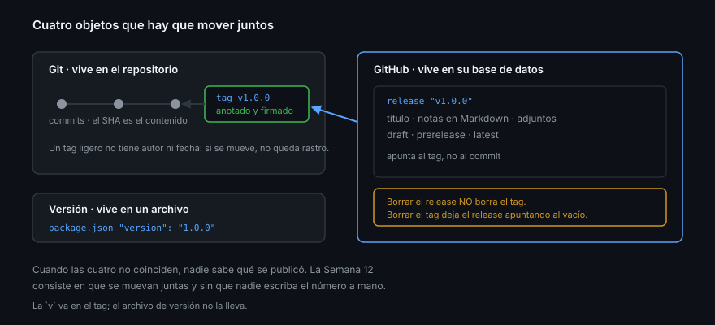

# Tag, release y versión no son lo mismo

> Tres palabras que se usan como sinónimos y que en GitHub son tres objetos
> distintos, con dueños distintos, ciclos de vida distintos y consecuencias
> distintas cuando se borran. Casi todo el desorden de publicación de un proyecto
> nace de confundirlas.

## 🎯 Objetivos

- Distinguir commit, tag, release y versión, y saber quién crea cada uno
- Leer un release por API y reconocer sus campos de estado
- Elegir con criterio entre `draft`, `prerelease` y `latest`
- Entender qué garantiza —y qué no— un release inmutable

## 1. Qué problema resuelve

«La versión 1.2.0» puede significar cuatro cosas a la vez:

| Cosa | Dónde vive | Quién la crea | Se puede mover |
|------|-----------|---------------|:--------------:|
| **Commit** | El grafo de Git | Quien hace `git commit` | No (el SHA es el contenido) |
| **Tag** | Una ref de Git | Quien hace `git tag` | Sí, salvo protección |
| **Release** | La base de datos de GitHub | La API de GitHub | Sí |
| **Versión** | `package.json`, `pyproject.toml`… | Quien edita el archivo | Sí |

Cuando las cuatro no coinciden, nadie sabe qué se publicó. El caso típico: el
`package.json` dice `1.2.0`, el tag dice `v1.2.1` y el release apunta a un commit
que no es ninguno de los dos, porque alguien creó el release desde la interfaz
seleccionando la rama en vez del tag.

La semana entera consiste en que esas cuatro cosas se muevan juntas y de forma
automática.



## 2. El tag: una ref, no un archivo

Un tag es un puntero a un commit. Hay dos clases y la diferencia importa:

```bash
git tag v1.0.0                         # ligero: solo un puntero
git tag -a v1.0.0 -m "Primera versión"  # anotado: objeto con autor, fecha y mensaje
git tag -s v1.0.0 -m "Primera versión"  # anotado y firmado
```

Un tag ligero no tiene autor ni fecha propios: si alguien lo mueve, no queda
rastro. Un tag anotado sí es un objeto de Git con su propio SHA, y firmado
además demuestra quién lo creó.

> [!IMPORTANT]
> Para publicar, **siempre anotado y a ser posible firmado**. La Semana 01 dejó
> la firma configurada; `git config --global tag.gpgSign true` la aplica también
> a los tags.

Comprobar qué clase es un tag:

```bash
git cat-file -t v1.0.0
# tag     → anotado
# commit  → ligero
```

## 3. El release: un objeto de GitHub

El release **no es Git**. Es un registro en la base de datos de GitHub que
apunta a un tag y añade lo que Git no tiene: título, cuerpo en Markdown,
adjuntos binarios, estado de borrador, y una marca de «esta es la última».

```bash
gh api repos/{owner}/{repo}/releases/latest \
  --jq '{tag_name, name, draft, prerelease, published_at, assets: [.assets[].name]}'
```

Consecuencia directa: **borrar un release no borra el tag**, y borrar el tag deja
el release apuntando al vacío. Son dos operaciones.

```bash
gh release delete v1.0.0            # borra el release, el tag sigue
gh release delete v1.0.0 --cleanup-tag  # borra los dos
```

## 4. Los tres estados

| Estado | Qué significa | Quién lo ve | Dispara `release: published` |
|--------|---------------|-------------|:----------------------------:|
| **Draft** | Existe pero no está publicado | Solo quien tiene escritura | No |
| **Prerelease** | Publicado, marcado como no estable | Todo el mundo | Sí |
| **Latest** | El release que la portada enseña | Todo el mundo | — |

`latest` no es «el más reciente por fecha». GitHub lo calcula por versión
semántica entre los releases no borrador y no prerelease, y se puede forzar:

```bash
gh release create v1.0.1 --latest         # forzar
gh release create v2.0.0-rc.1 --prerelease  # no será latest
```

El borrador es la pieza que más se infrautiliza. Permite montar el release
—subir binarios, revisar las notas— sin que nadie lo consuma, y publicarlo
después en un solo paso:

```bash
gh release create v1.1.0 --draft --generate-notes
gh release upload v1.1.0 dist/app.tar.gz
gh release edit v1.1.0 --draft=false     # aquí se publica de verdad
```

## 5. Releases inmutables

Un release publicado se podía editar: reemplazar un binario, mover el tag a otro
commit. Es el vector de ataque más limpio contra quien descarga por URL de
release —incluida, hasta 2025, la mitad de las actions del Marketplace—.

La inmutabilidad se activa por repositorio y, una vez publicado un release:

- El tag asociado no se puede mover ni borrar
- Los adjuntos no se pueden añadir, modificar ni borrar

```bash
gh api repos/{owner}/{repo}/immutable-releases
# {"enabled":false,"enforced_by_owner":false}

gh api repos/{owner}/{repo}/immutable-releases --method PUT   # activar
gh api repos/{owner}/{repo}/immutable-releases --method DELETE # desactivar
```

Los borradores quedan fuera: se pueden editar y borrar, y su tag también. Por eso
el flujo «crear como borrador, subir adjuntos, publicar» sigue funcionando con la
inmutabilidad activa — el candado cae en el último paso.

> [!NOTE]
> `enforced_by_owner` indica que la política viene de la organización o la
> empresa y no se puede desactivar desde el repositorio. En una cuenta personal
> siempre es `false`.

## 6. Qué se adjunta a un release

Los adjuntos son archivos arbitrarios servidos por GitHub sin autenticación en
un repositorio público. Lo que tiene sentido subir:

| Adjunto | Por qué |
|---------|---------|
| Binarios compilados | Para quien no va a construir el proyecto |
| `checksums.txt` | Sin él, nadie puede comprobar lo que descargó |
| SBOM | Semana 14 |
| Notas largas o de migración | Cuando el cuerpo del release se queda corto |

Lo que **no**: el código fuente (GitHub ya adjunta `.zip` y `.tar.gz`
automáticamente) ni nada que se pueda regenerar en un segundo.

## 7. Antipatrones

| Antipatrón | Por qué duele | Qué hacer |
|------------|---------------|-----------|
| Tag ligero para publicar | Sin autor ni firma; se mueve sin rastro | `git tag -s -a` |
| Crear el release desde una rama | El release apunta a un commit que se moverá | Taguear primero, `--verify-tag` después |
| Mover un tag ya publicado | Rompe a todo el que lo tenga pinneado | Nuevo tag, nueva versión |
| Borrar el release y dejar el tag | Enlaces rotos y un tag huérfano | `--cleanup-tag` o ninguno |
| Adjuntos sin checksums | Nadie puede verificar la descarga | `sha256sum` como adjunto |
| Publicar sin marcar `prerelease` | Los consumidores automáticos se lo tragan | `--prerelease` en todo lo que no sea estable |

## 8. Trucos

- **`gh release view v1.0.0 --json`** acepta los mismos campos que la API y evita
  abrir el navegador
- **`--verify-tag`** aborta si el tag no existe ya en remoto: convierte un error
  silencioso en un fallo inmediato
- **`gh release list --limit 5 --json tagName,isLatest,isDraft`** es la
  radiografía más rápida del estado de publicación de un repositorio
- **`git push --follow-tags`** empuja solo los tags anotados que apuntan a
  commits que ya viajan; `--tags` empuja todos, incluidos los locales de prueba
- **`gh release download v1.0.0 -p '*.tar.gz'`** baja adjuntos sin construir la
  URL a mano

## 📚 Recursos Adicionales

- [About releases](https://docs.github.com/en/repositories/releasing-projects-on-github/about-releases)
- [REST — Releases](https://docs.github.com/en/rest/releases/releases)
- [Immutable releases](https://docs.github.com/en/code-security/concepts/supply-chain-security/immutable-releases)
- [`gh release`](https://cli.github.com/manual/gh_release)

## ✅ Checklist de Verificación

- [ ] Sabes decir en qué se diferencian un tag y un release
- [ ] Distingues un tag anotado de uno ligero desde la terminal
- [ ] Sabes qué pasa al borrar un release sin borrar su tag
- [ ] Puedes explicar cuándo un release es `latest` y cuándo no
- [ ] Sabes qué congela exactamente la inmutabilidad y qué deja fuera
