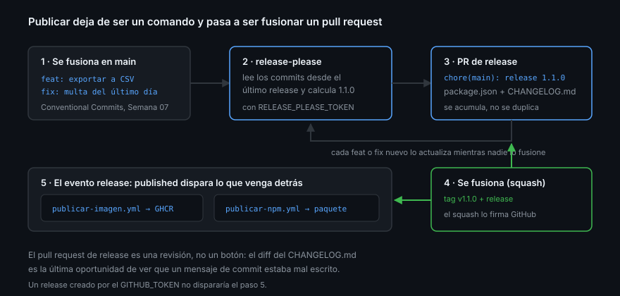

# `release-please` y el PR de release

> Publicar a mano funciona hasta la tercera versión. A partir de ahí alguien se
> olvida de subir el `package.json`, o taguea el commit equivocado, o escribe el
> changelog de memoria. `release-please` convierte «publicar» en «fusionar un
> pull request», que es la operación que tu repositorio ya sabe gobernar.

## 🎯 Objetivos

- Explicar el ciclo del *release PR* y por qué es una revisión y no un botón
- Configurar `release-please` con manifiesto y config
- Elegir el token correcto y entender por qué el `GITHUB_TOKEN` no vale aquí
- Reconocer cuándo `release-please` sobra

## 1. Qué problema resuelve

Publicar una versión son cinco pasos que hay que hacer en orden y sin fallar:

1. Decidir el número según lo que ha cambiado
2. Escribirlo en `package.json`
3. Añadir la entrada al `CHANGELOG.md`
4. Crear el tag anotado en el commit correcto
5. Crear el release con sus notas

`release-please` hace los cinco a partir de los mensajes de commit, y los propone
en un pull request. Tú fusionas o no fusionas.

## 2. El ciclo



1. Se fusiona un PR con un commit `feat:` en `main`
2. `release-please` corre en ese push, lee los commits desde el último release y
   **abre o actualiza** un PR titulado `chore(main): release 1.1.0`
3. Ese PR contiene solo dos cambios: la versión en los archivos que corresponda y
   el `CHANGELOG.md`
4. Mientras nadie lo fusione, cada `feat:` o `fix:` nuevo lo actualiza — el
   número sube solo si hace falta
5. Al fusionarlo, `release-please` crea el tag y el release en GitHub
6. El evento `release: published` dispara lo que venga detrás: imagen, paquete,
   despliegue

El PR de release es una **acumulación**: no hay un PR por cada cambio, hay uno
abierto que representa «lo que se publicaría si publicásemos ahora».

## 3. Configuración

Dos archivos en la raíz. El manifiesto guarda la versión actual:

```json
{
  ".": "1.0.0"
}
```

Y la config dice cómo tratar ese paquete:

```json
{
  "$schema": "https://raw.githubusercontent.com/googleapis/release-please/main/schemas/config.json",
  "packages": {
    ".": {
      "release-type": "node",
      "changelog-path": "CHANGELOG.md",
      "include-v-in-tag": true,
      "bump-minor-pre-major": true
    }
  }
}
```

| Clave | Qué hace |
|-------|----------|
| `release-type` | La estrategia: qué archivos toca al subir la versión (`node` toca `package.json`) |
| `include-v-in-tag` | Tag `v1.1.0` en vez de `1.1.0` |
| `bump-minor-pre-major` | En `0.x`, un cambio incompatible sube MINOR en vez de saltar a `1.0.0` |
| `changelog-path` | Dónde escribir el changelog |

El manifiesto es la **fuente de verdad** de la versión actual. Si se edita el
`package.json` a mano sin tocarlo, la siguiente versión se calculará mal.

## 4. El token: el detalle que hace fallar el primer intento

`release-please` necesita **crear pull requests**. El `GITHUB_TOKEN` por defecto
no puede si el repositorio tiene desactivado *Allow GitHub Actions to create and
approve pull requests* — que es exactamente lo que se desactivó en la Semana 11:

```bash
gh api repos/{owner}/{repo}/actions/permissions/workflow --jq .can_approve_pull_request_reviews
# false
```

El error es explícito: `GitHub Actions is not permitted to create or approve pull
requests`.

Hay dos salidas y solo una es buena:

| Salida | Consecuencia |
|--------|--------------|
| Reactivar el ajuste | Cualquier workflow del repositorio recupera la capacidad de **aprobar** PR, no solo de crearlos |
| Un token fine-grained propio, en un secreto | El permiso queda acotado a un repositorio, dos scopes y una fecha de caducidad |

La segunda. Un token fine-grained con `Contents: Read and write` y `Pull
requests: Read and write` sobre **ese único repositorio**:

```yaml
- uses: googleapis/release-please-action@45996ed1f6d02564a971a2fa1b5860e934307cf7 # v5.0.0
  with:
    token: ${{ secrets.RELEASE_PLEASE_TOKEN }}
    config-file: release-please-config.json
    manifest-file: .release-please-manifest.json
```

> [!IMPORTANT]
> Un PAT es un secreto de larga vida, justo lo que la Semana 11 evitaba con OIDC.
> Aquí no hay alternativa sin ceder algo peor, así que se compensa: alcance
> mínimo, un solo repositorio, caducidad corta y rotación anotada en el
> calendario. En una organización, la respuesta correcta es una GitHub App
> (Semana 16).

Efecto secundario útil: los PR y commits creados con un token de usuario **sí**
disparan otros workflows. Los creados con `GITHUB_TOKEN` no, por diseño, para
evitar bucles infinitos.

## 5. Los outputs

La action publica outputs que encadenan el resto del pipeline:

```yaml
jobs:
  release:
    runs-on: ubuntu-latest
    outputs:
      publicado: ${{ steps.rp.outputs.release_created }}
      tag: ${{ steps.rp.outputs.tag_name }}
    steps:
      - uses: googleapis/release-please-action@45996ed1f6d02564a971a2fa1b5860e934307cf7 # v5.0.0
        id: rp
        with:
          token: ${{ secrets.RELEASE_PLEASE_TOKEN }}

  publicar-imagen:
    needs: release
    if: needs.release.outputs.publicado == 'true'
    uses: ./.github/workflows/publicar-imagen.yml
```

`release_created` es `'true'` solo en la ejecución que sigue a fusionar el PR de
release. En todas las demás está vacío, y el `if` corta.

> [!NOTE]
> Los outputs de una action son **cadenas**. `if: ... == 'true'` con comillas,
> nunca contra el booleano. Es el mismo error de la Semana 10 con los inputs de
> las composite actions.

## 6. Alternativas y cuándo no usarlo

| Herramienta | Encaja cuando |
|-------------|---------------|
| `release-please` | Conventional Commits, uno o varios paquetes, quieres revisar antes de publicar |
| Changesets | Monorepo donde cada PR declara a mano qué paquetes afecta |
| `semantic-release` | Quieres publicar en cada push sin revisión intermedia |
| Nada, `gh release create` | Menos de un release al mes, un solo mantenedor |

`release-please` sobra en un proyecto con dos versiones al año. La automatización
tiene coste de mantenimiento; si publicar duele poco, no lo automatices todavía.

## 7. Antipatrones

| Antipatrón | Por qué duele | Qué hacer |
|------------|---------------|-----------|
| Editar la versión a mano con `release-please` activo | El manifiesto y el archivo divergen | Solo el PR de release toca la versión |
| Fusionar con squash cambiando el título | El tipo del commit se pierde y no calcula | Conservar `feat:`/`fix:` en el título |
| Reactivar «Actions puede crear y aprobar PR» | Devuelve a los workflows el poder de aprobar | Token fine-grained o GitHub App |
| Encadenar sin `release_created` | La imagen se publica en cada push a `main` | `if:` sobre el output |
| Cerrar el PR de release para «limpiar» | Se reabre en el siguiente push, sin la historia | Fusionarlo o dejarlo |
| Commits que no siguen la convención | No sube nada y parece que está roto | Ruleset o CI que valide el título del PR |

## 8. Trucos

- **`Release-As: 1.5.0`** en el cuerpo de un commit fuerza la versión exacta:
  la vía de escape cuando el cálculo no es el que quieres
- **Etiqueta `autorelease: pending`**: `release-please` la pone en su PR; sirve
  para filtrarlo en las notas y en los proyectos
- **`skip-github-release: true`** separa «calcular versión» de «taguear» cuando
  el tag lo tiene que crear otro sistema
- **El PR de release es revisable**: mira el diff del `CHANGELOG.md`; si una
  entrada no se entiende, el mensaje de commit estaba mal
- **Prueba en un repositorio desechable primero**: la primera configuración
  siempre necesita dos o tres intentos, y aquí cada intento crea un PR

## 📚 Recursos Adicionales

- [`release-please`](https://github.com/googleapis/release-please)
- [Manifest releaser (configuración avanzada)](https://github.com/googleapis/release-please/blob/main/docs/manifest-releaser.md)
- [`release-please-action`](https://github.com/googleapis/release-please-action)
- [Managing GitHub Actions settings for a repository](https://docs.github.com/en/repositories/managing-your-repositorys-settings-and-features/enabling-features-for-your-repository/managing-github-actions-settings-for-a-repository)
- [Changesets](https://github.com/changesets/changesets)

## ✅ Checklist de Verificación

- [ ] Sabes qué contiene el PR de release y por qué se acumula
- [ ] Distingues el manifiesto de la config y sabes cuál manda
- [ ] Sabes por qué el `GITHUB_TOKEN` no basta y qué token usar
- [ ] Puedes encadenar un job con `release_created`
- [ ] Sabes decir en qué proyecto `release-please` sería exceso
