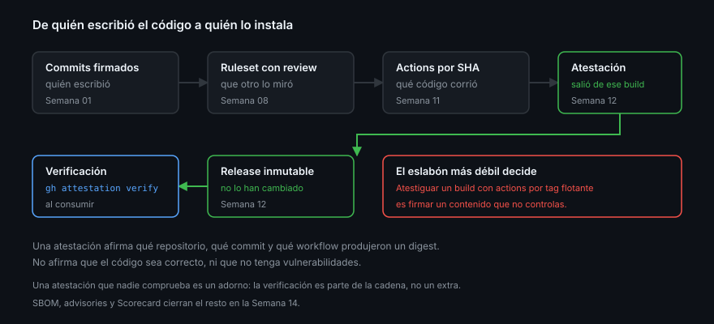

# Procedencia verificable

> Un paquete firmado no demuestra que sea bueno. Demuestra **de dónde salió**: qué
> repositorio, qué commit y qué workflow lo construyeron. Con eso, «¿esta imagen
> es la nuestra?» pasa de ser una creencia a ser un comando que devuelve 0 o 1.

## 🎯 Objetivos

- Explicar qué afirma una atestación de procedencia y qué no
- Generar procedencia para un adjunto de release y para una imagen de GHCR
- Verificar un artefacto con `gh attestation verify` y leer el resultado
- Saber qué hacer cuando hay que retirar una versión ya publicada

## 1. Qué problema resuelve

Descargas `app-1.2.3.tar.gz` de un release. Tres preguntas sin respuesta:

1. ¿Lo construyó el pipeline del proyecto, o alguien lo subió a mano?
2. ¿De qué commit salió?
3. ¿Lo han sustituido desde que se publicó?

La tercera la contesta la inmutabilidad ([teoría 01](01-tag-release-y-version.md)).
Las dos primeras, la procedencia.

Una **atestación** es una declaración firmada sobre un artefacto, identificado
por su digest SHA-256. Dice: «el workflow `X` del repositorio `Y`, en el commit
`Z`, produjo un archivo con este digest exacto». La firma la respalda Sigstore
con certificados de vida corta y un registro público de transparencia; GitHub
guarda además el resultado.

Lo que **no** afirma: que el código sea correcto, que no tenga vulnerabilidades,
ni que el mantenedor sea de fiar. Solo la cadena artefacto → build → fuente.

## 2. Generarla

Una action y un permiso nuevo:

```yaml
    permissions:
      contents: read
      id-token: write        # firmar
      attestations: write    # guardar la atestación en GitHub

    steps:
      - uses: actions/attest-build-provenance@4d101475d8b20a2381f78447822ac1eab6504dd8 # v4.2.2
        with:
          subject-path: dist/app-*.tar.gz
```

`id-token: write` es el mismo de la Semana 11: sin identidad no hay firma.
`attestations: write` es el permiso propio de esta acción.

Para una imagen de contenedor el sujeto no es un archivo, es un digest:

```yaml
      - id: build
        uses: docker/build-push-action@53b7df96c91f9c12dcc8a07bcb9ccacbed38856a # v7.3.0
        with:
          push: true
          tags: ${{ steps.meta.outputs.tags }}

      - uses: actions/attest-build-provenance@4d101475d8b20a2381f78447822ac1eab6504dd8 # v4.2.2
        with:
          subject-name: ghcr.io/${{ github.repository }}
          subject-digest: ${{ steps.build.outputs.digest }}
          push-to-registry: true
```

`push-to-registry: true` deja la atestación **junto a la imagen** en el registro,
además de en GitHub. Así se puede verificar sin llamar a la API de GitHub, que es
lo que hará un clúster que solo habla con el registro.

> [!IMPORTANT]
> `subject-digest` obliga a `subject-name`, y `push-to-registry` obliga a que ese
> nombre sea la imagen completamente cualificada. La combinación equivocada falla
> con un mensaje sobre el sujeto que no menciona el flag culpable.

## 3. Verificar

```bash
# un archivo descargado de un release
gh release download v1.2.3 -p '*.tar.gz'
gh attestation verify app-1.2.3.tar.gz --repo <owner>/<repo>

# una imagen
gh attestation verify oci://ghcr.io/<owner>/<repo>:1.2.3 --repo <owner>/<repo>
```

Salida en verde y **código de salida 0**. Ese código es lo que se pone en un
script de despliegue; la salida legible es para las personas.

La verificación es tan estricta como la identidad que exijas:

| Flag | Qué exige | Cuándo |
|------|-----------|--------|
| `--owner` | Que lo construyera cualquier repo de ese propietario | Mínimo aceptable |
| `--repo` | Un repositorio concreto | El habitual |
| `--signer-workflow` | Un workflow concreto | Cuando el repo tiene varios y solo uno publica |
| `--predicate-type` | Otro tipo de declaración (SBOM…) | Semana 14 |

`--owner` solo es débil: cualquier repositorio tuyo, incluido uno de pruebas,
pasaría. Si publicas de verdad, `--signer-workflow`.

> [!NOTE]
> Verificar una imagen por `oci://` requiere estar autenticado contra su
> registro, aunque sea pública, porque la verificación descarga el manifiesto.
> Un `docker login ghcr.io` antes, o `--bundle-from-oci` desactivado.

## 4. Consultarlo por API

```bash
DIGEST=$(sha256sum app-1.2.3.tar.gz | cut -d' ' -f1)
gh api repos/{owner}/{repo}/attestations/sha256:$DIGEST \
  --jq '.attestations[].bundle.verificationMaterial.certificate | keys'
```

Sirve para inventariar, no para verificar: leer el JSON **no valida las firmas**.
La verificación criptográfica la hace `gh attestation verify` y nada más.

## 5. Dónde encaja en la cadena



| Eslabón | Qué garantiza | Semana |
|---------|---------------|:------:|
| Commits firmados | Quién escribió el código | 01 |
| Ruleset con review | Que otro lo miró | 08 |
| Actions pinneadas por SHA | Qué código corrió en el build | 11 |
| Atestación de procedencia | Que el artefacto salió de ese build | **12** |
| Release inmutable | Que no lo han sustituido después | **12** |
| Verificación en el consumo | Que lo que instalas es lo anterior | **12** |

La cadena vale lo que su eslabón más débil. Atestiguar un build que usa actions
por tag flotante es firmar un contenido que no controlas — de ahí que el pinning
de la Semana 11 sea prerrequisito y no una recomendación.

## 6. El coste real

Ninguno en repositorios públicos, unos segundos por artefacto, y una consecuencia
operativa que sí importa: **quien consume tiene que verificar**. Una atestación
que nadie comprueba es un adorno.

Los sitios donde ponerlo, en orden de rendimiento:

1. El job de despliegue, antes de usar el artefacto
2. El `README` de instalación, como paso documentado
3. Una política de admisión en el clúster, si algún día lo hay

## 7. Retirar una versión publicada

Un release malo no se arregla editándolo — con inmutabilidad activa, ni siquiera
se puede. El procedimiento es siempre el mismo:

1. **Marcar, no borrar.** `gh release edit v1.2.3 --prerelease` lo saca de
   `latest`; el enlace sigue vivo para quien ya lo tenga
2. **Publicar el arreglo** como versión nueva: `1.2.4`, nunca «la 1.2.3 buena»
3. **Decirlo en las notas** de la versión retirada, editando el cuerpo (el cuerpo
   sí se puede editar; los adjuntos y el tag, no)
4. **Avisar donde se consume**: nota al principio del cuerpo del release
   retirado, entrada en el `CHANGELOG.md` y, si el paquete tiene usuarios, un
   issue fijado. `pnpm` no tiene comando de deprecación; en npmjs se marca desde
   la configuración del paquete en su web
5. Borrar de verdad **solo** si hay un secreto filtrado dentro, y entonces rotar
   primero y limpiar después — el orden de la Semana 11

> [!WARNING]
> Borrar un release, un tag o una versión de un paquete rompe a todo el que la
> tenga referenciada, y en un registro público puede ser irreversible pasada la
> ventana de restauración. Es la última opción, no la primera.

## 8. Antipatrones

| Antipatrón | Por qué duele | Qué hacer |
|------------|---------------|-----------|
| Firmar sin que nadie verifique | Coste sin beneficio | Verificar en el consumo |
| Verificar solo con `--owner` | Un repo de pruebas tuyo pasaría | `--repo` y `--signer-workflow` |
| Leer la API y llamarlo verificación | El JSON no valida firmas | `gh attestation verify` |
| Atestiguar un build con actions por tag | Se firma un contenido que no controlas | Pinning por SHA primero |
| Adjuntos subidos a mano al release | No hay build que atestiguar | Que los suba el workflow |
| Borrar la versión mala | Rompe a quien la usa y no la deshace | Marcar, publicar arreglo, deprecar |
| Reutilizar el número de versión | Envenena cachés y lockfiles | Versión nueva siempre |

## 9. Trucos

- **`--signer-workflow OWNER/REPO/.github/workflows/publicar.yml`** es la
  verificación estrecha; el resto son atajos
- **`gh attestation verify ... --format json --jq '.[0].verificationResult'`**
  da algo que un script puede leer
- **`gh attestation download`** guarda el bundle para verificar sin red después
- **`subject-checksums`** atestigua de golpe todo lo que aparezca en un
  `checksums.txt`: un solo step para todos los adjuntos
- **El digest del `build-push-action`** es el único sujeto correcto para una
  imagen: la etiqueta se mueve, el digest no
- **Verifica tu propia release una vez a mano** antes de escribirlo en el README:
  el primer intento casi siempre falla por la identidad del firmante

## 📚 Recursos Adicionales

- [Using artifact attestations to establish provenance for builds](https://docs.github.com/en/actions/how-tos/secure-your-work/use-artifact-attestations/use-artifact-attestations)
- [Verifying attestations offline](https://docs.github.com/en/actions/how-tos/secure-your-work/use-artifact-attestations/verify-attestations-offline)
- [`actions/attest-build-provenance`](https://github.com/actions/attest-build-provenance)
- [REST — Repository attestations](https://docs.github.com/en/rest/repos/attestations)
- [SLSA — Provenance](https://slsa.dev/spec/v1.0/provenance)

## ✅ Checklist de Verificación

- [ ] Sabes qué afirma una atestación y qué no
- [ ] Sabes qué dos permisos necesita generarla
- [ ] Distingues atestiguar un archivo de atestiguar una imagen por digest
- [ ] Has verificado un artefacto y sabes leer el código de salida
- [ ] Sabes por qué `--owner` a secas es una verificación débil
- [ ] Tienes claro el procedimiento para retirar una versión sin borrarla
