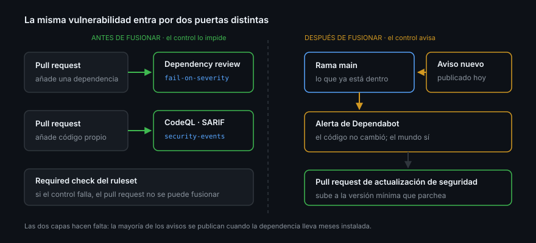

# El grafo de dependencias

> Antes de preguntarte si tu proyecto es vulnerable, contesta a algo más simple:
> ¿qué tiene dentro? Casi nadie lo sabe. El `package.json` declara diez paquetes
> y el `node_modules` acaba con novecientos. El grafo de dependencias es la única
> respuesta que no depende de tu memoria.

## 🎯 Objetivos

- Explicar de dónde saca GitHub la lista de lo que usa tu proyecto
- Distinguir manifiesto de lockfile, y dependencia directa de transitiva
- Leer una entrada del GitHub Advisory Database y saber qué afirma
- Diferenciar GHSA de CVE, y severidad CVSS de probabilidad EPSS
- Bloquear una dependencia vulnerable en el pull request, antes de fusionar

## 1. Qué problema resuelve

Instalas una librería de fechas. Ella instala un parser, que instala un
polyfill, que instala un módulo abandonado en 2019 con una expresión regular que
tarda seis segundos con la entrada correcta. Tú no elegiste nada de eso, pero se
ejecuta en tu servidor.

Ese es el problema: **la superficie de ataque de un proyecto no es el código que
escribes, es el que resuelve tu gestor de paquetes**. Y cambia sin que hagas
nada, porque un rango `^1.2.0` es una promesa sobre versiones que aún no existen.

El grafo de dependencias es el inventario. Todo lo demás de esta semana
—alertas, actualizaciones de seguridad, revisión de dependencias— se apoya en
él. Si el grafo no ve tu proyecto, Dependabot no tiene sobre qué avisarte.

## 2. Cómo se construye

GitHub lo calcula leyendo dos tipos de archivo del repositorio:

| Archivo | Qué declara | Ejemplo |
|---------|-------------|---------|
| **Manifiesto** | Lo que tú pediste, normalmente como rango | `package.json`, `pyproject.toml` |
| **Lockfile** | Lo que se resolvió exactamente, transitivas incluidas | `pnpm-lock.yaml`, `poetry.lock` |

La diferencia importa más de lo que parece:

- **Sin lockfile**, GitHub solo ve tus dependencias directas y sus rangos. Las
  transitivas quedan fuera del grafo, y por tanto fuera de las alertas.
- **Con lockfile**, ve el árbol completo con versiones exactas. Es la única
  forma de que te avise de la vulnerabilidad del polyfill que no elegiste.

> [!IMPORTANT]
> **Commitea el lockfile.** En un repositorio público sin `pnpm-lock.yaml`,
> Dependabot solo puede avisarte de lo que declaraste a mano. Es la causa número
> uno de «no me llega ninguna alerta» en proyectos que sí tienen problemas.

El grafo se activa solo en repositorios públicos. Para verlo:

```bash
gh api repos/{owner}/{repo}/dependency-graph/sbom \
  --jq '.sbom.packages | length'
```

Si eso devuelve `404`, el grafo aún no ha encontrado ningún manifiesto: revisa
que el archivo esté en una ruta que GitHub reconozca y que se haya empujado a la
rama por defecto.

## 3. La base de datos de avisos

GitHub mantiene el **GitHub Advisory Database**: un catálogo público de
vulnerabilidades conocidas, con los rangos de versión afectados por ecosistema.
Un aviso responde a tres preguntas:

1. **Qué paquete** y **en qué rango de versiones** es vulnerable
2. **Qué versión lo arregla** (`first_patched_version`)
3. **Cuánto duele** si te toca

Dos identificadores conviven, y no son lo mismo:

| Identificador | Quién lo asigna | Qué añade |
|---------------|-----------------|-----------|
| **CVE** (`CVE-2024-1234`) | El programa CVE, global | Identidad estable entre herramientas |
| **GHSA** (`GHSA-xxxx-xxxx-xxxx`) | GitHub | Rangos por ecosistema y versión parcheada exacta |

Un GHSA suele referenciar un CVE, pero existe antes: GitHub publica el aviso en
cuanto lo verifica, y el CVE puede tardar semanas. Hay GHSA sin CVE —
vulnerabilidades de paquetes pequeños que nadie registró — y por eso la base de
datos de GitHub encuentra cosas que un escáner que solo mire CVE no ve.

### Severidad no es riesgo

Dos números distintos, y confundirlos hace perder semanas:

- **CVSS** (`low`, `medium`, `high`, `critical` en la API; la interfaz escribe
  *Moderate* donde la API dice `medium`) mide **cuánto daño** haría si se
  explotara. Es una propiedad del fallo.
- **EPSS** estima **qué probabilidad** hay de que se explote en los próximos 30
  días. Es una propiedad del mundo.

Un `critical` con EPSS de 0,0004 y un `medium` con EPSS de 0,4 no piden la
misma reacción. La API de alertas expone ambos, y la Semana 13 usa los dos:
el CVSS para ordenar, el EPSS para decidir qué se arregla hoy.

También importa **dónde** está la dependencia. Una vulnerabilidad en algo que
solo se ejecuta en tu CI (`scope: development`) no es la misma urgencia que una
en lo que sirve peticiones (`scope: runtime`).

## 4. Bloquearlo en el pull request

El grafo tiene un uso que no es esperar avisos: comparar dos commits y ver qué
dependencias **añade** un pull request.

```bash
gh api repos/{owner}/{repo}/dependency-graph/compare/main...mi-rama \
  --jq '.[] | select(.change_type == "added") | {name, version, vulnerabilities: (.vulnerabilities | length)}'
```

Eso mismo, automatizado, es `actions/dependency-review-action`: falla el pull
request si introduce una dependencia vulnerable o con una licencia que no
aceptas.

```yaml
name: Revisión de dependencias

on: pull_request

permissions:
  contents: read

jobs:
  revisar:
    runs-on: ubuntu-latest
    steps:
      - uses: actions/checkout@11bd71901bbe5b1630ceea73d27597364c9af683 # v4.2.2
      - uses: actions/dependency-review-action@a1d282b36b6f3519aa1f3fc636f609c47dddb294 # v5.0.0
        with:
          fail-on-severity: high
          comment-summary-in-pr: on-failure
```

La diferencia con Dependabot es de **momento**:

| Herramienta | Cuándo actúa | Qué consigue |
|-------------|--------------|--------------|
| Dependency review | En el pull request, antes de fusionar | Que la vulnerabilidad no entre |
| Dependabot alerts | Sobre lo que ya está en `main` | Que te enteres de lo que ya entró |



Las dos hacen falta. La primera es barata y evita trabajo; la segunda cubre el
caso mayoritario, que es que el aviso se publique **después** de que fusionaras.

> [!NOTE]
> `comment-summary-in-pr` necesita `pull-requests: write` en el job. Sin ese
> permiso la action no falla: publica el resumen solo en el log del run, y la
> gente que revisa no lo ve.

## 5. Antipatrones

| Antipatrón | Por qué duele | Qué hacer |
|------------|---------------|-----------|
| No commitear el lockfile | El grafo solo ve directas; las transitivas quedan ciegas | Commitearlo siempre, también en librerías |
| Ordenar el trabajo solo por CVSS | Se arreglan `critical` teóricos y se ignoran `medium` explotados | Cruzar severidad con EPSS y con `scope` |
| Tratar `development` igual que `runtime` | Se gasta el presupuesto de atención donde no hay superficie | Priorizar por dónde se ejecuta |
| Esperar a que llegue la alerta | El PR ya fusionó la dependencia mala | `dependency-review-action` en cada PR |
| Añadir dependencias «que ya vienen con todo» | Cada una arrastra su propio árbol | Mirar el árbol antes: `pnpm why`, `pnpm ls --depth 2` |
| Confiar en que un CVE es la lista completa | Muchos GHSA no tienen CVE | Usar la base de GitHub, que es superconjunto |

## 6. Trucos

- **`pnpm why <paquete>`** contesta la pregunta que hace toda alerta de una
  transitiva: quién demonios la instaló
- **`gh api repos/{owner}/{repo}/dependency-graph/sbom --jq '.sbom.packages[].name'`**
  saca el inventario completo sin abrir la interfaz
- **La comparación `basehead` acepta cualquier par de refs**: `v1.0.0...v1.1.0`
  te dice qué dependencias añadió una versión
- **El endpoint público de avisos se consulta sin repositorio**:
  `gh api /advisories --jq '.[] | select(.severity=="critical") | .ghsa_id'`
- **`fail-on-severity: high`** deja pasar `moderate` y `low`: empieza así o el
  primer día bloqueas todos los pull requests del equipo. Ojo al nombre: esta
  action dice `moderate` donde la API de alertas dice `medium`
- **`deny-licenses`** en la misma action ataja el otro problema legal que nadie
  mira hasta que llega auditoría

## 📚 Recursos Adicionales

- [About the dependency graph](https://docs.github.com/en/code-security/supply-chain-security/understanding-your-software-supply-chain/about-the-dependency-graph)
- [GitHub Advisory Database](https://github.com/advisories)
- [About Dependabot alerts](https://docs.github.com/en/code-security/dependabot/dependabot-alerts/about-dependabot-alerts)
- [`actions/dependency-review-action`](https://github.com/actions/dependency-review-action)
- [REST — Dependency graph](https://docs.github.com/en/rest/dependency-graph)
- [EPSS — Exploit Prediction Scoring System](https://www.first.org/epss/)

## ✅ Checklist de Verificación

- [ ] Sabes qué archivos lee GitHub para construir el grafo
- [ ] Entiendes por qué sin lockfile no hay alertas de transitivas
- [ ] Distingues GHSA de CVE y sabes cuál llega antes
- [ ] Sabes qué mide CVSS y qué mide EPSS, y por qué no se sustituyen
- [ ] Puedes listar las dependencias que añade un pull request
- [ ] Tienes claro qué cubre `dependency-review` y qué cubre Dependabot
