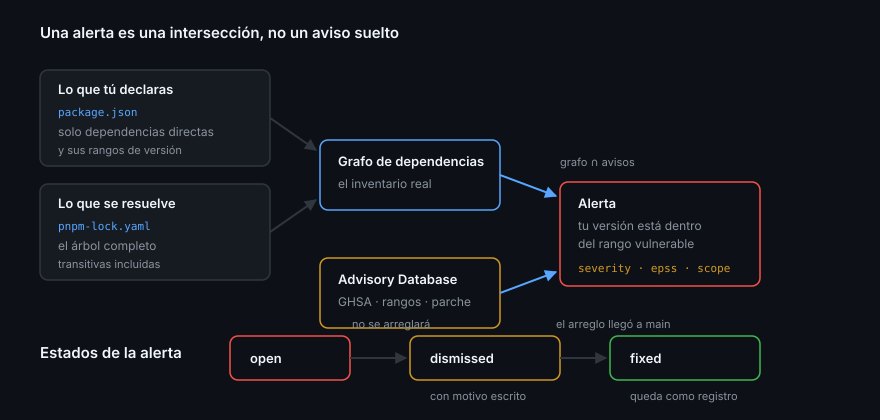

# Las alertas de Dependabot

> Una alerta no es una tarea. Es una afirmación: «una versión de este paquete que
> tú tienes instalada está en el rango vulnerable de este aviso». Decidir qué
> hacer con ella sigue siendo tuyo, y ahí es donde casi todos los equipos se
> ahogan: cincuenta alertas abiertas que nadie mira valen exactamente lo mismo
> que ninguna.

## 🎯 Objetivos

- Activar las alertas y saber qué se activa exactamente
- Leer una alerta campo a campo desde la API, sin la interfaz
- Ordenar el trabajo con severidad, EPSS, `scope` y `relationship`
- Descartar una alerta con un motivo que signifique algo, y saber reabrirla
- Reconocer cuándo una alerta es ruido estructural y automatizar su descarte

## 1. Qué problema resuelve

El grafo dice qué tienes. La base de avisos dice qué es vulnerable. Una **alerta
de Dependabot** es la intersección de las dos, calculada continuamente:

```
grafo de dependencias  ∩  advisory database  =  alertas
```



Se genera en dos momentos, y el segundo es el que la gente olvida:

1. Cuando **tú** añades una dependencia que ya estaba en un aviso
2. Cuando **se publica un aviso nuevo** sobre algo que llevas dos años usando

El segundo caso es la mayoría. Por eso «revisamos las dependencias al empezar el
proyecto» no es una estrategia: el código no ha cambiado, el mundo sí.

## 2. Cómo se activa

En un repositorio público, el grafo está siempre encendido; las alertas se
activan por repositorio:

```bash
# Activar
gh api repos/{owner}/{repo}/vulnerability-alerts --method PUT

# Comprobar: 204 si están activas, 404 si no
gh api repos/{owner}/{repo}/vulnerability-alerts --include --silent 2>&1 | head -1
```

> [!NOTE]
> Ese endpoint no devuelve JSON: contesta con un `204 No Content` cuando están
> activas y un `404` cuando no. Es de los pocos de la API de GitHub donde el
> código de estado **es** la respuesta. Para una comprobación automatizable
> conviene más pedir la lista de alertas: si el endpoint devuelve un array, están
> activas; si devuelve `403`, no lo están.

En la interfaz: **Settings → Advanced Security → Dependabot alerts**.

## 3. Anatomía de una alerta

```bash
gh api "repos/{owner}/{repo}/dependabot/alerts?state=open&per_page=100" \
  --jq '.[] | {
    n: .number,
    paquete: .dependency.package.name,
    donde: .dependency.scope,
    relacion: .dependency.relationship,
    severidad: .security_advisory.severity,
    ghsa: .security_advisory.ghsa_id,
    arregla: .security_vulnerability.first_patched_version.identifier
  }'
```

Los campos que deciden qué haces:

| Campo | Valores | Qué te dice |
|-------|---------|-------------|
| `state` | `open`, `dismissed`, `fixed`, `auto_dismissed` | En qué punto del ciclo está |
| `security_advisory.severity` | `low`, `medium`, `high`, `critical` | Cuánto daño haría |
| `security_advisory.epss` | Probabilidad y percentil | Cuánta prisa hay de verdad |
| `security_vulnerability.first_patched_version` | Versión o `null` | **Si hay arreglo o no lo hay** |
| `dependency.scope` | `runtime`, `development` | Si se ejecuta en producción |
| `dependency.relationship` | `direct`, `transitive`, `unknown`, `inconclusive` | Si puedes arreglarlo tú o depende de otro |
| `dependency.manifest_path` | Ruta | Cuál de tus manifiestos, en un monorepo |

> [!NOTE]
> La interfaz escribe *Moderate* donde la API dice `medium`. Es el mismo nivel
> con dos nombres, y hace fallar en silencio cualquier filtro que copies de una
> captura de pantalla.

El campo más infravalorado es `first_patched_version`. Cuando vale `null` **no
existe arreglo**: ninguna actualización cierra esa alerta. Toda la energía que
gastes en ella es energía perdida hasta que el mantenedor publique algo. Lo que
toca ahí es mitigar o sustituir el paquete, no reintentar.

## 4. Ordenar el trabajo

Una regla de tres factores, en este orden:

1. **¿Hay arreglo?** Sin `first_patched_version`, no es una tarea de
   actualización; es una decisión de arquitectura.
2. **¿Se ejecuta en producción?** `scope: runtime` antes que `development`.
   Una vulnerabilidad en un plugin de tests no llega a tus usuarios.
3. **¿Es probable que se explote?** Ahí entra el EPSS, no el CVSS.

```bash
# Lo que de verdad hay que mirar hoy
gh api "repos/{owner}/{repo}/dependabot/alerts?state=open&scope=runtime&per_page=100" \
  --jq '[.[] | select(.security_vulnerability.first_patched_version != null)]
        | sort_by(-(.security_advisory.epss.percentage // 0))
        | .[0:5] | .[] | {paquete: .dependency.package.name, epss: .security_advisory.epss.percentage}'
```

La API acepta filtros directamente — `state`, `severity`, `ecosystem`, `scope`,
`epss_percentage`, `has`, `package`, `manifest` — así que casi ninguna de estas
consultas necesita filtrar en `jq`.

## 5. Descartar bien

Descartar no es «ocultar». Es dejar escrito por qué esto no se va a arreglar,
para que dentro de seis meses nadie repita el análisis.

```bash
gh api repos/{owner}/{repo}/dependabot/alerts/42 --method PATCH \
  -f state=dismissed \
  -f dismissed_reason=not_used \
  -f dismissed_comment="Solo se importa desde el script de migración, que no corre en producción."
```

Los cinco motivos válidos, y cuándo es honesto usar cada uno:

| `dismissed_reason` | Significa | Trampa habitual |
|--------------------|-----------|-----------------|
| `fix_started` | Ya hay un PR abierto | Se queda ahí para siempre si el PR muere |
| `inaccurate` | El aviso no aplica a tu uso | Requiere argumentarlo; no es «no me lo creo» |
| `no_bandwidth` | No hay gente para esto ahora | Es honesto, y por eso hay que revisarlo |
| `not_used` | El código vulnerable nunca se ejecuta | Solo si lo has comprobado, no si lo supones |
| `tolerable_risk` | Se asume conscientemente | Debería llevar quién lo asume en el comentario |

Reabrir es el mismo `PATCH` con `-f state=open`. Y `auto_dismissed` es un estado
distinto de `dismissed`: lo pone GitHub, no una persona.

> [!TIP]
> El `dismissed_comment` es el único sitio donde queda constancia del análisis.
> Un descarte sin comentario es indistinguible de un descarte por pereza — y
> dentro de un año, tú tampoco los vas a distinguir.

## 6. Ruido estructural: reglas de auto-descarte

Hay familias enteras de alertas que en tu proyecto nunca van a ser accionables:
vulnerabilidades de desarrollo de severidad baja, por ejemplo. Descartarlas a
mano una por una es trabajo repetido para siempre.

GitHub permite definir **reglas de auto-triage** que descartan automáticamente
las alertas que casen con un patrón (ecosistema, severidad, `scope`, paquete), y
las marca como `auto_dismissed` para que se distingan de las decisiones humanas.

Es una herramienta afilada: una regla demasiado amplia esconde el problema en vez
de resolverlo. La forma sensata de escribir una es partir de las alertas que
llevas seis meses descartando con el mismo motivo.

## 7. Antipatrones

| Antipatrón | Por qué duele | Qué hacer |
|------------|---------------|-----------|
| Perseguir el cero de alertas | Se descarta en masa para limpiar el panel | Objetivo: cero **accionables**, no cero |
| Descartar sin comentario | El análisis se pierde y se repite | `dismissed_comment` siempre |
| Ordenar solo por severidad | Se ignoran `medium` con EPSS alto | Cruzar con EPSS y `scope` |
| Insistir en alertas sin parche | No hay nada que actualizar | Mitigar, sustituir o asumir por escrito |
| `tolerable_risk` sin dueño | Nadie asumió nada de verdad | Nombre y fecha en el comentario |
| Reglas de auto-descarte amplias | Esconden lo que sí importaba | Partir de patrones ya observados |
| Mirar las alertas solo en la interfaz | No se puede automatizar ni auditar | `gh api` y guiones |

## 8. Trucos

- **`--jq 'group_by(.security_advisory.severity) | map({sev: .[0].security_advisory.severity, n: length})'`**
  es el resumen de una línea que sirve para un informe semanal
- **`?has=patch`** filtra directamente lo que tiene arreglo disponible
- **`?epss_percentage=>0.01`** deja solo lo que el mundo está explotando
- **El `number` de la alerta es estable**: sirve para enlazarla desde un issue
- **`state=auto_dismissed`** enseña qué está tapando tu regla de auto-triage;
  revísalo de vez en cuando o la regla se convierte en una alfombra
- **Una alerta `fixed` no desaparece**: queda como registro de que llegaste a
  tenerla, que es exactamente lo que pide una auditoría

## 📚 Recursos Adicionales

- [About Dependabot alerts](https://docs.github.com/en/code-security/dependabot/dependabot-alerts/about-dependabot-alerts)
- [Viewing and updating Dependabot alerts](https://docs.github.com/en/code-security/dependabot/dependabot-alerts/viewing-and-updating-dependabot-alerts)
- [REST — Dependabot alerts](https://docs.github.com/en/rest/dependabot/alerts)
- [About auto-triage rules](https://docs.github.com/en/code-security/dependabot/dependabot-auto-triage-rules/about-dependabot-auto-triage-rules)
- [GitHub Advisory Database](https://github.com/advisories)

## ✅ Checklist de Verificación

- [ ] Sabes activar las alertas y comprobar que lo están
- [ ] Puedes listar tus alertas abiertas por API con los campos que importan
- [ ] Distingues `scope`, `relationship` y `first_patched_version`
- [ ] Sabes qué significa que `first_patched_version` sea `null`
- [ ] Conoces los cinco motivos de descarte y cuándo es honesto cada uno
- [ ] Entiendes la diferencia entre `dismissed` y `auto_dismissed`
