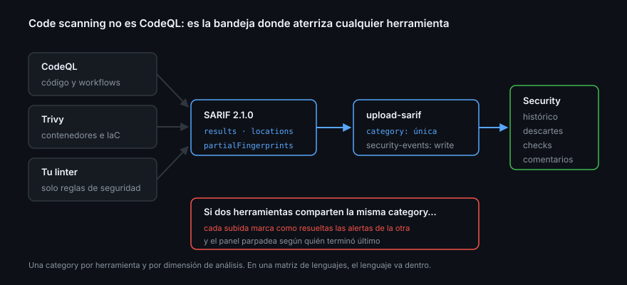

# SARIF y herramientas de terceros

> Code scanning no es CodeQL. Code scanning es una **bandeja**: un sitio donde
> las alertas de cualquier herramienta se ven, se filtran, se descartan con
> motivo y bloquean pull requests igual que las de GitHub. Lo que las mete ahí es
> un formato de archivo con un nombre feo.

## 🎯 Objetivos

- Explicar qué es SARIF y qué parte usa GitHub
- Subir los resultados de una herramienta cualquiera a la pestaña de seguridad
- Elegir bien la `category` y entender qué rompe cuando está mal
- Conocer los límites del formato antes de chocar con ellos
- Decidir qué merece la pena unificar ahí y qué no

## 1. Qué problema resuelve

Un proyecto real acumula herramientas: un linter con reglas de seguridad, un
escáner de secretos, uno de configuración de contenedores, uno de infraestructura
como código. Cada una escribe su informe en su formato y lo deja en el log de un
job que nadie abre. Cuatro herramientas, cuatro sitios donde mirar, cero
seguimiento de qué se descartó y por qué.

**SARIF** (*Static Analysis Results Interchange Format*) es el formato común. Es
un estándar de OASIS; GitHub soporta la versión `2.1.0` y usa un subconjunto. Una
herramienta que sepa emitirlo hereda gratis todo lo que la plataforma ya tiene:
la bandeja de alertas, el histórico, los descartes con motivo, los comentarios en
el pull request y los checks obligatorios del ruleset.

## 2. Qué hay dentro de un SARIF

Lo mínimo que GitHub necesita entender:

```json
{
  "$schema": "https://json.schemastore.org/sarif-2.1.0.json",
  "version": "2.1.0",
  "runs": [
    {
      "tool": {
        "driver": {
          "name": "mi-analizador",
          "rules": [
            { "id": "sin-validar-entrada", "shortDescription": { "text": "Entrada sin validar" } }
          ]
        }
      },
      "results": [
        {
          "ruleId": "sin-validar-entrada",
          "level": "error",
          "message": { "text": "El parámetro llega a la consulta sin sanear." },
          "locations": [
            {
              "physicalLocation": {
                "artifactLocation": { "uri": "src/api/socios.ts" },
                "region": { "startLine": 42 }
              }
            }
          ],
          "partialFingerprints": { "primaryLocationLineHash": "a1b2c3d4e5f6:1" }
        }
      ]
    }
  ]
}
```

Cinco piezas y para qué sirve cada una:

| Pieza | Qué aporta |
|-------|------------|
| `tool.driver.name` | El nombre que verás en `tool.name` de la API y en el filtro |
| `results[].ruleId` | Agrupa alertas del mismo tipo; permite filtrar por regla |
| `results[].level` | `note`, `warning` o `error` — de dónde sale la severidad |
| `results[].locations[]` | Archivo y línea: sin esto la alerta no se ancla al código |
| `partialFingerprints` | **La identidad de la alerta entre ejecuciones** |

`partialFingerprints` es el que más consecuencias tiene y el que más se omite.
Sin él, GitHub tiene que adivinar si la alerta de hoy es la misma de ayer; si
alguien añade tres líneas arriba, la alerta «se cierra» y «se abre» otra
idéntica, y con ella se pierde el descarte que alguien había escrito. Las
herramientas serias lo emiten solas: comprueba que la tuya lo hace antes de
culpar a GitHub.

## 3. Subirlo

La forma normal es un paso más en un workflow:

```yaml
name: Análisis estático

on:
  push:
    branches: [main]
  pull_request:

permissions:
  contents: read

jobs:
  analizar:
    runs-on: ubuntu-latest
    permissions:
      contents: read
      security-events: write     # publicar en la pestaña de seguridad
    steps:
      - uses: actions/checkout@11bd71901bbe5b1630ceea73d27597364c9af683 # v4.2.2

      - run: pnpm dlx eslint . --format @microsoft/eslint-formatter-sarif --output-file eslint.sarif
        continue-on-error: true

      - uses: github/codeql-action/upload-sarif@db488ddef3bf6cb639b32c2e9a7c0a7ea8271d28 # v4.37.8
        with:
          sarif_file: eslint.sarif
          category: eslint
```

Tres detalles que no son decorativos:

- **`security-events: write`** en el job, no en el workflow. Sin ese permiso la
  subida devuelve `403` y el job falla al final, después de gastar el análisis
- **`continue-on-error: true`** en el paso que analiza: casi todas las
  herramientas devuelven un código distinto de cero cuando encuentran algo, y sin
  esto el SARIF no llega a subirse nunca
- **`category`** identifica este análisis dentro del repositorio

La action acepta también un directorio en `sarif_file` — sube todos los `.sarif`
que encuentre — y `wait-for-processing`, activado por defecto, que hace que el
job falle si GitHub rechaza el archivo en vez de acabar en verde con un error que
solo se ve en la interfaz.

## 4. La `category`, o cómo un análisis borra a otro

GitHub trata cada `category` como una serie independiente de resultados. Al subir
un SARIF, **las alertas anteriores de esa misma categoría que ya no aparecen se
marcan como resueltas**.

De ahí sale el fallo más desconcertante de esta parte: dos herramientas subiendo
sin `category`, o con la misma, se pisan. Cada subida cierra las alertas de la
otra, y el panel parpadea entre dos conjuntos según quién terminó último.

La regla es simple: **una categoría por herramienta y por dimensión de análisis**.
En una matriz de lenguajes, la categoría lleva el lenguaje dentro:

```yaml
          category: "/language:${{ matrix.language }}"
```

## 5. Los límites

Vale la pena conocerlos antes de chocar:

| Límite | Valor |
|--------|-------|
| Versión de SARIF | Solo `2.1.0` |
| Tamaño del archivo comprimido con gzip | 10 MB |
| `runs` por archivo | 20 |
| Resultados por `run` | Se aceptan hasta 25 000; se muestran los 5 000 más severos |

Si una herramienta genera más que eso, el problema no es el límite: es que está
configurada para reportar estilo además de seguridad. Un SARIF de 40 MB es un
linter mal filtrado, no un proyecto inseguro.

## 6. Subirlo sin Actions

La API está debajo, y sirve para integrar una herramienta que corra fuera:

```bash
gzip -c resultados.sarif | base64 -w0 > sarif.b64

gh api repos/{owner}/{repo}/code-scanning/sarifs --method POST \
  -f commit_sha="$(git rev-parse HEAD)" \
  -f ref="refs/heads/main" \
  -f sarif="$(cat sarif.b64)"
# { "id": "...", "url": "..." }
```

El procesamiento es asíncrono. La respuesta trae un identificador con el que se
consulta cómo fue:

```bash
gh api repos/{owner}/{repo}/code-scanning/sarifs/<id> --jq '{processing_status, errors}'
```

Un `202` en la subida **no** significa que el archivo fuera válido: significa que
lo han aceptado para procesar. Los errores de esquema aparecen ahí.

## 7. Convivir con CodeQL



Las alertas de todas las herramientas viven en la misma bandeja, y `tool.name`
las separa:

```bash
gh api "repos/{owner}/{repo}/code-scanning/analyses?per_page=100" \
  --jq 'group_by(.tool.name) | map({herramienta: .[0].tool.name, analisis: length})'
```

Qué merece la pena subir ahí y qué no:

| Súbelo | No lo subas |
|--------|-------------|
| Reglas de seguridad de tu linter | Formato y estilo |
| Escáneres de contenedores y de IaC | Cobertura de tests |
| Analizadores de configuración de workflows | Métricas de complejidad |
| Herramientas de detección de secretos propias | Avisos de dependencias — eso es Dependabot |

El criterio: **si nadie va a descartar la alerta con un motivo, no es una alerta
de seguridad, es un aviso**. Y los avisos ya tienen sitio: el log del job.

## 8. Antipatrones

| Antipatrón | Por qué duele | Qué hacer |
|------------|---------------|-----------|
| Varias herramientas sin `category` | Cada subida cierra las alertas de la otra | Una categoría por herramienta |
| SARIF sin `partialFingerprints` | Las alertas se recrean y se pierden los descartes | Comprobar que la herramienta los emite |
| Subir el linter entero | Miles de avisos de estilo tapan lo importante | Solo el conjunto de reglas de seguridad |
| Sin `continue-on-error` en el análisis | La herramienta falla y el SARIF nunca sube | Ponerlo en el paso que analiza, no en el que sube |
| `security-events: write` a nivel de workflow | Permiso amplio sin motivo | En el job que sube |
| Fiarse del `202` | El archivo puede ser inválido | Consultar `processing_status` |
| Subir SARIF desde un PR de un fork | No tiene permiso y falla siempre | Analizar en `push` a la rama base |

## 9. Trucos

- **`--jq '[.[] | select(.tool.name != "CodeQL")] | length'`** contesta en una
  línea si tu SARIF de terceros llegó de verdad
- **`sarif_file:` acepta un directorio**: un solo paso para varias herramientas,
  siempre que cada archivo traiga su propio `tool.driver.name`
- **`wait-for-processing`** convierte un fallo silencioso en un job rojo; déjalo
  como está
- **Muchos linters tienen formateador SARIF oficial**; búscalo antes de escribir
  un conversor
- **Un SARIF se valida en local** contra el esquema publicado antes de gastar una
  ejecución de CI
- **La API de subida no necesita Actions**: una herramienta que corra en tu
  máquina puede publicar en la misma bandeja

## 📚 Recursos Adicionales

- [SARIF support for code scanning](https://docs.github.com/en/code-security/code-scanning/integrating-with-code-scanning/sarif-support-for-code-scanning)
- [Uploading a SARIF file to GitHub](https://docs.github.com/en/code-security/code-scanning/integrating-with-code-scanning/uploading-a-sarif-file-to-github)
- [REST — Code scanning (SARIF)](https://docs.github.com/en/rest/code-scanning/code-scanning#upload-an-analysis-as-sarif-data)
- [`github/codeql-action/upload-sarif`](https://github.com/github/codeql-action/tree/main/upload-sarif)
- [OASIS — SARIF 2.1.0](https://docs.oasis-open.org/sarif/sarif/v2.1.0/sarif-v2.1.0.html)
- [`@microsoft/eslint-formatter-sarif`](https://github.com/microsoft/sarif-js-sdk)

## ✅ Checklist de Verificación

- [ ] Sabes qué campos de un SARIF usa GitHub y para qué sirve cada uno
- [ ] Entiendes qué rompe cuando falta `partialFingerprints`
- [ ] Sabes qué permiso necesita el job que sube y dónde se declara
- [ ] Puedes explicar por qué dos herramientas sin `category` se pisan
- [ ] Conoces los límites de tamaño y de resultados
- [ ] Tienes criterio para decidir qué herramienta merece estar en la bandeja
