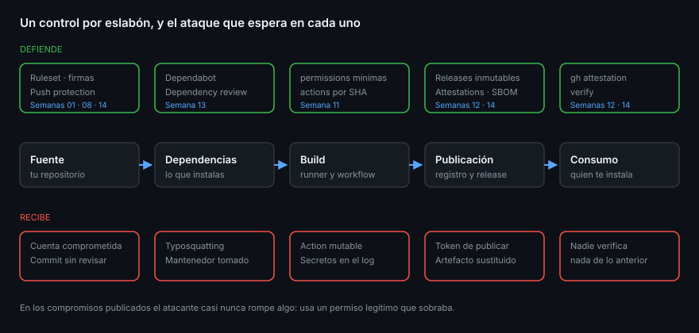

# La cadena de suministro de software

> Casi nada de lo que corre en producción lo escribiste tú. Entre tu editor y el
> proceso que atiende una petición hay decenas de manos: mantenedores que no
> conoces, un runner que no administras, un registro que no controlas. La cadena
> de suministro es esa lista de manos, y asegurarla no es un producto: es saber
> qué eslabón estás cubriendo con cada control que enciendes.

## 🎯 Objetivos

- Nombrar los cinco eslabones de la cadena y quién ataca cada uno
- Reconocer el patrón común de los compromisos reales que se han publicado
- Situar cada control del bootcamp en el eslabón que defiende
- Explicar qué son los niveles de SLSA y en cuál te deja GitHub Actions
- Distinguir entre *prevenir*, *detectar* y *demostrar*, que no son lo mismo

## 1. Qué problema resuelve

Un proyecto de Node moderno con veinte dependencias directas suele resolver a
más de mil paquetes. Cada uno lo publica alguien con una cuenta, desde una
máquina, con un token. Ese es el tamaño real de la superficie: no tu `src/`, sino
todo lo que tu `src/` arrastra y todo lo que toca tu artefacto antes de llegar al
usuario.



La pregunta de esta semana no es «¿tengo vulnerabilidades?» —esa fue la Semana
13— sino otra más incómoda:

> Si alguien quisiera meter código suyo en lo que tú publicas, **¿por dónde
> entraría, y me enteraría?**

## 2. Los cinco eslabones

| Eslabón | Qué es | Cómo se ataca |
|---------|--------|---------------|
| **Fuente** | Tu repositorio y quién puede escribir en él | Cuenta comprometida, colaborador malicioso, commit que nadie revisa |
| **Dependencias** | Lo que instalas | Typosquatting, mantenedor comprometido, paquete transferido a otro dueño |
| **Build** | El runner y el workflow que construyen | Workflow con permisos de más, action de terceros mutable, secretos expuestos en logs |
| **Publicación** | El registro donde dejas el artefacto | Token de publicación robado, artefacto sustituido, versión sobreescrita |
| **Consumo** | Quien instala lo tuyo | Nadie comprueba que el artefacto viene de donde dice |

Tres compromisos públicos, uno por eslabón, para que no suene teórico:

- **`event-stream` (2018)**: el mantenedor original cedió el paquete a un
  voluntario, que publicó una versión con código para robar carteras de
  criptomonedas. Eslabón: **dependencias**. Nadie revisó al nuevo dueño.
- **Codecov (2021)**: un script de instalación distribuido por el proveedor fue
  modificado para exfiltrar variables de entorno de los CI de sus clientes.
  Eslabón: **build**. El script se descargaba en cada ejecución, sin verificar.
- **`xz`/`liblzma` (2024)**: un contribuidor construyó reputación durante años
  hasta obtener permisos de mantenimiento y coló una puerta trasera en los
  artefactos de release —no en el código fuente legible. Eslabón: **fuente** y
  **publicación** a la vez.

El patrón que comparten los tres: **el atacante no rompió nada; usó un permiso
legítimo**. Por eso la respuesta no es un antivirus, sino reducir permisos, dejar
rastro y poder demostrar de dónde salió cada cosa.

## 3. Prevenir, detectar, demostrar

Los controles de esta semana caen en tres cajas distintas, y confundirlas es el
error más común al montar seguridad:

| Categoría | Qué hace | Ejemplo |
|-----------|----------|---------|
| **Prevenir** | Impide que la cosa mala ocurra | Push protection, ruleset, permisos mínimos |
| **Detectar** | Avisa después de que ocurrió | Secret scanning, Dependabot, code scanning |
| **Demostrar** | Permite a un tercero comprobarlo | Attestations, SBOM, releases inmutables |

Un equipo que solo previene se queda ciego el día que la prevención falla. Uno
que solo detecta vive apagando fuegos. Y sin la tercera caja no puedes contestar
la pregunta que llega en una auditoría —«¿de dónde salió este binario?»— con algo
distinto de «confía en mí».

## 4. SLSA: poner un número a «demostrar»

**SLSA** (*Supply-chain Levels for Software Artifacts*) es un marco que ordena
por niveles cuánto se puede confiar en la **procedencia** de un artefacto. La
pista de build tiene tres niveles útiles:

| Nivel | Qué exige | Cómo se consigue en GitHub |
|:-----:|-----------|----------------------------|
| **L1** | Existe procedencia y se publica | Generar la atestación del build |
| **L2** | La procedencia la firma el servicio de build, no el proyecto | Runners alojados por GitHub + artifact attestations |
| **L3** | El proceso de build está aislado del que lo invoca | Que la atestación la genere un **reusable workflow** |

Es decir: la Semana 12 te dejó en **L2** casi sin darte cuenta, porque
`actions/attest-build-provenance` corriendo en un runner de GitHub firma con la
identidad del propio servicio. El salto a **L3** es el de la Semana 10: mover los
pasos de build a un reusable workflow que sea quien emite la atestación, para que
el workflow que llama no pueda manipular el proceso.

> [!NOTE]
> SLSA no mide si tu código es bueno ni si tus dependencias son seguras. Mide
> **cuánto se puede confiar en la afirmación** de que ese artefacto salió de ese
> commit por ese proceso. Es exactamente la caja «demostrar».

## 5. El mapa: qué control cubre qué eslabón

Todo lo que llevas montado en el bootcamp, colocado en su sitio:

| Eslabón | Control | Semana |
|---------|---------|:------:|
| Fuente | Commits firmados, ruleset con revisión obligatoria | 01, 08 |
| Fuente | CODEOWNERS enrutando a quien sabe | 07 |
| Fuente | **Push protection: el secreto no entra** | **14** |
| Dependencias | Dependabot alerts y security updates | 13 |
| Dependencias | `dependency-review` bloqueando en el pull request | 13 |
| Dependencias | **SBOM: saber qué tienes, exportable** | **14** |
| Build | `permissions` mínimas por job, OIDC sin secretos largos | 11 |
| Build | Actions de terceros pinneadas por SHA | 11 |
| Build | CodeQL con el lenguaje `actions` | 13 |
| Publicación | Releases inmutables, GHCR, npm con provenance | 12 |
| Publicación | **Attestations propias sobre lo que publicas** | **14** |
| Consumo | `gh attestation verify` antes de confiar | 12, **14** |
| Todo | **Scorecard puntuando el conjunto** | **14** |

Las cuatro filas en negrita son las que faltan. Esta semana no añade una
tecnología nueva: **cierra los huecos** del mapa que llevas trece semanas
dibujando.

## 6. La parte que nadie automatiza

Dos eslabones no tienen botón:

- **Quién entra a tu repositorio.** Un colaborador nuevo es un cambio de
  superficie de ataque más grande que cualquier dependencia. La Semana 17 lo
  trata con teams y roles; hasta entonces, la regla es aburrida y funciona:
  nadie con `write` que no necesite `write`.
- **Cómo te enteras de un fallo desde fuera.** Si alguien encuentra una
  vulnerabilidad en tu proyecto y no tiene dónde contarla en privado, la va a
  publicar en un issue. Eso lo arregla un `SECURITY.md` de verdad y el reporte
  privado, y es la mitad de la semana que no es YAML.

## 7. Auditar una cadena en diez minutos

El mapa sirve si se puede recorrer. Estas seis preguntas, con su comando, son la
auditoría mínima de cualquier repositorio propio:

```bash
# Fuente: ¿quién puede escribir?
gh api repos/{owner}/{repo}/collaborators --jq '.[] | {login, permiso: .role_name}'

# Fuente: ¿hay ruleset activo?
gh api repos/{owner}/{repo}/rulesets --jq '.[] | {name, enforcement}'

# Fuente: ¿está cerrada la puerta a los secretos?
gh api repos/{owner}/{repo} --jq '.security_and_analysis'

# Dependencias: ¿queda algo grave abierto?
gh api "repos/{owner}/{repo}/dependabot/alerts?state=open&per_page=100" \
  --jq '[.[] | select(.security_advisory.severity == "critical")] | length'

# Build: ¿hay actions sin anclar por SHA?
grep -rnE 'uses: .*@(v[0-9]|main|master)' .github/workflows/ | wc -l

# Publicación: ¿el último release se puede verificar?
gh release download "$(gh release list --limit 1 --json tagName --jq '.[0].tagName')" --pattern '*'
```

Seis comandos, seis eslabones. Si alguno no puedes contestarlo, ese es el hueco
por el que entraría alguien — y probablemente ya sabes de qué semana era.

## 8. Antipatrones

| Antipatrón | Por qué duele | Qué hacer |
|------------|---------------|-----------|
| Cubrir un eslabón y llamarlo cadena | El atacante entra por el que falta | Auditar el mapa entero, no la herramienta favorita |
| Solo detectar | Todo el trabajo llega tarde | Emparejar cada detección con una prevención |
| Firmar sin verificar | Una firma que nadie comprueba es decoración | Verificar en el consumo, aunque sea tú mismo |
| Perseguir un nivel SLSA como trofeo | El número no arregla el eslabón débil | El nivel es consecuencia, no objetivo |
| Confiar en la reputación del mantenedor | `xz` duró años construyéndola | Confiar en el proceso, no en la persona |
| Dejar el reporte de fallos sin puerta | Te enteras por Twitter | `SECURITY.md` + reporte privado |

## 9. Trucos

- **Léelo al revés.** Empieza por el artefacto publicado y ve hacia atrás
  preguntando «¿quién pudo tocar esto?». Los huecos aparecen solos.
- **`gh api repos/{owner}/{repo}/collaborators --jq '.[].login'`** es la
  auditoría más barata de la semana: quién puede escribir en tu fuente.
- **El eslabón más atacado es el build**, porque es el único que tiene a la vez
  código ajeno y secretos propios.
- **Un control que nunca ha dicho que no** no está demostrado. Todas las
  prácticas de esta semana incluyen ver el control fallar a propósito.

## 📚 Recursos Adicionales

- [SLSA — Supply-chain Levels for Software Artifacts](https://slsa.dev/)
- [SLSA — Build levels](https://slsa.dev/spec/v1.0/levels)
- [About supply chain security](https://docs.github.com/en/code-security/supply-chain-security/end-to-end-supply-chain/end-to-end-supply-chain-overview)
- [Using artifact attestations and reusable workflows to achieve SLSA v1 Build Level 3](https://docs.github.com/en/actions/how-tos/secure-your-work/use-artifact-attestations/increase-security-rating)
- [OpenSSF — Secure Supply Chain Consumption Framework](https://best.openssf.org/)

## ✅ Checklist de Verificación

- [ ] Sabes nombrar los cinco eslabones y un ataque típico de cada uno
- [ ] Distingues prevenir, detectar y demostrar, y sabes en qué caja está cada control
- [ ] Puedes decir en qué nivel de SLSA te dejó la Semana 12 y qué falta para el siguiente
- [ ] Sabes qué cuatro huecos cierra esta semana en tu mapa
- [ ] Entiendes por qué la reputación del mantenedor no es un control
