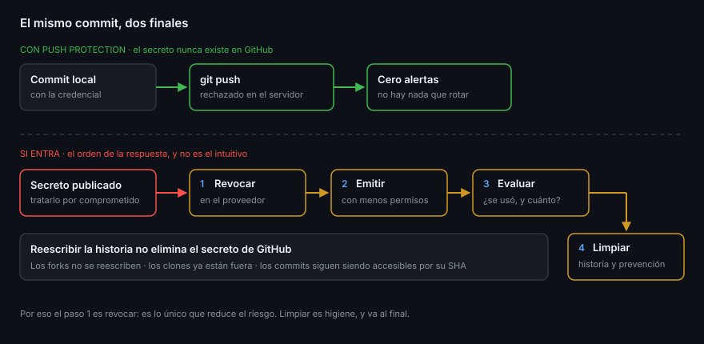

# Push protection

> Secret scanning te avisa de que la credencial ya está publicada. Push
> protection es la otra mitad: rechaza el `push` antes de que llegue al servidor.
> La diferencia entre las dos, medida en trabajo, es la que hay entre rotar un
> token y no tener que hacerlo.

## 🎯 Objetivos

- Explicar en qué momento exacto actúa el bloqueo y qué se comprueba
- Leer el mensaje del bloqueo y saber qué hacer con él
- Conocer los tres motivos de excepción y qué alerta genera cada uno
- Entender qué es el bypass delegado y por qué existe
- Reconocer los tres casos que la protección **no** cubre

## 1. Qué problema resuelve

Un secreto que llega a un repositorio público hay que darlo por comprometido:
existen bots suscritos al flujo público de eventos de GitHub cuyo trabajo es
recoger credenciales recién publicadas y probarlas. El coste no es limpiar el
historial, es **rotar la credencial y auditar qué se hizo con ella**.

Push protection mueve el control un paso antes: el servidor examina el contenido
del `push` y, si encuentra algo que casa con un patrón de proveedor, **rechaza el
push entero**. El secreto nunca llega a existir en GitHub.



## 2. Dónde actúa

No es un hook local: corre en el servidor, así que protege por igual todas las
vías de escritura.

| Vía | ¿Protegida? |
|-----|:-----------:|
| `git push` desde la terminal | ✅ |
| Editar un archivo en la interfaz web | ✅ |
| Subir archivos por arrastrar y soltar | ✅ |
| Crear o actualizar contenido por la API REST | ✅ |
| Un `git push` que ya está en el historial de otro repositorio | ❌ (es un `push` nuevo, se comprueba igual) |

Que sea del lado del servidor tiene una consecuencia práctica: **no se puede
desactivar accidentalmente en tu máquina**, y funciona igual en un runner de
Actions que en tu portátil.

## 3. El bloqueo, por dentro

Cuando el push se rechaza, la salida de Git trae tres cosas: el tipo de secreto
detectado, el commit y la ruta donde está, y una URL para desbloquear.

```
remote: —— GitHub Secret Protection ——————————————————————
remote: Resolve the following secrets before pushing again.
remote:
remote:   —— GitHub Personal Access Token ————————————————
remote:    locations:
remote:      - commit: 8a1f2c...
remote:        path: src/config.ts:12
remote:
remote:    (?) To push, remove secret from commit(s) or follow this URL to
remote:        allow the secret.
```

Lo que hay que entender del mensaje: **señala el commit, no el archivo actual**.
Si borras la línea y haces otro commit encima, el push se sigue rechazando,
porque el secreto sigue estando en el commit anterior del mismo push. La salida
correcta es reescribir esos commits locales —`git reset`, `git commit --amend` o
un rebase interactivo— antes de volver a empujar.

> [!IMPORTANT]
> El orden importa, y es contraintuitivo: **primero revoca la credencial, después
> arregla los commits**. Si el token ya existe, ya es un riesgo, y arreglar la
> historia local no lo reduce en nada. La Semana 18 cubre la reescritura de
> historia; esta semana cubre por qué eso nunca es el primer paso.

## 4. Los tres motivos de excepción

Si el bloqueo es un falso positivo o el secreto no tiene poder, se puede pedir
una excepción desde la URL del mensaje. Hay exactamente tres motivos, y **cada
uno deja un rastro distinto**:

| Motivo | Qué pasa después |
|--------|------------------|
| *It's used in tests* | El push pasa y se crea una alerta **cerrada** como `used_in_tests` |
| *It's a false positive* | El push pasa y se crea una alerta **cerrada** como `false_positive` |
| *I'll fix it later* | El push pasa y se crea una alerta **abierta** |

Los tres tienen la misma propiedad y es la importante: **no hay salto silencioso**.
Elijas el que elijas, queda una alerta con tu nombre, la fecha y el motivo. Eso
es exactamente lo que se audita después:

```bash
gh api "repos/{owner}/{repo}/secret-scanning/alerts?is_bypassed=true" \
  --jq '.[] | {n: .number, tipo: .secret_type_display_name, quien: .push_protection_bypassed_by.login}'
```

*I'll fix it later* es el único de los tres que es honesto cuando el secreto era
real: deja la alerta abierta para que alguien la rote. Los otros dos son
afirmaciones sobre el secreto —«no autentica contra nada»— y hay que poder
sostenerlas.

## 5. Sacar el secreto del push

El bloqueo señala un commit, así que la salida es reescribir commits **locales**
—que todavía no están en ningún sitio— antes de volver a empujar. Tres casos, en
orden de frecuencia:

| Caso | Qué hacer |
|------|-----------|
| El secreto está en el último commit y no hay nada más ahí | `git reset --hard HEAD~1`, rehacer el cambio sin el secreto |
| El secreto está en el último commit, con cambios que sí quieres | `git reset --soft HEAD~1`, quitar el secreto, `git commit` |
| El secreto está tres commits atrás, sin empujar | `git rebase -i HEAD~3` y editar ese commit |

```bash
# ¿En qué commits de esta rama está?
git log --oneline origin/main..HEAD
git log -S "fragmento-del-secreto" --oneline
```

Lo que **no** funciona, y es lo primero que intenta todo el mundo: borrar la
línea y hacer un commit nuevo encima. El push sigue llevando el commit anterior,
y el bloqueo se comprueba sobre todo lo que entra.

Y si los commits **ya estaban empujados** antes de activar la protección, esto no
aplica: ahí la credencial ya está publicada, y lo que toca es el
[archivo 04](04-la-vida-de-un-secreto-filtrado.md), empezando por revocar.

## 6. Bypass delegado

En un equipo, dar a todo el mundo la capacidad de saltarse la protección
convierte el control en un cartel. El **bypass delegado** (*delegated bypass*)
cambia el modelo: quien empuja **solicita** la excepción y un grupo designado la
aprueba o la rechaza, como un review.

Es una función de **GitHub Secret Protection** y por tanto de pago en
repositorios privados, así que no forma parte de los entregables. Merece
conocerse por el patrón, que se repite en toda la plataforma: cuando un control
tiene una válvula de escape, la válvula necesita dueño.

## 7. Lo que no cubre

Tres huecos que hay que tener claros:

1. **Lo que ya está dentro.** Push protection mira lo que entra. Para el
   historial existente está secret scanning, que es justo el otro archivo.
2. **Los patrones que no conoce.** Solo bloquea patrones de proveedor con formato
   reconocible. La contraseña de tu base de datos, `p4ssw0rd-de-produccion`, no
   tiene formato: pasa sin problema. Ahí es donde entran los patrones genéricos
   y los propios.
3. **Los archivos que no lee.** Un secreto dentro de un binario, un `.zip` o una
   imagen no se detecta.

De los tres, el segundo es el que más gente sorprende: **push protection no es
una garantía de que no hay secretos, es una red que atrapa los formatos
conocidos**. El `.gitignore` con `.env` dentro sigue siendo tu primera línea.

## 8. Antipatrones

| Antipatrón | Por qué duele | Qué hacer |
|------------|---------------|-----------|
| Saltarse el bloqueo para «desbloquear el trabajo» | El secreto queda publicado y ya es rotación | Sacarlo del commit; cuesta dos minutos |
| Elegir *false positive* sin comprobarlo | La alerta nace cerrada y nadie la revisa | Solo si de verdad no autentica |
| Arreglar el archivo y volver a empujar | El secreto sigue en el commit anterior | Reescribir los commits locales |
| Creer que protege del todo | Lo genérico y los binarios pasan | `.gitignore`, secretos en Actions, revisión |
| Desactivarla porque «molesta en un repo de pruebas» | Los repos de pruebas también son públicos | Dejarla; el ruido es la señal |
| Rotar después de limpiar la historia | El token estuvo vivo todo ese rato | Revocar primero, siempre |

## 9. Trucos

- **`?is_bypassed=true`** es la consulta de auditoría: quién se saltó qué y
  cuándo
- **El bloqueo se comprueba por push, no por commit**: agrupar veinte commits en
  un push no lo hace más rápido, y si uno lleva un secreto, se caen los veinte
- **Un secreto en el mensaje de commit también bloquea** — el escáner no mira
  solo el diff
- **Si el push tarda mucho en rechazarse**, suele ser un push enorme: el análisis
  ocurre antes de aceptar los objetos
- **Activarla y desactivarla es un `PATCH` sobre `security_and_analysis`**, así
  que se puede auditar en un guion sobre todos tus repositorios

## 📚 Recursos Adicionales

- [About push protection](https://docs.github.com/en/code-security/secret-scanning/introduction/about-push-protection)
- [Working with push protection from the command line](https://docs.github.com/en/code-security/secret-scanning/working-with-secret-scanning-and-push-protection/working-with-push-protection-from-the-command-line)
- [Enabling push protection for a repository](https://docs.github.com/en/code-security/secret-scanning/enabling-secret-scanning-features/enabling-push-protection-for-your-repository)
- [Delegated bypass for push protection](https://docs.github.com/en/code-security/secret-scanning/using-advanced-secret-scanning-and-push-protection-features/delegated-bypass-for-push-protection/about-delegated-bypass-for-push-protection)

## ✅ Checklist de Verificación

- [ ] Sabes en qué momento actúa el bloqueo y por qué no es un hook local
- [ ] Puedes leer el mensaje del rechazo y sacar el secreto de los commits
- [ ] Conoces los tres motivos de excepción y la alerta que deja cada uno
- [ ] Sabes consultar por API quién se ha saltado la protección
- [ ] Puedes nombrar los tres casos que la protección no cubre
- [ ] Tienes claro que revocar va antes que limpiar la historia
