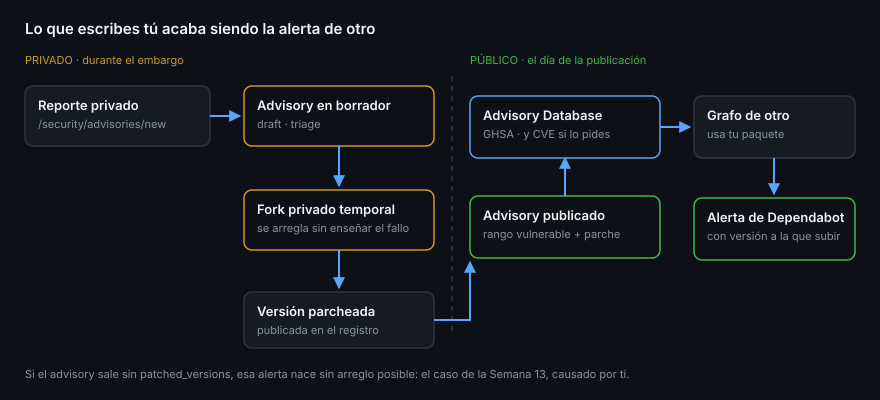

# Los advisories del repositorio

> La Semana 13 te enseñó a consumir la base de avisos: alertas de Dependabot que
> nacen de un GHSA que escribió otra persona. Esta semana te toca el otro lado
> del mostrador. Cuando el proyecto con la vulnerabilidad es el tuyo, el advisory
> lo escribes tú, y de ese texto depende que a tus usuarios les llegue la alerta.

## 🎯 Objetivos

- Distinguir los cinco estados de un advisory y quién ve cada uno
- Redactar un advisory con los campos que hacen que la alerta funcione
- Usar el fork privado temporal para arreglar sin publicar el fallo
- Saber cuándo y cómo se solicita un CVE, y quién lo emite
- Cerrar el círculo: de tu advisory a la alerta de Dependabot de tus usuarios

## 1. Qué problema resuelve

Arreglar una vulnerabilidad no avisa a nadie. Tus usuarios tienen instalada la
versión rota, y un commit con el arreglo —por muy claro que sea el mensaje— no
llega a ninguna bandeja de seguridad.

Un **repository security advisory** es la pieza que convierte tu arreglo en una
notificación: se publica, entra en la **GitHub Advisory Database**, y desde ahí
alimenta el grafo de dependencias de todo el que use tu paquete. Al día
siguiente, esa gente tiene una alerta de Dependabot con la versión a la que
subir.



## 2. Los cinco estados

| Estado | Qué significa | Quién lo ve |
|--------|---------------|-------------|
| `draft` | Lo estás escribiendo | Tú y los colaboradores del advisory |
| `triage` | Lo creó alguien de fuera por reporte privado | Tú y quien reportó |
| `published` | Público y en la base de avisos | Todo el mundo |
| `closed` | Descartado sin publicar | Tú y los colaboradores |
| `withdrawn` | Se publicó y se retiró | Todo el mundo, marcado como retirado |

Los dos primeros son privados de verdad: el contenido no aparece en la API
pública, ni en la pestaña Security, ni en las notificaciones del repositorio.

## 3. Crearlo

En la interfaz: **Security → Advisories → New draft security advisory**.

Por API, con los campos que importan:

```bash
gh api repos/{owner}/{repo}/security-advisories --method POST --input - <<'JSON'
{
  "summary": "Inyección de comando en el parámetro de exportación",
  "description": "Las versiones anteriores a la 1.2.3 construyen un comando de shell concatenando el valor de `format` sin validarlo, lo que permite ejecutar comandos arbitrarios en el servidor.",
  "severity": "high",
  "cwe_ids": ["CWE-78"],
  "vulnerabilities": [
    {
      "package": { "ecosystem": "npm", "name": "mi-paquete" },
      "vulnerable_version_range": "< 1.2.3",
      "patched_versions": "1.2.3",
      "vulnerable_functions": ["exportReport"]
    }
  ],
  "start_private_fork": true
}
JSON
```

Los ecosistemas válidos son un conjunto cerrado: `npm`, `pip`, `maven`, `nuget`,
`composer`, `go`, `rust`, `rubygems`, `erlang`, `actions`, `pub`, `swift` y
`other`. Y `severity` y `cvss_vector_string` son **mutuamente excluyentes**: o
pones el nivel a mano, o pones el vector y GitHub calcula el nivel.

## 4. Los campos que deciden si la alerta funciona

Un advisory mal rellenado se publica igual y no avisa a nadie. Tres campos son
los que hacen el trabajo:

| Campo | Qué pasa si está mal |
|-------|----------------------|
| `package.ecosystem` + `package.name` | Si el nombre no coincide **exacto** con el del registro, ningún grafo de dependencias lo cruza con nada |
| `vulnerable_version_range` | Demasiado ancho, alertas a gente que no lo está; demasiado estrecho, silencio para quien sí |
| `patched_versions` | Sin esto, la alerta de tus usuarios nace con `first_patched_version: null` — la que no se puede arreglar |

El rango se escribe con la sintaxis de comparadores: `< 1.2.3`,
`>= 1.0.0, < 1.2.3`, `= 0.9.1`. Si hay dos ramas mantenidas y ambas están
afectadas, van **dos entradas** en `vulnerabilities`, una por rama.

> [!TIP]
> Rellena `vulnerable_functions` cuando lo sepas. Es lo que permite a las
> herramientas de análisis de alcance decidir si el consumidor llama de verdad a
> la función vulnerable o solo tiene el paquete instalado.

## 5. El fork privado temporal

Un advisory en borrador puede crear un **fork privado temporal** del repositorio.
Es el sitio donde se arregla el fallo durante el embargo:

- Es privado, aunque tu repositorio sea público
- Puedes invitar a colaboradores del advisory, incluido quien lo reportó
- Sus pull requests y sus commits no se ven desde fuera
- Al publicar el advisory, el arreglo se fusiona en el repositorio real

Sin él, la única forma de arreglar es en abierto: un commit público cuyo diff
enseña exactamente dónde está el fallo y cómo explotarlo, días antes de que
tus usuarios puedan actualizar. Eso se llama arreglar en abierto y es el error
más caro de esta parte de la semana.

## 6. El CVE

**CVE** es el identificador global de una vulnerabilidad; **GHSA** es el de
GitHub. Los dos pueden coexistir para el mismo fallo, y de hecho es lo normal.

GitHub es una **CNA** (*CVE Numbering Authority*), así que puede emitir CVE para
vulnerabilidades en repositorios alojados en GitHub:

```bash
gh api repos/{owner}/{repo}/security-advisories/GHSA-xxxx-xxxx-xxxx/cve --method POST
```

Se solicita desde el borrador y GitHub lo revisa. Cuándo vale la pena:

- ✅ El proyecto lo consume gente fuera de tu equipo
- ✅ Alguien va a necesitar citarlo en un informe de cumplimiento
- ❌ Es una aplicación interna que solo despliegas tú — el GHSA ya avisa a
  Dependabot, y el CVE no añade nada

El CVE llega después, y no bloquea la publicación: puedes publicar el advisory y
recibir el identificador más tarde.

## 7. Publicar

Publicar es un cambio de estado, y es **irreversible en un sentido**: se puede
retirar (`withdrawn`), pero no volver a privado.

```bash
gh api repos/{owner}/{repo}/security-advisories/GHSA-xxxx-xxxx-xxxx \
  --method PATCH -f state=published
```

El orden del día de publicación, que es donde se equivoca todo el mundo:

1. El arreglo está fusionado en la rama por defecto
2. **La versión parcheada está publicada** en el registro y se puede instalar
3. Se publica el advisory
4. Se anuncia (release notes, discussion, redes)

Publicar el advisory antes de que exista la versión con el arreglo deja a tus
usuarios con una alerta que no pueden resolver: es exactamente el
`first_patched_version: null` de la Semana 13, pero causado por ti.

## 8. Antipatrones

| Antipatrón | Por qué duele | Qué hacer |
|------------|---------------|-----------|
| Nombre de paquete aproximado | No cruza con el grafo: cero alertas | Copiarlo del registro, exacto |
| Rango de versiones inventado | Alerta a quien no toca o calla a quien sí | Comprobar desde qué versión existe el fallo |
| Publicar antes que el parche | Alerta sin arreglo posible | Publicar el paquete primero |
| Arreglar en abierto durante el embargo | El commit es el mapa del ataque | Fork privado temporal |
| Descripción sin impacto | Nadie sabe si le urge | Qué puede hacer un atacante, y con qué acceso |
| Pedir CVE por costumbre | Trabajo de revisión para nada | Solo si alguien de fuera lo va a citar |
| Olvidar los créditos | El trabajo lo hizo quien reportó | `credits` con su `login` y su `type` |

## 9. Trucos

- **`gh api repos/{owner}/{repo}/security-advisories?state=draft`** lista los
  borradores olvidados: es sorprendentemente común dejar uno a medias
- **`start_private_fork: true` en la creación** ahorra el paso manual de crearlo
  después desde la interfaz
- **`credits` acepta `type: "finder"` y `type: "reporter"`** — son distintos, y a
  quien reporta le importa la diferencia
- **El GHSA se puede citar antes de publicar**: el identificador existe desde el
  borrador, así que sirve para nombrar la rama del arreglo sin decir qué arregla
- **Un advisory retirado sigue siendo visible**: retirar es admitir públicamente
  el error, no borrarlo. Por eso conviene publicar con los rangos comprobados

## 📚 Recursos Adicionales

- [About repository security advisories](https://docs.github.com/en/code-security/security-advisories/working-with-repository-security-advisories/about-repository-security-advisories)
- [Creating a repository security advisory](https://docs.github.com/en/code-security/security-advisories/working-with-repository-security-advisories/creating-a-repository-security-advisory)
- [Collaborating in a temporary private fork](https://docs.github.com/en/code-security/security-advisories/working-with-repository-security-advisories/collaborating-in-a-temporary-private-fork-to-resolve-a-repository-security-vulnerability)
- [About CVE identifiers](https://docs.github.com/en/code-security/security-advisories/working-with-global-security-advisories-from-the-github-advisory-database/about-global-security-advisories)
- [REST — Repository security advisories](https://docs.github.com/en/rest/security-advisories/repository-advisories)

## ✅ Checklist de Verificación

- [ ] Distingues `draft`, `triage`, `published`, `closed` y `withdrawn`
- [ ] Sabes qué tres campos deciden si la alerta llega a tus usuarios
- [ ] Puedes escribir un `vulnerable_version_range` correcto
- [ ] Sabes para qué sirve el fork privado temporal y cuándo crearlo
- [ ] Puedes decidir si un fallo tuyo merece CVE o le basta el GHSA
- [ ] Conoces el orden del día de publicación y por qué el parche va primero
