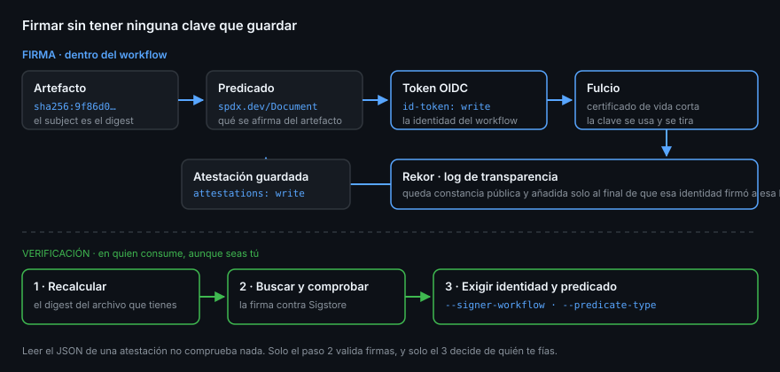

# Attestations más allá de la procedencia

> La Semana 12 firmó una afirmación concreta: «este artefacto salió de este
> commit por este workflow». Eso es una atestación de procedencia, y es solo un
> tipo. La maquinaria de debajo sirve para firmar cualquier afirmación
> verificable sobre un artefacto — incluida «este es su inventario de
> dependencias».

## 🎯 Objetivos

- Describir las tres partes de una atestación y qué aporta cada una
- Explicar qué firma exactamente Sigstore cuando no hay claves que guardar
- Emitir una atestación de SBOM y una de predicado propio
- Verificar por tipo de predicado y entender qué se comprueba
- Saber dónde vive la atestación y cómo se recupera

## 1. Qué problema resuelve

Un artefacto no lleva contexto. Un `.tgz` en un release es una bolsa de bytes:
no dice de dónde salió, quién lo construyó ni qué hay dentro. Todo eso vive en
la página de la que te lo bajaste, y una página se puede editar.

Una **atestación** es esa afirmación separada del artefacto y firmada, de modo
que se puede comprobar sin confiar en quien te la dio.

## 2. Las tres partes

Una atestación es una declaración **in-toto** con esta forma:

| Parte | Qué es | Ejemplo |
|-------|--------|---------|
| **Subject** | Qué artefacto, identificado por su digest | `sha256:9f86d0…` |
| **Predicate type** | Qué clase de afirmación es | `https://slsa.dev/provenance/v1` |
| **Predicate** | La afirmación | El workflow, el commit, el runner |

El **subject es el digest, nunca el nombre**. Una etiqueta como `:latest` apunta
a cosas distintas según el día; el digest identifica exactamente unos bytes. Es
la misma lección de la Semana 12 con las imágenes de GHCR.

Los tipos de predicado que vas a usar:

| Predicate type | Qué afirma | Quién lo genera |
|----------------|------------|-----------------|
| `https://slsa.dev/provenance/v1` | De dónde salió | `actions/attest-build-provenance` |
| `https://spdx.dev/Document/v2.3` | Qué hay dentro (SPDX) | `actions/attest` con `sbom-path` |
| `https://cyclonedx.org/bom` | Qué hay dentro (CycloneDX) | `actions/attest` con `sbom-path` |
| El que tú definas | Lo que tú afirmes | `actions/attest` con `predicate-type` |



## 3. Sigstore: firmar sin guardar claves

La pregunta obvia es dónde está la clave privada. La respuesta es que **no hay**,
y ese es el punto entero de Sigstore:

1. El workflow pide su token OIDC a GitHub — la identidad de la Semana 11
2. Con ese token, **Fulcio** emite un certificado de vida muy corta que dice
   *«esta identidad de workflow firmó, a esta hora»*
3. Se firma con la clave efímera asociada y **la clave se tira**
4. La firma se registra en **Rekor**, un log de transparencia público y
   append-only

Lo que se verifica después no es «esta clave es de fulano», sino **«este workflow
de este repositorio firmó esto y quedó registrado a esta hora»**. No hay clave
que rotar, que guardar en un secreto ni que perder.

> [!NOTE]
> En repositorios **públicos** se usa la instancia pública de Sigstore, cuyo log
> de transparencia es consultable por cualquiera. En repositorios privados y de
> empresa, GitHub usa su propia instancia. Es la razón por la que
> `gh attestation verify` tiene la bandera `--no-public-good`.

## 4. Emitir una atestación de SBOM

```yaml
permissions:
  contents: read
  id-token: write        # pedir el token OIDC
  attestations: write    # guardar la atestación en el repositorio

steps:
  - name: Atestar el SBOM del artefacto
    uses: actions/attest@1e69f48acb82d1966a394da916b4c1698aa569d6 # v4.2.2
    with:
      subject-path: ./dist/mi-paquete-1.2.3.tgz
      sbom-path: sbom.spdx.json
```

`actions/attest` detecta si el archivo es SPDX o CycloneDX y elige el tipo de
predicado correcto — de un SPDX 2.3 sale `https://spdx.dev/Document/v2.3`. El
límite del SBOM son 16 MB.

> [!WARNING]
> `actions/attest-sbom` está **deprecada**: sigue funcionando pero imprime un
> aviso en cada ejecución y no es más que un envoltorio de `actions/attest`. Para
> SBOM usa `actions/attest` directamente. `actions/attest-build-provenance`, la
> de la Semana 12, **no** está deprecada: es el atajo recomendado para
> procedencia.

Para una afirmación propia —«estas pruebas pasaron», «este artefacto lo aprobó
este entorno»— se usan `predicate-type` y `predicate-path` en vez de `sbom-path`.
Son mutuamente excluyentes.

## 5. Verificar

```bash
# Procedencia (es lo que verifica por defecto)
gh attestation verify ./mi-paquete-1.2.3.tgz --repo <tu-usuario>/<tu-repo>

# El SBOM: hay que pedir el tipo de predicado explícitamente
gh attestation verify ./mi-paquete-1.2.3.tgz \
  --repo <tu-usuario>/<tu-repo> \
  --predicate-type https://spdx.dev/Document/v2.3
```

Lo que comprueba el comando, en este orden:

1. Calcula el digest del archivo que le das
2. Busca atestaciones para ese digest en el repositorio o el propietario
3. Comprueba la firma contra la raíz de confianza de Sigstore
4. Comprueba que la identidad del firmante casa con lo que exigiste
5. Comprueba que el tipo de predicado es el que pediste

El paso 4 es el que decide cuánta seguridad te da: `--owner` es un filtro muy
ancho —cualquier repositorio de ese propietario—, mientras que
`--signer-workflow OWNER/REPO/.github/workflows/release.yml` exige que la firma
venga de ese workflow exacto.

## 6. Dónde vive

Las atestaciones se guardan asociadas al repositorio y se piden por digest:

```bash
DIGEST=$(sha256sum ./dist/mi-paquete-1.2.3.tgz | cut -d' ' -f1)

gh api "repos/{owner}/{repo}/attestations/sha256:$DIGEST" \
  --jq '.attestations[].bundle.dsseEnvelope.payloadType'

# Para verificación sin red después
gh attestation download ./dist/mi-paquete-1.2.3.tgz --repo {owner}/{repo}
```

Ese endpoint admite `?predicate_type=` para filtrar cuando un mismo artefacto
tiene varias atestaciones — que es lo normal: una de procedencia y una de SBOM.

## 7. Antipatrones

| Antipatrón | Por qué duele | Qué hacer |
|------------|---------------|-----------|
| Atestar por etiqueta y no por digest | La etiqueta se mueve; la firma deja de significar | `subject-digest` con el digest real |
| Firmar y no verificar nunca | Es teatro criptográfico | Verificar en el consumo, aunque seas tú |
| Verificar solo con `--owner` | Vale cualquier repositorio del propietario | `--signer-workflow` o `--repo` |
| Leer el JSON y llamarlo verificación | No comprueba ninguna firma | Solo `gh attestation verify` verifica |
| `attestations: write` a nivel de workflow | Permiso de escritura donde no hace falta | En el job que atesta |
| Usar `actions/attest-sbom` en material nuevo | Está deprecada | `actions/attest` con `sbom-path` |
| Atestar un artefacto que luego se reconstruye | El digest cambia y no casa nada | Atestar exactamente lo que se publica |

## 8. Trucos

- **`--predicate-type` acepta cualquier URI**: los predicados propios se
  verifican igual que los estándar
- **`--deny-self-hosted-runners`** rechaza atestaciones generadas en runners que
  no administra GitHub: útil al verificar artefactos ajenos
- **`--format json --jq`** deja `verify` listo para un guion, y devuelve código
  distinto de cero cuando falla — sirve como paso de CI
- **`gh attestation trusted-root`** vuelca la raíz de confianza para verificar
  sin conexión, que es como se hace en un entorno cerrado
- **Un artefacto puede tener varias atestaciones**: filtra por `predicate_type`
  en vez de asumir que hay una
- **El digest de una imagen sale del `build-push-action`**, no de la etiqueta —
  la lección de la Semana 12, que aquí se repite igual

## 📚 Recursos Adicionales

- [Using artifact attestations to establish provenance for builds](https://docs.github.com/en/actions/how-tos/secure-your-work/use-artifact-attestations/use-artifact-attestations)
- [Managing the lifecycle of artifact attestations](https://docs.github.com/en/actions/how-tos/secure-your-work/use-artifact-attestations/manage-attestations)
- [REST — Repository attestations](https://docs.github.com/en/rest/repos/attestations)
- [`actions/attest`](https://github.com/actions/attest)
- [in-toto Attestation Framework](https://github.com/in-toto/attestation)
- [Sigstore](https://www.sigstore.dev/)

## ✅ Checklist de Verificación

- [ ] Sabes qué son subject, predicate type y predicate
- [ ] Puedes explicar por qué no hay clave privada que guardar
- [ ] Sabes emitir una atestación de SBOM con `actions/attest`
- [ ] Sabes verificar pidiendo un tipo de predicado concreto
- [ ] Entiendes la diferencia de garantía entre `--owner` y `--signer-workflow`
- [ ] Sabes recuperar las atestaciones de un artefacto por su digest
