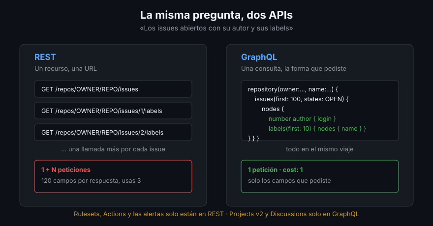

# Dos APIs para el mismo GitHub

> Todo lo que has hecho en catorce semanas —abrir un issue, mover una tarjeta,
> activar un ruleset, publicar un release— pasó por una API. La interfaz web es
> un cliente más. Esta semana dejas de pedirle las cosas a la interfaz y se las
> pides directamente al servidor.

## 🎯 Objetivos

- Explicar por qué GitHub mantiene dos APIs y qué se puede hacer solo en cada una
- Reconocer el *over-fetching* y el *under-fetching* en tu propio flujo
- Elegir REST o GraphQL por el número de llamadas, no por moda
- Saber dónde vive la fuente de verdad de cada esquema
- Entender qué significa que `gh` sea solo un cliente de esas dos APIs

## 1. Qué problema resuelve

Toda la plataforma es una API. La interfaz web, `gh`, Dependabot, las Actions y
el bot que te etiqueta los PRs hablan con los mismos endpoints que vas a usar tú.
Eso tiene tres consecuencias prácticas:

1. **Todo lo que ves se puede automatizar.** Si aparece en la interfaz, hay una
   forma de leerlo por API — y casi siempre de escribirlo
2. **Lo que no se puede verificar por API, no existe** a efectos de auditoría.
   Es la regla de este bootcamp desde la Semana 01
3. **La interfaz cambia; la API tiene contrato.** Los menús se mueven cada
   trimestre; `repos/{owner}/{repo}/rulesets` lleva años en el mismo sitio

GitHub expone dos: **REST** (la API v3) y **GraphQL** (la v4). No es que una sea
la nueva y la otra el legado. Conviven, y cada una cubre cosas que la otra no.



## 2. Cómo funciona cada una

### REST: un recurso, una URL

```bash
gh api repos/cli/cli --jq '.stargazers_count'
```

Pides un recurso identificado por su ruta y recibes **su representación
completa**: unas 120 claves para un repositorio, de las que usas una.

- Verbo HTTP + ruta: `GET repos/{owner}/{repo}`, `POST repos/{owner}/{repo}/issues`
- La forma de la respuesta la decide el servidor
- Los recursos relacionados están en otras rutas: los labels de un issue, sus
  comentarios y su autor son tres llamadas más

### GraphQL: una consulta, la respuesta que pediste

```bash
gh api graphql -f query='
query {
  repository(owner: "cli", name: "cli") {
    stargazerCount
  }
}'
```

Un único endpoint (`POST /graphql`), y la forma de la respuesta la decides tú.
Puedes atravesar relaciones en la misma consulta: el repositorio, sus issues
abiertos, el autor de cada uno y sus labels, en un solo viaje.

## 3. Los dos vicios que esto arregla

| Vicio | Qué es | Dónde duele |
|-------|--------|-------------|
| **Over-fetching** | Traes 120 campos para leer 1 | Ancho de banda, y sobre todo ruido: el `--jq` tapa el problema pero el servidor ya hizo el trabajo |
| **Under-fetching** | Necesitas 4 llamadas para contestar 1 pregunta | Latencia y límite de peticiones: es el que de verdad te frena |

El under-fetching es el que decide. «Los 30 issues abiertos con su autor y sus
labels» son **1 + 30 llamadas** en REST si los labels no vienen incrustados, y
**1 consulta** en GraphQL. Con 300 issues la diferencia deja de ser estética.

> [!NOTE]
> REST incrusta bastante: un issue ya trae `user` y `labels` dentro. El
> under-fetching aparece cuando la relación no está incrustada — los reviews de
> un PR, los campos de un Project v2, los checks de un commit.

## 4. Lo que solo está en una

Esta es la razón de verdad para saber las dos:

| Solo en REST | Solo en GraphQL |
|--------------|-----------------|
| Rulesets (`repos/{owner}/{repo}/rulesets`) | **Projects v2** entero |
| Actions: workflows, runs, logs, artifacts | Discussions (crear, responder, marcar respuesta) |
| Dependabot alerts y secret scanning alerts | Sub-issues y jerarquías de issues |
| Code scanning: subir y leer SARIF | `mergeQueue` de una rama |
| Releases y assets, packages, SBOM | Estado agregado de checks de un commit (`statusCheckRollup`) |
| Attestations | Campos calculados (`viewerCanAdminister`, `viewerSubscription`) |

Dos consecuencias:

- **Un guion de auditoría realista usa las dos.** El de la Práctica 03 lee
  rulesets por REST y el estado del proyecto por GraphQL, porque no hay otra
- **No busques paridad.** Ninguna de las dos va a alcanzar a la otra. La pregunta
  correcta no es «¿cuál uso?», es «¿dónde vive este dato?»

## 5. Cómo elegir

```
¿El dato solo está en una?          → esa. Fin de la decisión.
¿Una sola cosa, una sola vez?       → REST: se escribe en cinco segundos.
¿Muchas cosas relacionadas?         → GraphQL: una consulta en vez de N+1.
¿Vas a escribir (crear, cerrar)?    → REST, salvo Projects v2 y Discussions.
¿Necesitas paginar mucho?           → GraphQL si puedes: menos coste por dato.
```

Traducido a la vida real: **para leer un dato suelto, `gh api`; para construir un
informe, GraphQL; para escribir, casi siempre REST.**

## 6. Los límites, en dos líneas

Cada API cuenta de una forma distinta, y esto es lo primero que sorprende:

| | REST | GraphQL |
|--|-----|---------|
| Unidad | 1 petición = 1 punto | Puntos por nodos pedidos |
| Cupo por hora (usuario) | 5 000 | 5 000 puntos |
| Consulta típica | 1 | 1 (sí, `cost: 1` para 100 issues) |

Una consulta GraphQL que trae 100 issues con 10 comentarios cada uno cuesta
**1 punto**; las 101 llamadas REST equivalentes cuestan **101**. El
[archivo 04](04-limites-y-cortesia.md) lo desarrolla, pero el titular es ese: la
API que parece más complicada es la que te deja llegar más lejos.

## 7. `gh` es un cliente, no una tercera API

`gh issue list` es una consulta GraphQL con una tabla bonita encima. `gh api` es
la misma tubería sin la tabla. Eso significa que:

- Todo lo que hace `gh` se puede hacer con `gh api` — al revés no
- Cuando `gh` no tiene comando para algo (rulesets, atestaciones, la mitad de los
  ajustes), `gh api` sí lo tiene, porque la API lo tiene
- `GH_DEBUG=api gh issue list` te enseña la petición exacta que manda. Es la
  forma más rápida de aprender un endpoint: hacer que `gh` lo llame por ti

```bash
GH_DEBUG=api gh issue list --limit 1 2>&1 | grep -A5 "POST /graphql"
```

## 8. Antipatrones

| Antipatrón | Por qué duele | Qué hacer |
|------------|---------------|-----------|
| «GraphQL es la nueva, uso solo esa» | Rulesets, Actions y las alertas de seguridad no están ahí | Elegir por dónde vive el dato |
| Bucle de REST para rellenar relaciones | N+1 llamadas y el límite a la vuelta de la esquina | Una consulta GraphQL |
| Traer todo y filtrar con `jq` en local | El servidor ya hizo el trabajo caro | Filtros en la consulta (`--jq` para dar forma, no para paginar a mano) |
| `curl` con el token en la línea de comandos | Queda en el historial del shell | `gh api`, que usa el token del `keyring` |
| Deducir el endpoint por analogía | Los plurales y los verbos no son regulares | Buscarlo en `docs.github.com/rest` |
| Parsear la salida de `gh issue list` | Formato pensado para humanos, cambia | `--json` o `gh api` |

## 9. Trucos

- **`gh api` acepta `{owner}`, `{repo}` y `{branch}` literales**: dentro de un
  repositorio clonado los resuelve solo. Los guiones se vuelven portables
- **`gh api graphql` sin `-f query`** no hace nada útil, pero
  `gh api graphql -f query='{ viewer { login } }'` es la forma más corta de
  saber con qué identidad estás hablando
- **`gh api meta --jq '.actions | length'`** te dice cuántos rangos de IP usan
  los runners. Sirve para comprobar que la API contesta sin tocar tu repositorio
- **El explorador de GraphQL** (`docs.github.com/graphql/overview/explorer`)
  autocompleta el esquema entero. Media hora ahí ahorra un día de prueba y error
- **Si dudas de un nombre de campo, introspecciona**: el esquema se consulta a sí
  mismo, y es la única fuente que no envejece

## 📚 Recursos Adicionales

- [REST API — Getting started](https://docs.github.com/en/rest/using-the-rest-api/getting-started-with-the-rest-api)
- [GraphQL API — Introduction](https://docs.github.com/en/graphql/guides/introduction-to-graphql)
- [Migrating from REST to GraphQL](https://docs.github.com/en/graphql/guides/migrating-from-rest-to-graphql)
- [Comparación oficial REST / GraphQL](https://docs.github.com/en/rest/about-the-rest-api/comparing-githubs-rest-api-and-graphql-api)
- [`gh api` — manual](https://cli.github.com/manual/gh_api)

## ✅ Checklist de Verificación

- [ ] Sabes nombrar tres cosas que solo están en REST y tres solo en GraphQL
- [ ] Distingues over-fetching de under-fetching con un ejemplo tuyo
- [ ] Puedes decidir la API de una tarea sin pensarlo dos veces
- [ ] Sabes que 100 issues por GraphQL cuestan un punto y por REST cien
- [ ] Has visto con `GH_DEBUG=api` qué manda `gh` por debajo
