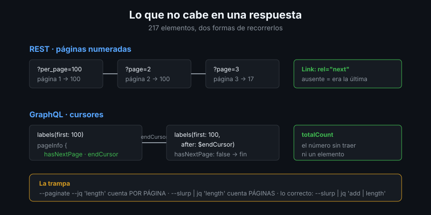

# Paginación: lo que no cabe en una respuesta

> La primera consulta de todo el mundo devuelve 30 resultados y parece correcta.
> El repositorio tenía 217. Los informes silenciosamente incompletos son el
> error más caro de esta semana, porque no fallan: mienten.

## 🎯 Objetivos

- Explicar por qué la API nunca te devuelve todo de una vez
- Paginar en REST con `--paginate` y saber qué hace con `--jq`
- Usar `--slurp` y conocer su incompatibilidad exacta
- Paginar en GraphQL con cursores y `$endCursor`
- Contar bien: saber cuándo el número que ves es el total y cuándo no

## 1. Qué problema resuelve

Ningún endpoint de colección devuelve la colección entera: sería lento, caro y
frágil. La API parte el resultado en **páginas** y te da la forma de pedir la
siguiente. Cada API lo hace distinto:

| | REST | GraphQL |
|--|-----|---------|
| Mecanismo | Número de página (`?page=2`) | Cursor (`after: "Y3Vyc29y..."`) |
| Tamaño | `?per_page=` (máximo 100, por defecto 30) | `first:` / `last:` (máximo 100) |
| «¿Hay más?» | Cabecera `Link: <...>; rel="next"` | `pageInfo { hasNextPage endCursor }` |
| Total | A veces en `total_count`, casi nunca | `totalCount`, casi siempre |



## 2. REST: `--paginate`

```bash
# 30 primeros: el valor por defecto que engaña
gh api repos/cli/cli/labels --jq 'length'

# 100 por página, todas las páginas
gh api 'repos/cli/cli/labels?per_page=100' --paginate --jq 'length'
```

Y aquí está la trampa. La segunda línea **no imprime el total**: imprime la
longitud de cada página, una por línea. `gh` no fusiona las páginas antes de
aplicar el `--jq`, se lo aplica a cada una:

```
100
82
```

Tres formas de contar bien:

```bash
# 1. Aplanar y contar líneas
gh api 'repos/cli/cli/labels?per_page=100' --paginate --jq '.[].name' | wc -l

# 2. --slurp para juntar las páginas, y jq fuera
gh api 'repos/cli/cli/labels?per_page=100' --paginate --slurp | jq 'add | length'

# 3. Cuando el endpoint da total_count (búsqueda), preguntarle a él
gh api 'search/issues?q=repo:cli/cli+is:pr+is:merged&per_page=1' --jq '.total_count'
```

> [!IMPORTANT]
> `--slurp` **no se puede combinar con `--jq` ni con `--template`**. El comando
> falla con `the --slurp option is not supported with --jq or --template`. La
> solución es la de arriba: `--slurp` y luego una tubería a `jq`.

Y ojo con `--slurp | jq 'length'`: eso cuenta **páginas**, no elementos. El
`add` de la opción 2 es el que concatena los arrays antes de contar.

## 3. `per_page` no es cosmético

Con 217 elementos:

| `per_page` | Peticiones | Cupo gastado |
|:----------:|:----------:|:------------:|
| 30 (por defecto) | 8 | 8 |
| 100 | 3 | 3 |

Es la optimización más barata que existe en esta semana: escribir `?per_page=100`
divide por tres el consumo de cualquier guion que recorra colecciones.

## 4. GraphQL: cursores

Un cursor es un puntero opaco a «justo después de este elemento». No es un
número de página y no se puede fabricar: lo devuelve el servidor.

```graphql
query($owner: String!, $repo: String!, $endCursor: String) {
  repository(owner: $owner, name: $repo) {
    labels(first: 100, after: $endCursor) {
      totalCount
      nodes { name }
      pageInfo { hasNextPage endCursor }
    }
  }
}
```

```bash
gh api graphql -F owner=cli -F repo=cli -F query=@labels.graphql \
  --paginate --jq '.data.repository.labels.nodes[].name' | wc -l
```

Para que `gh api graphql --paginate` funcione, la consulta **tiene que** cumplir
dos condiciones — las dos, o no pagina:

1. Declarar la variable `$endCursor: String` y pasarla como `after:`
2. Pedir `pageInfo { hasNextPage endCursor }` en la colección que paginas

`gh` ejecuta la consulta, lee `endCursor`, la vuelve a ejecutar con ese valor y
repite hasta que `hasNextPage` es `false`.

> [!NOTE]
> Solo se pagina **una colección por consulta**. Si pides issues y PRs a la vez y
> las dos tienen más de 100, `gh` sigue el cursor de la primera que encuentra.
> Para dos colecciones grandes, dos consultas.

## 5. `totalCount`: la ventaja silenciosa

En GraphQL casi todas las conexiones exponen `totalCount`, y contar **no cuesta
traer**:

```bash
gh api graphql -F owner=cli -F repo=cli -f query='
query($owner: String!, $repo: String!) {
  repository(owner: $owner, name: $repo) {
    abiertos: issues(states: OPEN) { totalCount }
    cerrados: issues(states: CLOSED) { totalCount }
    prs: pullRequests(states: OPEN) { totalCount }
  }
}' --jq '.data.repository | map_values(.totalCount)'
```

Tres números, una petición, sin paginar nada. El equivalente REST es paginar tres
colecciones enteras o recurrir a la API de búsqueda.

## 6. Cuándo *no* paginar

Paginar entero cuesta tiempo y cupo. Antes de recorrer 2 000 elementos:

- **¿Te vale el total?** `totalCount` en GraphQL, `total_count` en búsqueda
- **¿Te valen los últimos?** `?sort=created&direction=desc&per_page=10`
- **¿Puedes filtrar en el servidor?** `?state=open&labels=bug` trae 12 en vez de
  2 000. Filtrar en `jq` después es traer 2 000 para tirar 1 988
- **¿Lo necesitas hoy?** Un informe semanal puede mirar solo lo de la semana:
  `?since=2026-08-15T00:00:00Z`

## 7. Antipatrones

| Antipatrón | Por qué duele | Qué hacer |
|------------|---------------|-----------|
| Olvidar `--paginate` | Informe incompleto que parece correcto | Paginar siempre en colecciones |
| `--paginate --jq 'length'` | Cuenta por página, no en total | `--slurp` + `jq 'add \| length'` |
| `--slurp \| jq 'length'` | Cuenta páginas | `add \| length` |
| Dejar `per_page` por defecto | Tres veces más peticiones | `?per_page=100` |
| Guardar cursores para después | Son opacos y caducan | Repaginar |
| Paginar para contar | Miles de peticiones para un número | `totalCount` |
| Filtrar en `jq` lo que filtra el servidor | Trae todo para tirarlo | Parámetros de consulta |

## 8. Trucos

- **`--paginate` con `--jq '.[]'`** aplana páginas a elementos: encadena con
  `jq -s` o con `wc -l` sin sorpresas
- **`gh api ... -i --silent | grep -i '^link'`** enseña la cabecera de paginación
  con `rel="next"` y `rel="last"`: sirve para saber cuántas páginas hay antes de
  pedirlas
- **`per_page=1` con búsqueda** es la forma más barata de obtener un total: una
  petición, un elemento, `total_count` completo
- **En GraphQL, `first: 100` es el máximo**. Pedir 101 es un error de validación,
  no un recorte silencioso
- **`--paginate` respeta el límite secundario**: si tu guion se para a mitad, no
  es un fallo del comando, es la API pidiendo calma (archivo 04)

## 📚 Recursos Adicionales

- [Using pagination in the REST API](https://docs.github.com/en/rest/using-the-rest-api/using-pagination-in-the-rest-api)
- [Paginating with the GraphQL API](https://docs.github.com/en/graphql/guides/using-pagination-in-the-graphql-api)
- [`gh api --paginate`](https://cli.github.com/manual/gh_api)
- [GraphQL Cursor Connections Specification](https://relay.dev/graphql/connections.htm)

## ✅ Checklist de Verificación

- [ ] Sabes por qué `--paginate --jq 'length'` no da el total
- [ ] Conoces la incompatibilidad de `--slurp` con `--jq`
- [ ] Sabes contar elementos de tres formas distintas y cuál usar
- [ ] Puedes escribir una consulta GraphQL que `--paginate` sepa recorrer
- [ ] Usas `?per_page=100` por reflejo
- [ ] Sabes cuándo no hace falta paginar
