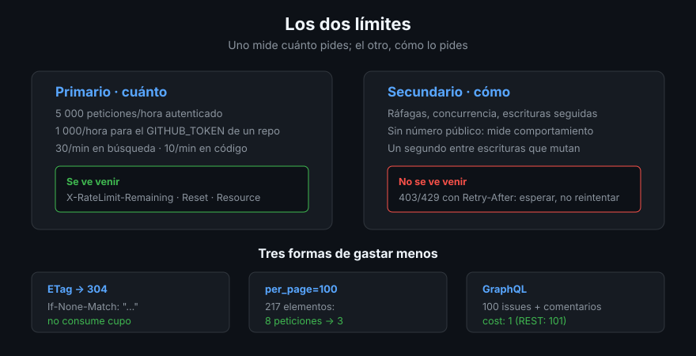

# Límites: cómo no ser el problema

> Un bucle mal escrito no rompe GitHub: rompe **tu** acceso a GitHub durante una
> hora, y si va en CI, el de todo el que comparta el token. Los límites no son un
> castigo, son el contrato. Leerlos convierte un guion frágil en uno que se puede
> dejar corriendo en un cron.

## 🎯 Objetivos

- Distinguir el límite primario del secundario y saber qué dispara cada uno
- Leer el cupo restante en las cabeceras y en `rate_limit`
- Entender qué cuenta como «coste» en GraphQL y por qué casi siempre es 1
- Usar peticiones condicionales con ETag para no gastar cupo
- Reaccionar a un `403`/`429` como lo haría un cliente educado

## 1. Qué problema resuelve

GitHub atiende a millones de clientes con la misma infraestructura. Los límites
reparten esa capacidad y, de paso, te protegen del bucle infinito que escribiste
a las once de la noche.

Hay **dos límites distintos** y confundirlos lleva a arreglos que no arreglan:

| | **Primario** | **Secundario** |
|--|-------------|----------------|
| Qué mide | Cuántas peticiones por hora | Cómo te comportas |
| Cupo | 5 000/hora autenticado, 60/hora sin autenticar | Sin número público fijo |
| Se ve venir | Sí, en las cabeceras | No |
| Cómo avisa | `403` con `X-RateLimit-Remaining: 0` | `403`/`429` con `Retry-After` |
| Se arregla | Esperando al `reset` | Bajando el ritmo y la concurrencia |



## 2. El límite primario, por API

```bash
gh api rate_limit --jq '.resources | {
  core: .core, graphql: .graphql, search: .search, code_search: .code_search
} | map_values({limit, remaining, reset})'
```

Los cupos no son uno solo, son varios cubos independientes:

| Recurso | Cupo/hora | Comentario |
|---------|:---------:|------------|
| `core` | 5 000 | REST general |
| `graphql` | 5 000 puntos | El coste no es 1 por consulta |
| `search` | 30/minuto | La API de búsqueda va aparte, y es la más estrecha |
| `code_search` | 10/minuto | Búsqueda de código, más estrecha todavía |

Y el detalle que importa en CI: **`GITHUB_TOKEN` de Actions tiene su propio cupo
de 1 000 peticiones por hora y por repositorio**, no los 5 000 de un usuario. Un
guion de auditoría que funciona en tu portátil puede toparse con el techo en el
runner.

> [!NOTE]
> Consultar `rate_limit` **no gasta cupo**. Es el único endpoint gratis, y por eso
> es la primera línea de cualquier guion serio.

## 3. Leerlo sin pedirlo aparte

Cada respuesta trae el estado del cubo en sus cabeceras:

```bash
gh api repos/{owner}/{repo} -i --silent | grep -i '^x-ratelimit'
```

```
X-Ratelimit-Limit: 5000
X-Ratelimit-Remaining: 4966
X-Ratelimit-Reset: 1755921201
X-Ratelimit-Used: 34
X-Ratelimit-Resource: core
```

`X-RateLimit-Reset` es un *epoch* en segundos: `date -d @1755921201` lo traduce.

## 4. El coste en GraphQL

El cupo de GraphQL no se mide en consultas sino en **puntos**, y la fórmula
sorprende: se calcula sobre el **número de nodos que podría devolver** la
consulta, dividido por 100 y redondeado. En la práctica:

```bash
gh api graphql -f query='
query {
  rateLimit { cost remaining resetAt }
  repository(owner: "cli", name: "cli") {
    issues(first: 100) { nodes { number comments(first: 10) { nodes { id } } } }
  }
}' --jq '.data.rateLimit'
```

100 issues con 10 comentarios cada uno: **`cost: 1`**. Las 101 peticiones REST
equivalentes habrían costado 101 de tu cupo.

La conclusión práctica: **si un guion se acerca a los límites, la solución
normalmente no es esperar, es pasar esa parte a GraphQL**.

> [!TIP]
> Pon `rateLimit { cost remaining }` en tus consultas mientras desarrollas. Ver el
> coste real de lo que escribes cambia cómo lo escribes.

## 5. Peticiones condicionales: gastar cero

Una petición que devuelve `304 Not Modified` **no consume cupo primario**. El
mecanismo es el ETag:

```bash
# 1. Guardar el ETag de la respuesta
ETAG=$(gh api repos/{owner}/{repo} -i --silent | grep -i '^etag:' | cut -d' ' -f2 | tr -d '\r')

# 2. Volver a preguntar diciendo lo que ya tienes
gh api repos/{owner}/{repo} -H "If-None-Match: $ETAG" -i --silent | head -1
```

Si nada cambió, la respuesta es `304`, sin cuerpo y sin coste. Es la técnica de
los bots que sondean cada minuto — y la razón por la que pueden hacerlo.

`gh api --cache 10m` es el primo perezoso: no pregunta siquiera, sirve de disco.
Vale para desarrollar; el ETag vale para producción, porque siempre trae el dato
fresco cuando cambió.

## 6. El límite secundario

No mide volumen, mide comportamiento. Se dispara con:

- **Concurrencia**: más de ~100 peticiones simultáneas
- **Ráfagas**: muchas peticiones por segundo, aunque quepan en el cupo horario
- **Escrituras seguidas**: crear contenido sin pausa (issues, comentarios) — la
  guía oficial pide **al menos un segundo** entre escrituras que mutan
- **Consultas caras repetidas** contra el mismo recurso

La respuesta trae `Retry-After` en segundos. La única reacción correcta es
esperar ese tiempo; reintentar antes empeora el bloqueo.

## 7. Cómo se porta un cliente educado

1. **Autenticarse siempre.** 60 peticiones por hora sin token es una demo, no un
   guion
2. **`per_page=100`** y filtros en el servidor: menos peticiones para lo mismo
3. **Una petición cada vez.** La concurrencia rara vez compensa aquí
4. **Un segundo entre escrituras.** Barato de implementar, caro de olvidar
5. **Respetar `Retry-After`** y hacer *backoff* exponencial en los `5xx`
6. **Comprobar `rate_limit` al empezar** y abortar con un mensaje claro si el
   cupo no da para el trabajo previsto
7. **Cachear con ETag** lo que se consulta de forma repetida

Octokit trae los puntos 5 y 6 hechos con los plugins `retry` y `throttling`
([archivo 06](06-octokit.md)); en bash se implementan a mano en tres líneas.

## 8. Antipatrones

| Antipatrón | Por qué duele | Qué hacer |
|------------|---------------|-----------|
| Reintentar inmediatamente tras un `403` | Refuerza el bloqueo secundario | Respetar `Retry-After` |
| Paralelizar «para ir más rápido» | Dispara el secundario en segundos | Secuencial, con `per_page=100` |
| Sondear cada minuto sin ETag | Gasta 60 peticiones/hora para nada | `If-None-Match`, o webhooks (Semana 16) |
| Guiones sin autenticar | 60/hora y sin acceso a lo privado | `gh` ya autentica; en CI, `GH_TOKEN` |
| Asumir 5 000 en Actions | El `GITHUB_TOKEN` tiene 1 000/hora por repositorio | Medir, y bajar el trabajo del cron |
| Ignorar el cubo de `search` | 30/minuto se agota en un bucle corto | Sustituir búsqueda por listados filtrados |
| Bucle REST donde cabía una consulta | Cien puntos frente a uno | GraphQL |

## 9. Trucos

- **`gh api rate_limit` no gasta cupo**: úsalo como primera y última línea de un
  guion para saber cuánto costó de verdad
- **`date -d @$(gh api rate_limit --jq '.resources.core.reset')`** dice a qué hora
  vuelves a tener cupo, sin calcular epochs a mano
- **`X-RateLimit-Resource`** en la respuesta te dice **qué cubo** estás gastando:
  distingue `core` de `search` cuando no sabes qué te está limitando
- **`rateLimit { cost }`** en cada consulta GraphQL durante el desarrollo enseña
  más de optimización que cualquier artículo
- **Un `304` es una victoria**, no un error: significa que preguntaste sin gastar
- **En Actions, mide el cupo del job**: `gh api rate_limit --jq .rate.remaining`
  al principio y al final de la ejecución

## 📚 Recursos Adicionales

- [Rate limits for the REST API](https://docs.github.com/en/rest/using-the-rest-api/rate-limits-for-the-rest-api)
- [Best practices for using the REST API](https://docs.github.com/en/rest/using-the-rest-api/best-practices-for-using-the-rest-api)
- [Resource limitations (GraphQL)](https://docs.github.com/en/graphql/overview/resource-limitations)
- [Using conditional requests](https://docs.github.com/en/rest/using-the-rest-api/best-practices-for-using-the-rest-api#use-conditional-requests-if-appropriate)
- [`GITHUB_TOKEN` — permisos y límites](https://docs.github.com/en/actions/security-for-github-actions/security-guides/automatic-token-authentication)

## ✅ Checklist de Verificación

- [ ] Distingues el límite primario del secundario por cómo avisan
- [ ] Sabes leer el cupo restante en las cabeceras y en `rate_limit`
- [ ] Puedes explicar por qué 100 issues por GraphQL cuestan 1 punto
- [ ] Has hecho una petición condicional y visto un `304`
- [ ] Sabes que el `GITHUB_TOKEN` de Actions tiene 1 000/hora por repositorio
- [ ] Tu guion espera lo que dice `Retry-After` en vez de reintentar
