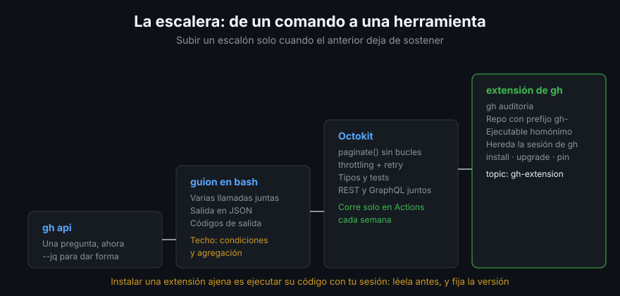

# Extensiones de `gh`

> Un guion útil acaba copiado en tres máquinas y desincronizado en las tres. Una
> extensión de `gh` es el mismo guion con distribución, versionado y un nombre
> que se escribe como si fuera parte de la herramienta: `gh auditoria`.

## 🎯 Objetivos

- Explicar qué es exactamente una extensión y qué contrato cumple
- Crearla, instalarla, actualizarla y borrarla
- Elegir entre extensión en bash y extensión precompilada
- Publicarla para que otros la encuentren e instalen
- Saber qué riesgo asumes al instalar la de otra persona

## 1. Qué problema resuelve

`gh` cubre lo común. Lo tuyo —la auditoría de tus repositorios, el informe que
pide tu equipo, el flujo de release de tu organización— no lo va a cubrir nunca.
Las extensiones son el punto de extensión oficial:

- Se instalan con un comando y se actualizan con otro
- Heredan la **autenticación** de `gh`: cero gestión de tokens
- Se llaman como cualquier subcomando: `gh auditoria --repo OWNER/REPO`
- Se versionan con releases, como cualquier otro software



## 2. El contrato, en tres reglas

Una extensión es **un repositorio** que cumple:

1. El nombre del repositorio empieza por **`gh-`** → `gh-auditoria`
2. Contiene un **ejecutable con el mismo nombre** que el repositorio en la raíz →
   `gh-auditoria`, con permiso de ejecución
3. Ese ejecutable recibe **todos los argumentos** que siguen a `gh auditoria`

No hay manifiesto, ni registro, ni proceso de aprobación. Eso es todo el
contrato. La extensión más simple que funciona son cuatro líneas:

```bash
#!/usr/bin/env bash
set -euo pipefail

gh api repos/{owner}/{repo} --jq '{repo: .full_name, estrellas: .stargazers_count}'
```

> [!NOTE]
> Una extensión **no puede sustituir a un comando propio de `gh`**. Si el nombre
> colisiona, gana el comando nativo y la extensión solo se puede lanzar con
> `gh extension exec <nombre>`.

## 3. El ciclo completo

```bash
# Crear el esqueleto (crea el directorio y el ejecutable)
gh extension create auditoria

# Probarla sin publicar nada: se instala desde el directorio actual
cd gh-auditoria
gh extension install .
gh auditoria

# Publicar
gh repo create gh-auditoria --public --source=. --push
gh repo edit --add-topic gh-extension

# Instalarla en otra máquina
gh extension install <tu-usuario>/gh-auditoria

# Mantenimiento
gh extension list
gh extension upgrade auditoria      # o --all
gh extension remove auditoria
```

`gh extension create` sin argumentos abre un asistente que pregunta el tipo. Con
`--precompiled=go` genera un proyecto en Go con su workflow de release ya escrito.

## 4. Bash o precompilada

| | **Bash / cualquier intérprete** | **Precompilada (Go, Rust…)** |
|--|-------------------------------|------------------------------|
| Instalación | Clona el repositorio | Descarga el binario del release |
| Requiere en el cliente | El intérprete y las utilidades que uses | Nada |
| Windows | Necesita un shell POSIX | Funciona nativo |
| Versionado | La rama por defecto | Releases por plataforma |
| Escribirla | Cinco minutos | Un proyecto de verdad |

Para uso propio y de equipo, **bash gana**: es el guion que ya tienes, con un
nombre y una carpeta. Para algo que va a instalar gente con Windows y sin `jq`,
compila.

Las precompiladas se publican con la action oficial, que compila para todas las
plataformas y adjunta los binarios al release:

```yaml
name: Publicar la extensión

on:
  push:
    tags: ["v*"]

permissions:
  contents: write        # crear el release y subir los binarios

jobs:
  release:
    runs-on: ubuntu-latest
    steps:
      - uses: actions/checkout@3d3c42e5aac5ba805825da76410c181273ba90b1 # v7.0.1
        with:
          persist-credentials: false
      - uses: cli/gh-extension-precompile@76961aa3bd1123d0a6fd42d0a41aca0696937c39 # v2.2.0
```

## 5. Escribir una extensión que no dé pena

La diferencia entre un guion y una herramienta son cinco detalles baratos:

```bash
#!/usr/bin/env bash
set -euo pipefail

REPO=""
FORMATO="texto"

uso() {
  cat <<'AYUDA'
Audita la configuración de un repositorio.

USO
  gh auditoria [--repo OWNER/REPO] [--formato texto|json]
AYUDA
}

while [ $# -gt 0 ]; do
  case "$1" in
    --repo)    REPO="$2"; shift 2 ;;
    --formato) FORMATO="$2"; shift 2 ;;
    -h|--help) uso; exit 0 ;;
    *) echo "Opción desconocida: $1" >&2; uso >&2; exit 2 ;;
  esac
done

# Sin --repo, el del directorio actual: gh resuelve {owner}/{repo}
[ -n "$REPO" ] && export GH_REPO="$REPO"
```

1. **`-h/--help`**, porque es lo primero que va a escribir quien la instale
2. **Argumentos con nombre**, no posicionales que hay que recordar
3. **`--formato json`**, para que se pueda encadenar con otra cosa
4. **Errores a `stderr` y códigos de salida distintos** (`2` para uso incorrecto)
5. **`GH_REPO`**, la variable que hace que `{owner}` y `{repo}` apunten donde tú
   quieras sin cambiar una línea de las llamadas

## 6. Distribución y descubrimiento

- **El topic `gh-extension`** es el catálogo: `github.com/topics/gh-extension`.
  Sin ese topic, tu extensión existe pero nadie la encuentra
- **`gh extension search <término>`** busca ahí desde la terminal
- **`gh extension browse`** abre un navegador interactivo de extensiones
- **Un README con un ejemplo de salida** es lo que decide si alguien la instala

## 7. El riesgo de instalar extensiones ajenas

`gh extension install` **descarga y ejecuta código de un tercero con tu token de
GitHub en el entorno**. No hay revisión, ni firma, ni sandbox: el propio `gh` lo
advierte en su ayuda.

Antes de instalar una que no sea tuya:

- Lee el ejecutable. Suelen ser cien líneas
- Mira quién la mantiene y cuándo fue el último commit
- Desconfía de cualquiera que pida un token aparte del de `gh`
- En un equipo, **fija la versión**: instala desde una etiqueta concreta y sube
  de versión a propósito, no por sorpresa

```bash
gh extension install <owner>/gh-loquesea --pin v1.2.0
```

## 8. Antipatrones

| Antipatrón | Por qué duele | Qué hacer |
|------------|---------------|-----------|
| Repositorio sin prefijo `gh-` | `gh` no la reconoce | Renombrarlo |
| Ejecutable sin permiso de ejecución | Instala y no arranca | `chmod +x` y commitear el bit |
| Extensión sin `--help` | Nadie sabe usarla, tú incluido en marzo | Función `uso()` |
| Salida solo para humanos | No se puede encadenar | `--formato json` |
| Token propio dentro de la extensión | Duplica credenciales y se filtra | Usar el de `gh` |
| Instalar extensiones sin leerlas | Código ajeno con tu token | Leer, o no instalar |
| Bash con `jq` para usuarios de Windows | No lo tienen | Precompilar |

## 9. Trucos

- **`gh extension install .`** desde el directorio de trabajo prueba la extensión
  sin publicar nada; `gh extension remove` la quita
- **`GH_REPO=owner/repo gh auditoria`** apunta cualquier extensión a otro
  repositorio sin tocar su código
- **`gh extension exec <nombre>`** la ejecuta aunque el nombre colisione con un
  comando nativo
- **`gh extension list`** enseña versión y origen de cada una: la primera parada
  cuando algo dejó de funcionar
- **Las extensiones heredan `GH_HOST` y `GH_TOKEN`**: la misma sirve para
  github.com y para una instancia Enterprise
- **`gh extension upgrade --all --dry-run`** dice qué cambiaría antes de cambiarlo

## 📚 Recursos Adicionales

- [Creating GitHub CLI extensions](https://docs.github.com/en/github-cli/github-cli/creating-github-cli-extensions)
- [Using GitHub CLI extensions](https://docs.github.com/en/github-cli/github-cli/using-github-cli-extensions)
- [`gh extension` — manual](https://cli.github.com/manual/gh_extension)
- [`cli/gh-extension-precompile`](https://github.com/cli/gh-extension-precompile)
- [Topic `gh-extension`](https://github.com/topics/gh-extension)

## ✅ Checklist de Verificación

- [ ] Sabes las tres reglas del contrato de una extensión
- [ ] Has instalado una desde un directorio local con `gh extension install .`
- [ ] Sabes cuándo compilar y cuándo dejarlo en bash
- [ ] Tu extensión tiene `--help` y una salida en JSON
- [ ] Sabes qué topic la hace descubrible
- [ ] Sabes qué estás autorizando al instalar la extensión de otra persona
